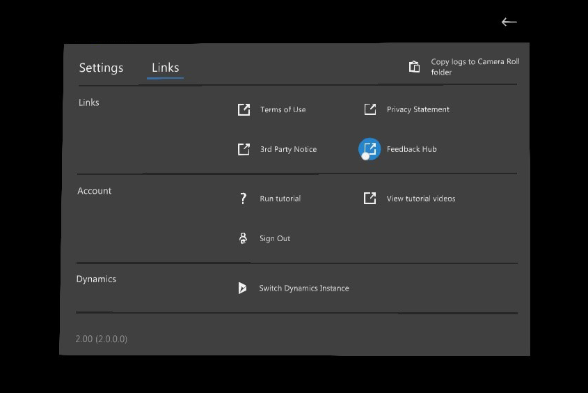

# Dynamics 365 Remote Assist frequently asked questions

Here are some answers to common questions about deploying and using [!include[cc-microsoft](../includes/cc-microsoft.md)] [!include[pn-dyn-365-remote-assist](../includes/pn-dyn-365-remote-assist.md)], which is available on HoloLens 1, HoloLens 2, and [AR-capable mobile phones and tablets](https://docs.microsoft.com/dynamics365/mixed-reality/remote-assist/requirements).

In general, you can request help using our [Dynamics 365 Remote Assist Community Forum](https://community.dynamics.com/365/remoteassist). And if you'd like to suggest an idea or vote for future ideas, try our [Dynamics 365 Remote Assist Ideas Portal](https://experience.dynamics.com/ideas/categories/?forum=4323c621-52bc-e811-a975-000d3a1bec70&forumName=Dynamics%20365%20Remote%20Assist). 

This document also includes device-specific ways to provide file a bug, request help, and provide feedback.

## Deploy Remote Assist (for IT Admins)

### What are the technical requirements for installing Dynamics 365 Remote Assist?

To use [!include[pn-dyn-365-remote-assist](../includes/pn-dyn-365-remote-assist.md)], you’ll need:

- [A subscription to Dynamics 365 Remote Assist.](../licensing/buy-and-deploy.md)

- A [HoloLens running the Windows 10 April 2018
    Update](https://support.microsoft.com/help/12643) or a [mobile phone or tablet](https://docs.microsoft.com/dynamics365/mixed-reality/remote-assist/requirements)/

- To make a video call, you'll need a contact using the latest version of [Microsoft Teams](https://products.office.com/microsoft-teams/group-chat-software) on a PC running Windows 10 or a mobile device running [!include[pn-microsoft-teams](../includes/pn-microsoft-teams.md)] Mobile. [!include[pn-microsoft-teams](../includes/pn-microsoft-teams.md)] is [available as a free download](https://teams.microsoft.com/downloads).

### Do I need a subscription to Microsoft Teams or Office 365?

A Teams subscription is included in the [!include[pn-dyn-365-remote-assist](../includes/pn-dyn-365-remote-assist.md)] subscription for individuals using a [!include[pn-dyn-365-remote-assist](../includes/pn-dyn-365-remote-assist.md)] license on [!include[pn-hololens](../includes/pn-hololens.md)]. A [!include[pn-microsoft-teams](../includes/pn-microsoft-teams.md)] license is also required for individuals (experts) who communicate with a [!include[pn-dyn-365-remote-assist](../includes/pn-dyn-365-remote-assist.md)] user on [!include[pn-hololens](../includes/pn-hololens.md)]. [!include[pn-teams](../includes/pn-teams.md)] may be available [as a free download](https://teams.microsoft.com/downloads) for these users. 

### How often is Dynamics 365 Remote Assist updated?

[!include[pn-dyn-365-remote-assist](../includes/pn-dyn-365-remote-assist.md)] follows the Modern Lifecycle Policy with continuous service updates and major updates every six months (October and April). 

### How can I tell what version I'm using?

Go to **Settings**, and then find the version number in the **About** section.

### Where is Dynamics 365 Remote Assist available?

[!include[pn-dyn-365-remote-assist](../includes/pn-dyn-365-remote-assist.md)], which requires [!include[cc-microsoft](../includes/cc-microsoft.md)] [!include[pn-hololens](../includes/pn-hololens.md)], is available worldwide.

[!include[pn-hololens](../includes/pn-hololens.md)] devices are available in the following markets (English only):

|         |        |   |
|----------------|---------------|----------------|
| Austria        | Germany       | New Zealand    |
| Australia      | Greece        | Norway         |
| Belgium        | Hungary       | Poland         |
| Bulgaria       | Iceland       | Portugal       |
| Canada         | Ireland       | Romania        |
| China          | Italy         | Slovakia       |
| Croatia        | Japan         | Slovenia       |
| Cyprus         | Latvia        | Spain          |
| Czech Republic | Liechtenstein | Sweden         |
| Denmark        | Lithuania     | Switzerland    |
| Estonia        | Luxembourg    | Turkey         |
| Finland        | Malta         | United Kingdom |
| France         | Netherlands   | United States  |

## Configure Remote Assist

### Can I use Dynamics 365 Remote Assist to place a call between two separate tenants?

Yes. If you want to use Remote Assist and enable an out-of-tenant collaborator to use Teams, follow [these instructions](cross-tenant-licensing-implementation.md). 

If you would like to use Teams and enable an out-of-tenant collaborator to use Remote Assist, follow [these instructions](cross-company-calling.md). This is particularly useful for customer service scenarios when you want to "lease" a Remote Assist license to a customer and set up information barriers to limit who your customer can search and collaborate with.

### How do I set up Dynamics 365 Field Service to work with Dynamics 365 Remote Assist?

To learn how to set up Dynamics 365 Field Service integration with Dynamics 365 Remote Assist so that a first-line worker can call an expert in the context of a Field Service booking, see [Integrate Dynamics 365 Field Service with Dynamics 365 Remote Assist](troubleshoot-field-service.md).

## Using Remote Assist on HoloLens 1 or HoloLens 2 

### What languages is Dynamics 365 Remote Assist HoloLens available in?

At this time, [!include[pn-dyn-365-remote-assist](../includes/pn-dyn-365-remote-assist.md)] is available in: 

- Chinese (simplified)
- Chinese (traditional)
- Dutch (Netherlands)
- English (UK)
- French (Canada)
- French (France)
- German (Germany)
- Italy (Italy)
- Japanese (Japan)
- Korean (Korea)
- Spanish (Spain)

### What languages are voice commands and speech recognition available for?

At this time, for HoloLens 1, voice and speech recognition are available only in English. For HoloLens 2, voice commands and speech recognition are available for the following languages:

-	English (US)
-	English (Canada)
-	English (United Kingdom)
-	English (Australia)
-	Chinese (China)
-	French (France)
-	French (Canada)
-	German (Germany)
-	Italian (Italy)
-	Japanese (Japan)
-	Spanish (Spain)

### Why am I not getting incoming call notifications?

This can happen if you’re signed in to [!include[pn-dyn-365-remote-assist](../includes/pn-dyn-365-remote-assist.md)] with a different account
than the one you used to sign in to your [!include[pn-hololens](../includes/pn-hololens.md)]. Make sure you’re signed into
both the app and the device with the same account. 

### I see a message saying I have no internet connection.

To use [!include[pn-dyn-365-remote-assist](../includes/pn-dyn-365-remote-assist.md)], you need a Wi-Fi connection. Make sure your [!include[pn-hololens](../includes/pn-hololens.md)] is
[connected to Wi-Fi](https://support.microsoft.com/help/12629).

### Dynamics 365 Remote Assist is frozen or unresponsive.

Try closing and reopening [!include[pn-dyn-365-remote-assist](../includes/pn-dyn-365-remote-assist.md)]. If you’re still having problems,
[restart your HoloLens](https://support.microsoft.com/help/12642).

### Dynamics 365 Remote Assist isn't showing my contacts.

If you don’t see the contacts you expect, try the following actions:

- Make sure you’ve signed in to [!include[cc-microsoft](../includes/cc-microsoft.md)] [!include[pn-teams](../includes/pn-teams.md)] at least once with the account you’re using on your [!include[pn-hololens](../includes/pn-hololens.md)].

- Close and reopen [!include[pn-dyn-365-remote-assist](../includes/pn-dyn-365-remote-assist.md)].

- [Restart your HoloLens](https://support.microsoft.com/help/12642).

### The Mixed Reality toolbar doesn’t appear on the PC Teams client during a Dynamics 365 Remote Assist call.

This might happen if [!include[pn-teams](../includes/pn-teams.md)] has downloaded a new version of the client in the background but is still running the older version of the app. Restarting your PC will usually fix this issue.

### Why does audio sometimes cut out even in quiet environments?

If [!include[pn-dyn-365-remote-assist](../includes/pn-dyn-365-remote-assist.md)] is used in a loud environment, use headphones on both ends for
better communication. Using headphones for both users prevents any echo
filtering from proactively turning on noise cancellation, which turns off audio.

### I signed in to my HoloLens, but I still can't sign in to Dynamics 365 Remote Assist.

If you’re having trouble signing in to [!include[pn-dyn-365-remote-assist](../includes/pn-dyn-365-remote-assist.md)], try the following:

- Make sure you’re using a work or school account, not a [!include[cc-microsoft](../includes/cc-microsoft.md)] account, to sign into [!include[pn-hololens](../includes/pn-hololens.md)].

-  Make sure that the work or school account you’re using has a valid [Office 365 Business](https://products.office.com/business/office) Premium or Essentials subscription with [Microsoft Teams](https://products.office.com/microsoft-teams/group-chat-software) enabled.

- Make sure your [!include[pn-hololens](../includes/pn-hololens.md)] is connected to the internet.

- Check with your administrator to make sure your device and network are set up to work with [!include[pn-dyn-365-remote-assist](../includes/pn-dyn-365-remote-assist.md)].

### What file formats does the Insert file feature support?

The **Insert file** feature supports most image formats (JPG, GIF, PNG, BMP, TIFF) and PDFs.

### Can I share files from SharePoint on Dynamics 365 Remote Assist?

No, you can only share local files and files from [!include[pn-onedrive](../includes/pn-onedrive.md)].

### Can a Teams desktop user show the Remote Assist HoloLens user a video or PowerPoint?

Yes! We understand that technicians, inspectors, and remote collaborators want to refer to a wide variety of resources and reference documents during the call. By using the Teams desktop **Share** feature, the Teams desktop user can show the Remote Assist HoloLens whatever they are looking at on their desktop or in a specific application window. For example, the Teams desktop user can show the technician a video playing in a web browser. Furthermore, because the Teams desktop user's screen or application window is shared in real time, all call participants will see when the Teams desktop user pauses or restarts the video. 

### When a Remote Assist call ends, how can I access the messages, snapshots, and files during the call?

For messages sent in text chat: any messages, links, or images sent in the text chat will be available for all participants via Teams Chat but not via Remote Assist.

For snapshots from Remote Assist HoloLens user: snapshots are saved differently depending on whether the Remote Assist call is associated with a Dynamics 365 Field Service booking.
- If a Remote Assist call is associated with a booking, the Remote Assist user will take a snapshot and decide whether to save it to OneDrive or to the booking.
- If a Remote Assist call is not associated with a booking, the Remote Assist user’s snapshot will automatically be saved in OneDrive.  

    However, regardless of how snapshots are saved, a link to the snapshot is sent via the text chat, and the Teams user can view the snapshot and also view the link to the snapshot. 

For files: A link to the files sent by the Teams user is sent in the chat. During the call, the Remote Assist user can use the controls in the top-right corner of a file to save it to their OneDrive.

### How can I improve hologram stability?

Hologram stability refers to how well a placed hologram stays where you placed it – be this perceptual or actual.

- *Perceptual* instability could refer to a hologram that seems to move with your head motion, instead of tracking the placed position in space.
- *Actual* instability could refer to a hologram whose coordinates have changed in virtual space, or whose position relative to a real-world object has shifted regardless of user input or head tracking.

Holograms are always going to be most stable when your **head (not your eyes)** is pointed directly at them. The expected tolerance for hologram stability is that they remain within 1 cm of the placed position for every 1 m of distance from the device.

To improve hologram stability, complete eye calibration. 

- To complete eye calibration on HoloLens 1, [manually start the calibration process]( https://docs.microsoft.com/hololens/hololens-calibration#calibrating-your-hololens-1st-gen). 
- HoloLens 2 will prompt you to calibrate the device under several circumstances. [Complete eye calibration]( https://docs.microsoft.com/hololens/hololens-calibration#calibrating-your-hololens-2) when requested. It will only take about 20 seconds. 

### Multiple people in my organization use Remote Assist on the same HoloLens. How do I clean my HoloLens?

Learn how to clean [HoloLens 1](https://docs.microsoft.com/hololens/hololens1-hardware#care-and-cleaning) and [HoloLens 2](https://docs.microsoft.com/hololens/hololens2-hardware#care-and-cleaning). 

Additional details about cleaning HoloLens 2:

**Device**: Remove any dust by gently wiping with a dry lint-free microfiber cloth. Lightly moisten the cloth with medical 70% isopropyl alcohol, and then gently wipe the surface of the device.

Let it dry completely.

**Brow pad**: Wipe it with a cloth moistened with water and a mild, antibiotic soap. Let it dry completely.

**Can I use Purell wipes to clean the HoloLens?**
Purell wipes can be applied in limited use to clean the HoloLens surfaces. The cleaning guide linked at the beginning of this question is the recommended method. 

**Can I use Clorox or Lysol wipes to clean the HoloLens?**
A: Clorox, Lysol, and similar bleach-keeping wipes are **not** recommended for use. Use these wipes on when it's critically necessary, and nothing else is available.

**Can I use any lens cleaner for cleaning HoloLens visor?**
No. Lens cleaners can be abrasive to the coatings on the visor. Please use a mix of isopropyl alcohol (IPA) and water, and then gently wipe the surface of the visor.

### Can I save call artifacts to a Field Service work order?

Yes! If you opened a Field Service booking and then made a Remote Assist call, at the end of the call, you'll be prompted to post the call log and files shared by remote collaborators to the work order associated with that booking.

To view the call log and files, sign into Field Service and select the work order. Two new notes will have been created and attached to the work order. One note will include call log info. The other note will include and a link to each file in plain text. You can also edit the note to include the Stream link of the recorded call, which can be found in your Teams chat.

For more information, visit our article on [displaying and saving files](display-save-files.md).

### How do I file a support ticket?

If you encounter an issue that blocks you from using the application and you do not see an answer on our [user forum](https://community.dynamics.com/365/remoteassist), please [file a support ticket](https://support.microsoft.com/hololens). Support will work directly with you and communicate daily until the issue is resolved.  

### How do I report a bug?

If you encounter an issue, use the HoloLens Feedback Hub to let us know so we can resolve it in future releases.

There are two ways to get to the HoloLens Feedback Hub application to report a bug. 

1. From the **Start menu**: At any time, you can go to the **Start menu** and launch **Feedback Hub**. 
2. From Remote Assist: If you just ended a call and are looking at the **Recent Contacts** page, select **Settings** in the top-right corner. Select the **Links** tab, and in the **Links** section, select **Feedback Hub** to launch **Feedback Hub**. 

When you're in the HoloLens Feedback Hub: 

1. From the home tab (represented by this icon, select **Report a problem**, as seen in the following screenshot.

2. In the **Enter your feedback** section, summarize your feedback. To type, tap the text field and a holographic keyboard will appear. Then, select **Next**. To edit your response to any step after you’ve chosen **Next**, select **Edit**, which is to the top right of the text field. 
3. In the **Choose a category** section, categorize the issue using "Apps" and "Microsoft Remote Assist." To select an item in the drop-down menu, select the menu.
   - If you're using HoloLens 1, scroll by gazing at the content of the app window. Tap and hold and then move your hand slightly upwards or downwards to scroll the content.
   - If you're using HoloLens 2, scroll by placing your finger on the drop-down menu and move your finger up and down, as you would on a touch screen device. 

4. In the **Find similar feedback** section, select "Make new bug."
5. In the **Additional details** section:
   - Optionally select "Consider this a blocking issue."  
   - Categorize your problem.
6. Select **Recreate your problem**:
   - Select **Start recording**.
   - Use the start menu to launch Remote Assist and replicate the issue.
   - When you're finished replicating the issue, use the start menu to return to **Feedback Hub**.
   - Select **End recording**.
   - Diagnostic data, a video, and audio from the recording will be attached. You may remove each one if you want to. 

> [!Note]
> Optionally, check the "This is blocking me" box if the issue is blocking you from completing your work or tasks. 

## Using Remote Assist on mobile  

### What are the yellow tracking dots?

Yellow tracking dots are feature points that detect visually distinct features in your video calls. These help with your tracking experience and placing of annotations. In the April 2020 release and beyond, Remote Assist will continue to track your space but you will remove the yellow tracking dots visualization.

### How can I improve the tracking experience?

- Map your environment area at the beginning of a video call.
- Avoid rapid camera movements.
- Avoid frequently minimizing the app and reopening it while there are annotations present.

Limitations that may hinder accurate understanding of surfaces or facilitate in losing tracking include:
- Flat surfaces without texture, such as a white desk.
- Environments with dim lighting or bright lighting.
- Transparent or reflective surfaces like glass.
- Dynamic or moving surfaces.

## As a Remote Assist mobile user, what kinds of calls can I be in?

* **Can I make calls to a Teams mobile user?** No. However, Remote Assist mobile to Remote Assist mobile calling is on our backlog.
* **Can I make or be in a group call?** No. 

## How do I provide feedback?

Technicians can provide feedback or make requests directly in the Remote Assist mobile app. The Remote Assist mobile team values your feedback and strives to make significant improvements to the app.

### Provide feedback customer scenario
1.	Select the **Main Menu** icon.

2.	Select **Feedback**. 

>[!Note]
> To provide feedback, you'll need to have the native iOS Mail app set up if you're on an iPhone. On Android devices, you'll be able to select which mail app you'd like to open.

3.	Provide your feedback.

>[!Note]
> Remote Assist mobile users can also provide feedback to our team in the [Dynamics 365 Remote Assist Community Forum](https://community.dynamics.com/365/remoteassist) for Remote Assist or in the [Dynamics 365 Remote Assist Ideas Portal](https://experience.dynamics.com/ideas/categories/list/?category=81a97e52-9c54-e911-a963-000d3a4f33c1&forum=4323c621-52bc-e811-a975-000d3a1bec70) for Remote Assist mobile.

### See also
- [Overview of Dynamics 365 Remote Assist](index.md)
- [Requirements](requirements.md)
- [How-to videos](videos.md)
