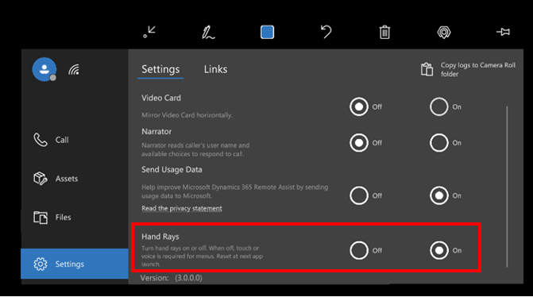

# Turn hand rays on or off in the Dynamics 365 Remote Assist HoloLens app

You might want to turn hand rays off in the Dynamics 365 Remote Assist HoloLens app if xxx. When you turn hand rays off, you disable near-field communications, 
which means you have to use touch or voice to use the menus. You can easily turn hand rays back on again when you need them. 

If you use features that require hand rays (inking and arrows, for example), hand rays are automatically turned back on when you select those tools. Hand rays are also turned on automatically whenever you start the HoloLens app. 

## Turn hand rays on or off 

1. In the HoloLens app, select **Settings**.

2. Under **Hand Rays**, select **On** or **Off**.

   .

   > [!TIP]
   > You can also [use voice commands to turn hand rays on or off](hololens-voice-commands.md).

