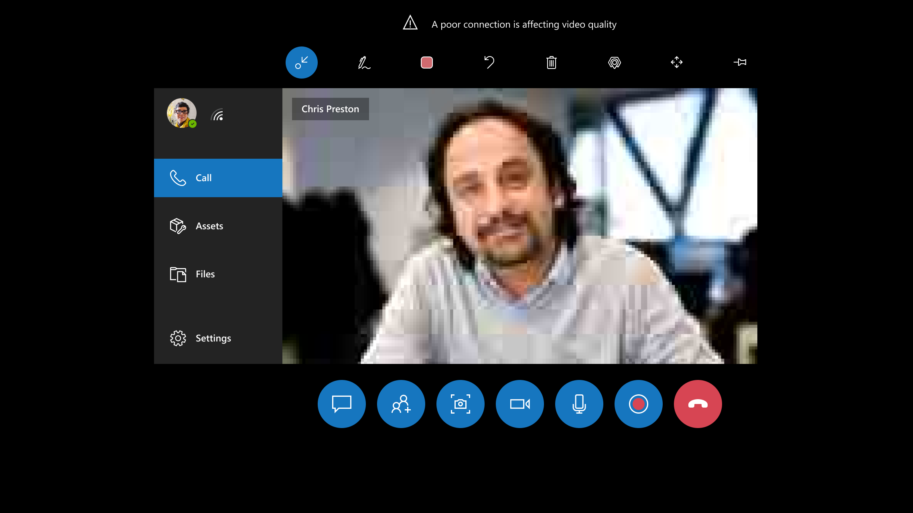
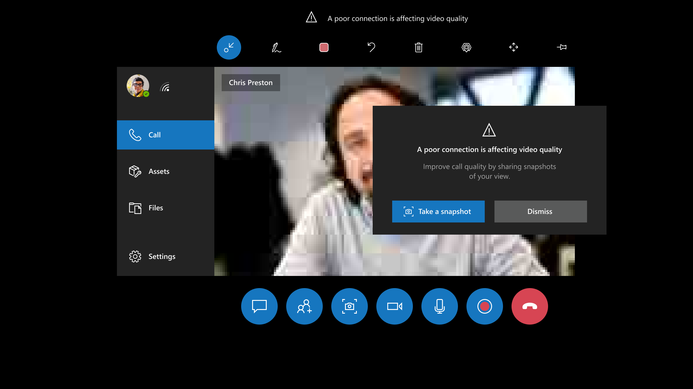
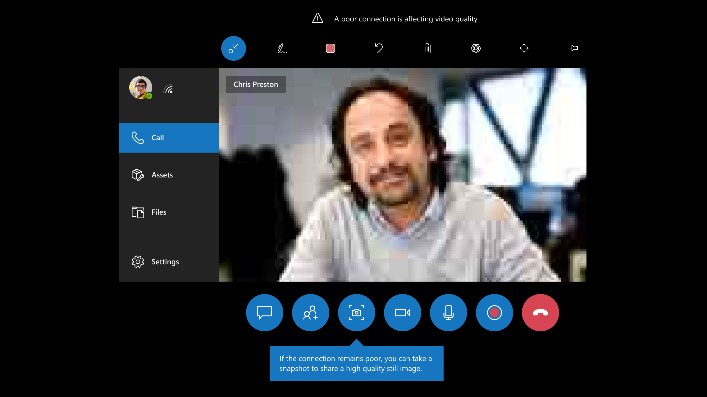
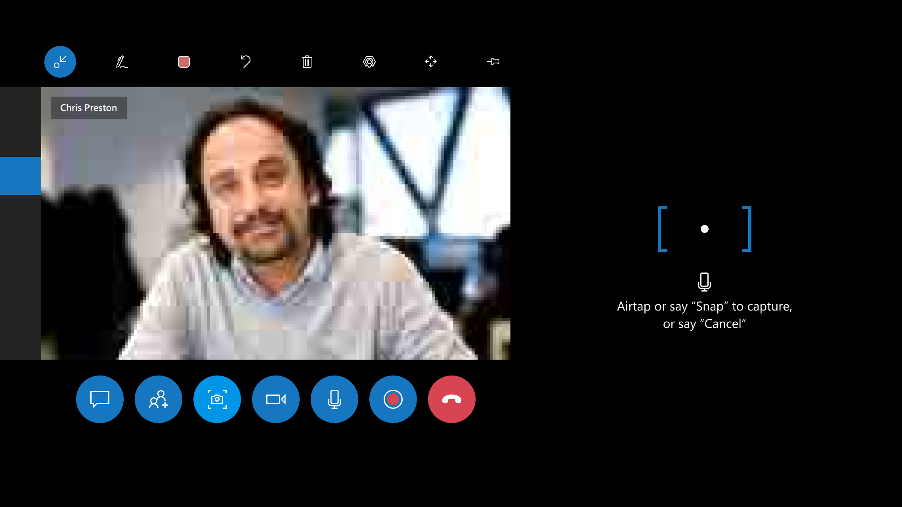
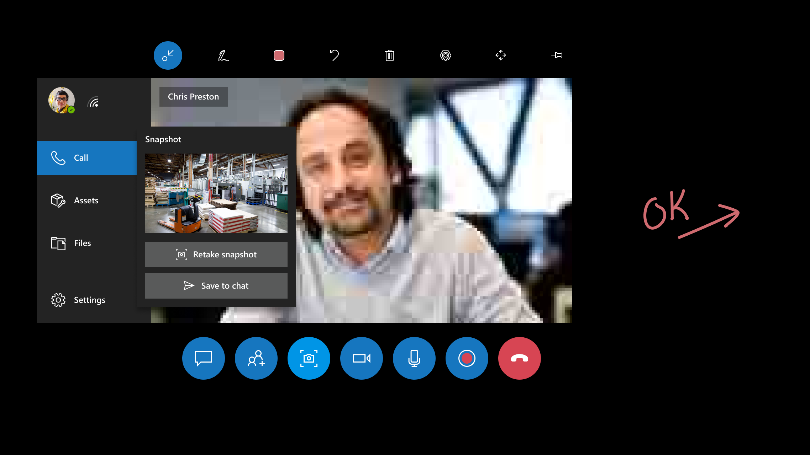
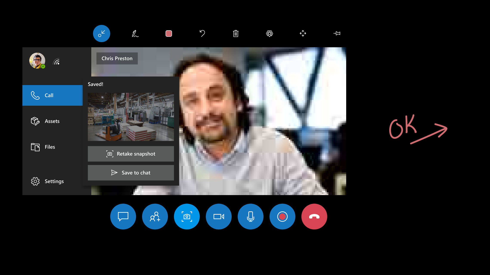

# Use Dynamics 365 Remote Assist HoloLens in low-bandwidth situations

Technicians sometimes find themselves on factory floors or remote locations with poor network connectivity. Without strong network connectivity (bandwidth (up/down) of 1.5 Mbps or higher), technicians might experience difficulty troubleshooting and resolving problems in real time. Dynamics 365 Remote Assist HoloLens gives technicians the ability to discuss, diagnose, and resolve issues with remote collaborators even in low-bandwidth situations.

## What determines poor network connectivity 

Poor network connectivity is determined by the following conditions: 

- The bandwidth is between 150 kbps and 1.5 Mbps

- The latency is higher than 1,000 ms

- The packet loss is higher than 10 percent

Dynamics 365 Remote Assist **autodetects** if the technician is experiencing poor network conditions. If so, the technician is prompted to **share snapshots** with the remote expert to collaborate, instead of transmitting a live video feed. This way, the expert can view and annotate high-quality images instead of a low-quality video feed.

## How it works

Let's take a quick look at what happens in a field scenario when a technician encounters poor network connectivity. In this scenario, the technician is a field worker. The  remote collaborator is elsewhere with good network conditions. 

1. The technician launches a video call with a remote collaborator.

     

2. In the call, Dynamics 365 Remote Assist autodetects if the technician is experiencing poor network conditions. 

     

3. The technician is prompted to use the **Snapshot** tool to share images with the expert.

     
    
    > [!Note]
    > A OneDrive license is required to share snapshots with the Snapshot tool. 

4. The technician is instructed on how to use the **Snapshot** tool.

     
 
5. The technician takes a snapshot, which is shared with the remote collaborator. The remote collaborator now sees a snapshot that has better quality. The technician and remote collaborator can annotate simultaneously on the snapshot.

      

6. After sharing a snapshot, the technician can save it to the meeting's chat or retake the snapshot.

     

7. The technician returns to the video call and can continue to send snapshots to the remote collaborator.

     

> [!NOTE]
> The low-bandwidth feature is not supported in group calling scenarios. 

[!INCLUDE[footer-include](../includes/footer-banner.md)]

