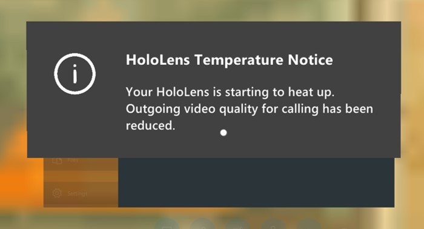
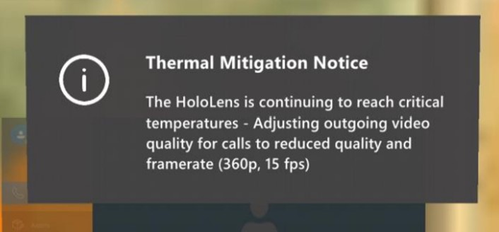
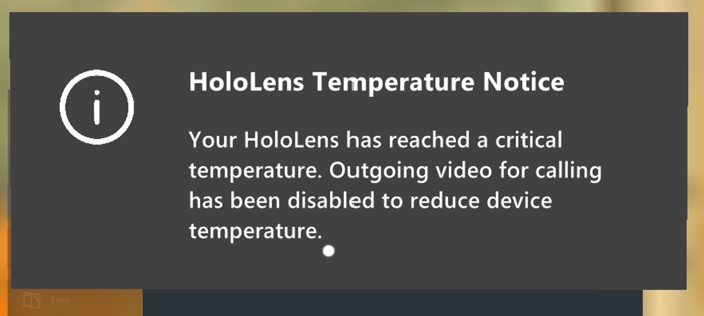
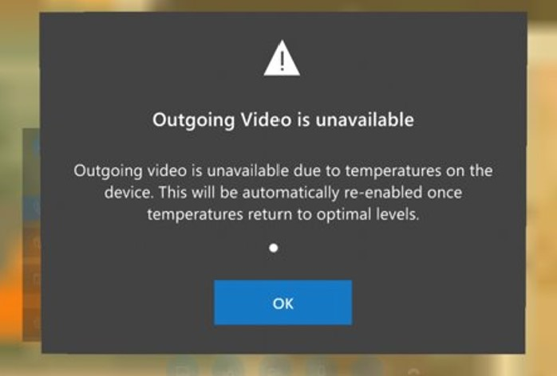

# How Dynamics 365 Remote Assist automatically adjusts HoloLens temperature if the device overheats

If you're on a longer call in Microsoft Dynamics 365 Remote Assist for HoloLens, the HoloLens device can become hot if it's using 
several device capabilities at the same time (for example, multiple cameras, Mixed Reality Capture, and Wi-Fi). To extend the length of the call and keep the device 
from overheating, Dynamics 365 Remote Assist gradually reduces outgoing video quality (resolution and frame rate). If this happens, you'll see a series of messages to let you know how and why the outgoing video quality is being adjusted. 

The first warning message tells you that HoloLens is heating up and that outgoing video quality is being reduced.

If the device continues to heat up, you'll see a warning that the device is continuing to reach critical temperatures.

If the device reaches a critical temperature, you'll see a warning that outgoing video is being disabled. 

You'll then see a warning that video has been disabled.

When the device returns to an optimal operating temperature, you'll see a message saying that outgoing video quality is being restored.

If you had video turned on before it was disabled, the video will automatically be turned back on. If you had video off before it was disabled, it will remain off but you can turn it back on. 

