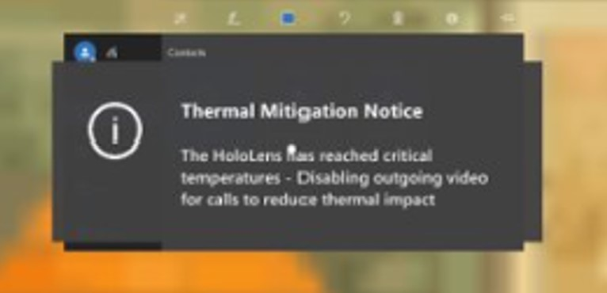

# How Dynamics 365 Remote Assist automatically adjusts HoloLens temperature if the device overheats

If you're on a longer call in Microsoft Dynamics 365 Remote Assist for HoloLens, the HoloLens device can become hot if it's using 
several device capabilities at the same time (for example, multiple cameras, Mixed Reality Capture, and wi-fi). To extend the length of the call and keep the device 
from overheating, Dynamics 365 Remote Assist gradually reduces outgoing video quality. In this case, you'll see a series of messages to let you know how and why the 
video quality is being adjusted. If the device reaches a critical temperature, you'll see a message that outgoing video will be disabled completely. 

When the device returns to an optimal operating temperature, you'll see a message saying that outgoing video quality is being restored.

