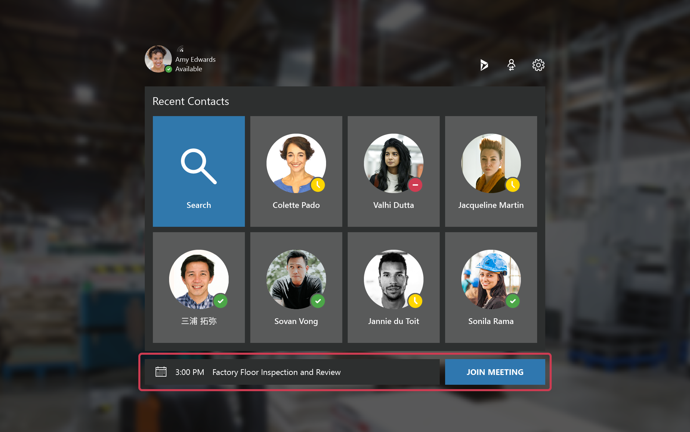

# Join a Dynamics 365 Remote Assist meeting on HoloLens

A Teams meeting is a meeting scheduled using Teams involving any number of participants. Meetings are useful for maintenance and repairs that are scheduled in advance. It's also useful for inspections and other recurring scenarios.

> ![Note]
> If a remote collaborator joins a meeting, you will not receive a call or notification, regardless whether you are in the app. You must select “Join Meeting” (or say “Join Meeting”) to join the meeting. In addition, calling the participants involved in a scheduled meeting will not enable you to join the meeting, you must actually join the meeting. 

To join a meeting, select **Join Meeting** (or say “Remote Assist, Join Meeting”) below the **Recent Contacts** screen. The **Join Meeting** button appears if the meeting is happening now or within the next 15 minutes.
