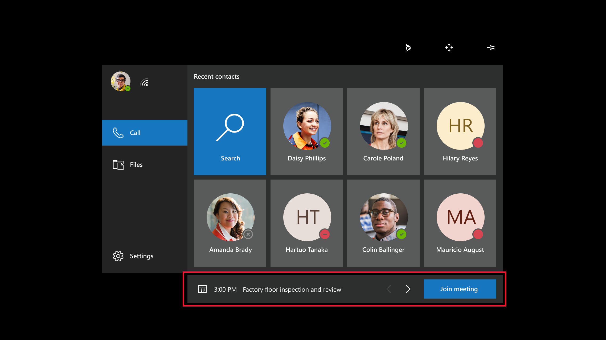

# Join a meeting on HoloLens

A Microsoft Teams meeting is a meeting scheduled using Teams involving any number of participants. Meetings are useful for maintenance and repairs that are scheduled in advance. It's also useful for inspections and other recurring scenarios.

> [!Note]
> If a remote collaborator joins a meeting, you will not receive a call or notification, regardless of whether you are in the app. You must select **Join Meeting** (or say "Remote Assist, Join meeting") to join the meeting. In addition, calling the participants involved in a scheduled meeting will not enable you to join the meeting; you must actually join the meeting.

If for some reason you're unable to join the meeting, you may also ask the Teams user to join the meeting and use the **Open Participants** feature to call you. You'll receive an incoming call notification. Accept the call using audio or video, and you will join the meeting.

To join a meeting, select **Join Meeting**, or say "Remote Assist, Join Meeting", below the **Recent Contacts** screen. The **Join Meeting** button appears if the meeting is happening now or within the next 15 minutes. If your upcoming meetings overlap, you can use the arrows to select which meeting to join.  

After you join a meeting, you or the Teams user can add more people to the meeting. Select **Open Participants** (as represented by this icon: ). You'll see the first person you called on the left side of the video card, and a list of participants on the right side of the video card. On the bottom of the video card, there's a text field. Select the text field, and a holographic keyboard will pop out. A list of your recent contacts will appear. If the person you'd like to call isn't on the list, enter a name or email address using the holographic keyboard, and then select a name in the search results to start the call.

## Tip for setting up a meeting 

> [!NOTE]
> Dynamics 365 Remote Assist currently **does not enable lobby support** to allow Teams desktop users into meetings from the lobby. 
> To ensure that Teams desktop users can successfully join a meeting, follow these steps:
> - Select **New Meeting** on Teams calendar. 
> - Invite at least one participant. Select **Send.** This will close the meeting. 
> - Open the meeting, and select **Meeting Options** in the description box to set lobby permissions.
> - A dialog box will appear stating **These people don't have to wait in the lobby** or **Who can bypass the lobby?**; select **Everyone**. 
> - Select **OK** or **Save**.
> Steps for setting up a Teams meeting via Outlook are similar, except after selecting **New meeting**, select **Teams meeting**. Then, you will see **Meeting Options**; select it to modify lobby settings.
