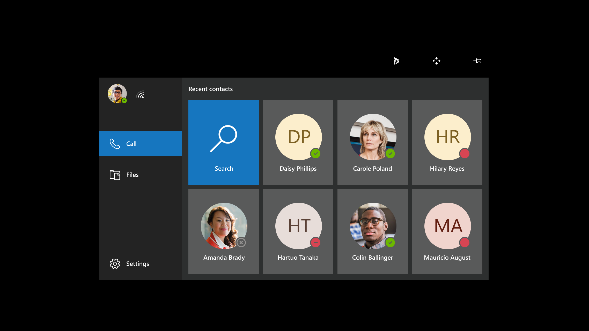

# Launch Dynamics 365 Remote Assist on HoloLens

>[!Note]
> HoloLens 2 uses eye-tracking technology to improve your experience seeing and interacting with the virtual environment. Calibrating the HoloLens 2 ensures that it can accurately track your eyes (and the eyes of anyone else who uses the device). When you put on HoloLens 2, it will likely prompt you to calibrate the device to your eyes. [Complete eye calibration]( https://docs.microsoft.com/hololens/hololens-calibration#calibrating-your-hololens-2) when requested. It will only take about 20 seconds.
> To complete eye calibration on HoloLens, [manually start the calibration process]( https://docs.microsoft.com/hololens/hololens-calibration#calibrating-your-hololens-1st-gen).
The Start menu is where you'll open apps, see important status info, access tools like the camera, and more. Use the Start gesture to launch the Start menu.

|| |
|--|--|
|On HoloLens 2, even if you have not downloaded Dynamics 365 Remote Assist, you'll see a dark grey app tile. Select it, and Dynamics 365 Remote Assist will begin downloading. After it's done downloading, select the app to launch it.
On HoloLens, if you have not downloaded Dynamics 365 Remote Assist, you'll need to download it from the Microsoft Store.|If you have downloaded Dynamics 365 Remote Assist, select the app to launch it.|

After you launch the app, you'll see a **3D app launcher** (also known as a **live cube**). Press play.

When the app loads, you'll see the **Call tab** open with your recent contacts.

Now, you're ready to make a call!

[!INCLUDE[footer-include](../includes/footer-banner.md)]