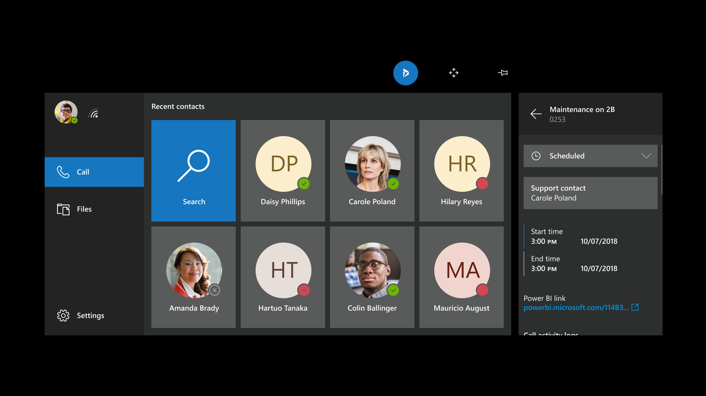

# Make or take calls in Dynamics 365 Remote Assist on HoloLens

[!INCLUDE[try-guides-ra](../includes/try-guides-ra.md)]

With Microsoft Dynamics 365 Remote Assist, you can make or take the following types of calls:  

- **One-to-one call**. A one-to-one call includes two participants. For example, if you're repairing a machine and need help on-the-go, you can make a one-to-one call to a remote collaborator who uses Microsoft Teams.

- **Group call**. A group call includes three or more participants. For example, if you're inspecting an asset in a one-to-one call but need a third person's expertise, any participant can add the third person to the call to form a group call.  

- **Meeting**. A meeting is a scheduled call using Teams or Outlook. Meetings can include any number of participants. For example, if you want to have a weekly inspection with your team, you can create a meeting so that everyone receives notifications about the meeting and can join the meeting.

## Supported scenarios

With Dynamics 365 Remote Assist on HoloLens, you can collaborate with:

- A Teams desktop user in a one-to-one call, group call, or meeting scheduled using Microsoft Teams or Outlook. To learn more about different combinations of HoloLens and Teams users on group calls, go to [Group calls](#group-calls).

- A Teams mobile user in a one-to-one call.

> [!NOTE]
> The mixed-reality toolbar doesn't appear if the Dynamics 365 Remote Assist user joins the call from two different devices.

## Make a one-to-one call to a contact in your company

1. When you open Dynamics 365 Remote Assist, your recent contacts list appears in the **Call** tab. To call one of the contacts you see, select the contact. If you don't see the contact you want, select **Search**, and then use the holographic keyboard to enter a name or email address.

    

    > [!NOTE]
    > If your organization has enabled integration with Dynamics 365 Field Service, you can view and call the contact assigned to your Field Service booking. Select the Dynamics 365 Field Service icon (or say, "Remote Assist, Dynamics"), go to your instance and booking, and then select the **Support Contact** listed.
    >
    > 

1. If you work in multiple environments and are asked to select the environment, choose the environment to store the call information.

    > [!NOTE]
    > You don't have to select an environment to make a call. To start a call without selecting an environment, select **Launch call**. Learn about [storing data for the Calls dashboard](calls-dashboard.md).

1. While you're on a call, you can mute yourself at any point if you need to. You can't mute the other participant in a one-to-one call, however.

## Make a one-to-one call to a Teams user inside your tenant  

A technician or inspector can use Remote Assist to work collaboratively with a remote colleague (typically an expert in a particular field) who uses Microsoft Teams in your tenant.

The licensed Remote Assist HoloLens user can [set up a Teams meeting](./join-meeting-hololens.md) and invite the collaborator. Then, the licensed Remote Assist user [joins the meeting using the Remote Assist HoloLens app](join-meeting-hololens.md). The Teams user sees the meeting invitation in their Outlook calendar or Teams calendar. They right-click the meeting invitation and select **Join Teams meeting**. The web browser might launch and display options for joining the meeting. To join via Teams application, select **Launch it now**.

## Make a one-to-one call to a Teams user outside your tenant

You can search, call, and receive a call from a Dynamics 365 Remote Assist user in another tenant if your tenant is federated with that tenant. To call a federated user, open the app, select **Search**, and then use the holographic keyboard to enter their full email address. If you enter just a name or a partial email address, search results don't display. After you call a federated contact, they appear in your recent contacts list, so you don't have to search for that contact again.

>[!Note]
> If you can't find the contact you're looking for, it might be because Teams federation isn't enabled. Contact your administrator to [manage Teams external access](/microsoftteams/trusted-organizations-external-meetings-chat?tabs=organization-settings).

## Group calls

A group call can include Dynamics 365 Remote Assist HoloLens users  and Teams desktop and mobile users. You can also switch between participants' video feeds and mute participants as needed.

You can combine HoloLens users with Teams users in different combinations:

- Multiple HoloLens users can collaborate on the same Dynamics 365 Remote Assist call. 

- Any Teams user can choose any HoloLens user's space to annotate on if there's more than one HoloLens user. 

- Multiple Teams users can annotate on the same HoloLens user's space at the same time.

### Make a group call

1. Start by calling one person, and then select **Open Participants** () or say "Remote Assist, Open Participants."

    The first person you called appears on the left side of the video card, and a list of participants on the right side.

2. On the bottom of the video card, select the text field to pop out a holographic keyboard with a list of your recent contacts. If the person you want to call isn't on the list, enter a name or email address using the holographic keyboard, and then select a name in the search results to start the call.

To mute a participant in a group call:

1. Select **Open Participants** () or say "Remote Assist, Open Participants." 

2. Tap a participant to see their video feed. 

3. Tap the mute button next to the participant's name to mute them. Muted participants can unmute themselves. Other people on the call can't unmute a muted participant.

> [!Note]
> If the call includes a large number of participants, you might experience performance issues, such as delays in viewing annotations and lower video resolution. [Learn more about the number of participants that can join a Microsoft Teams call](/microsoftteams/limits-specifications-teams#meetings-and-calls). 

## Accept a call

You can do any of the following when you receive a call:

- Select **Video** (or say "Remote Assist, Video") to accept the call as a video call.

- Select **Audio** (or say "Remote Assist, Audio") to accept the call as a voice-only call. 

- Select **Ignore** (or say "Remote Assist, Ignore") to decline the call.

If you join the call, remote collaborators are able to see what you see in your space, including holograms.

> [!Note]
> In you're using another HoloLens app, you can have Dynamics 365 Remote Assist run in the background to receive any incoming calls. To do this, first open Dynamics 365 Remote Assist. Then use the Start gesture to go to the **Start** menu and select another app to use. You'll get a notification if a Dynamics 365 Remote Assist call comes in, and you'll be able to select **Accept** to initiate an audio call, **Video** to initiate a video call, or **Ignore** to ignore the call.

## End a call

- Select **End Call** (), or say "Remote Assist, End Call."

## Adjust outgoing video quality if the HoloLens device gets too hot

If you're on a longer call in Dynamics 365 Remote Assist for HoloLens, the HoloLens device can become hot if it's using several device capabilities at the same time (for example, multiple cameras, Mixed Reality Capture, and wi-fi). To extend the length of the call and keep the device from overheating, Dynamics 365 Remote Assist gradually reduces outgoing video quality. A series of messages appear letting you know how and why the outgoing video quality is being adjusted. Learn more about how [Dynamics 365 Remote Assist adjusts video quality](hololens-thermal-adjusting.md).

[!INCLUDE[footer-include](../includes/footer-banner.md)]
