# Dynamics 365 Remote Assist Mobile User Guide (in preview)

[This topic is pre-release documentation and is subject to change.]

The Microsoft Dynamics 365 Remote Assist mobile app extends the capabilities of Dynamics 365 Remote Assist to work with Android 
ARCore-capable phones (in addition to Microsoft HoloLens). Technicians can use their phones to connect and collaborate with an 
expert on Microsoft Teams. Using live video calling and mixed reality annotations, they can share what they see with the expert 
to troubleshoot problems together, faster. 

## What you’ll need

You’ll need the following to use the Remote Assist mobile app:

- An Android ARCore-capable phone (tablets are not currently supported), with ARCore installed. [View the full list of supported 
devices](https://developers.google.com/ar/discover/supported-devices). 

- A Google Play account.

- The Remote Assist mobile app.

- A Microsoft Teams account (available for free).

- A Microsoft Teams desktop client running Windows 10 (for the remote expert receiving the call).

- An internet connection. At least 1.5 MB of bandwidth is recommended for the best experience.

If you want to use Remote Assist together with Dynamics 365 for Field Service so you can automatically log call information to a 
Field Service work order, you’ll also need one or both of the following:

- Dynamics 365 for Field Service web application

- Dynamics 365 for Field Service mobile app 

## Get started

### Step 1: Sign up for a Microsoft Teams account (free)

A Microsoft Teams account is required to use Remote Assist mobile . If you don’t already have a Teams account, you can [create a 
Teams account for free](https://businessstore.microsoft.com/en-us/create-account/signup?products=CFQ7TTC0K8P5:0001&lm=deeplink&lmsrc=freePageWeb&cmpid=FreemiumSignUpHeader). 

### Step 2: Download the app

1.	Go to the Google Play Store: https://play.google.com/store/apps/details?id=com.microsoft.ramobile.

2.	Select **Download**. 
 
### Step 3: Sign in to the app for the first time

1.	After you’ve downloaded the app, open it on your Android phone. 

2.	Sign in with your Microsoft Teams account.

    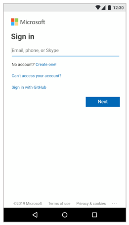
  
    > [!TIP]
    > The sign-in address will be in the form: *username@company*.
    
3.	In the dialaog box that appears, select **Enable Feature** to link Remote Assist to Dynamics 365 for Field Service, or 
select **Skip** if you don’t want to link the apps at this time. You can always link them later through **Settings**. To learn more about how the apps work together, select **Learn More**.

    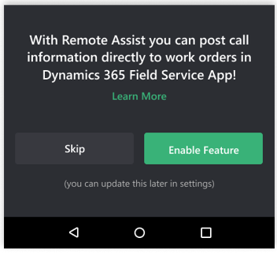
  
## Make a call
After signing in, you’ll see the **Contacts** page, which is the main page in the Remote Assist mobile app. On the **Contacts** page, 
your contacts are organized by the most recent calls.

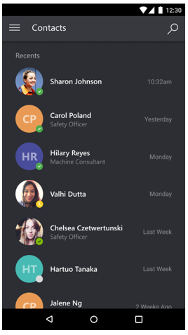
  
To make a call:

1.	Do one of the following:

    - Select a contact in the **Recents** list. 

      -Or-
      
    a.	If the contact isn’t listed in the **Recents** list, select  .
    
    b.	Enter the name of the contact to search for , and then select the contact from the resulting list.
    
2.	In the contact card, select **Launch Call**.

    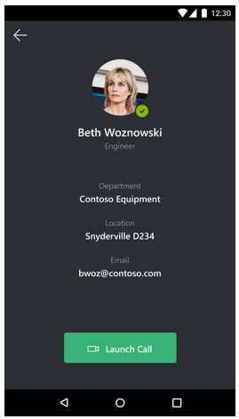
  
    Use the buttons in the bar at the bottom of the screen to mute the call, pause the video feed, turn on the speaker phone, or 
    end the call.
    
    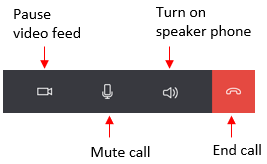
  
 
## Add annotations
You can add annotations to your screen to share with an expert on the call. To create annotations, your phone needs to recognize 
at least one plane (vertical or horizontal) in your work area. You do this by scanning your work area with the phone. When a plane has been recognized, you’ll see a confirmation visualization and the annotation toolbar will appear at the top of the screen:

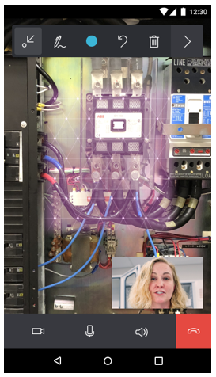
  
> [!NOTE] 
> If you lock your phone or minimize Remote Assist, the recognized planes will reappear automatically as soon as your phone 
recognizes the environment.

### Add an annotation
You can add an annotation by using the buttons on the annotation toolbar:

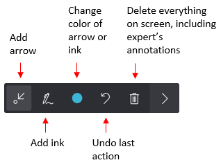
  
For example, to add an arrow, tap the arrow tool and drag your finger to the spot where you want to place the arrow.

### Minimize or restore the toolbar

You can minimize the toolbar if you want to see more of the screen.

To minimize the toolbar:

- Select the arrow on the right side of the toolbar. 

  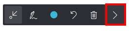
 
To restore the toolbar to its original size:

- Select the **Pen** button. 

### Make the expert’s video feed bigger

When you call an expert, the expert’s video feed appears in the lower-right corner of your phone screen. To make the expert’s 
video feed bigger, tap the feed. Tap the feed again to return to the original size.

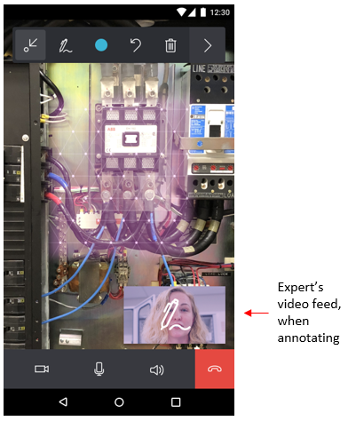
  
If the expert is annotating, a notification icon will appear on the expert screen .  

## Switch the camera view from portrait to landscape

You can switch the orientation of the camera view from portrait to landscape while in a call by changing the orientation of your phone. Using landscape view provides a wider field of view, which may improve the experience for the remote expert on the call.
   
## Use Remote Assist together with Dynamics 365 for Field Service

You use Remote Assist together with Dynamics 365 for Field Service if you want to automatically log call information to a 
Field Service work order when you end the call. 

When you sign in to the Remote Assist mobile app for the first time, you’re prompted to link Remote Assist to Dynamics 365 for 
Field Service. You can link the apps through Settings if you chose not to link them at first sign in.

### Link the Remote Assist mobile app to Dynamics 365 for Field Service

1.	Select the **Main menu**  button.

2.  Select the **Settings** button.  

3.	In the **Settings** dialog box, move the slider to on.

    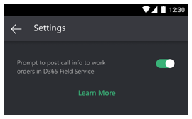
  
### Save call data to a Field Service work order

1.	When you end the call, the following dialog box will appear:

    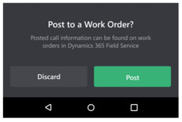
  
2.	Select **Post**.

3.	In the **Select one of today’s bookings** screens, select the appropriate booking to post the call data to.

    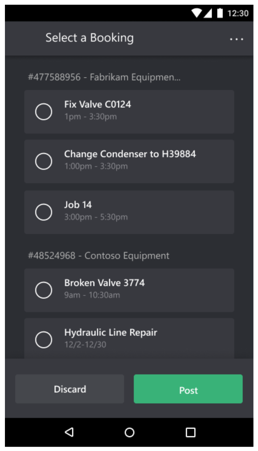
  
    > [!NOTE]
    > If you don’t see the booking you’re looking for, it may be because you have access to multiple organizations (instances). 
    To switch to a different organization, select Change D365 Instance . 
    
## Sign out of the app

1.	Select the **Main menu**  button.

2.	Select **Sign Out**.

## Get Help

1.	Select the **Main menu**  button.

2.	Select **Help**.

## Get support or provide feedback

If you’d like to get direct access to the product team forum and provide feedback on the mobile app preview:

1.	Sign up for the Dynamics 365 Remote Assist Mobile Public Preview Insiders Program at https://experience.dynamics.com. 

2.	Select the **Insiders Program** box, which will lead you to the Insiders Program application.

    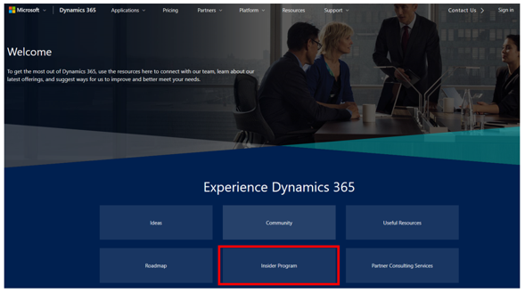
 
You can also provide feedback directly from the app by using the following procedure:

1.	Select the **Main menu**  button.

2.	Select **Feedback**.
