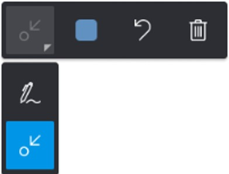
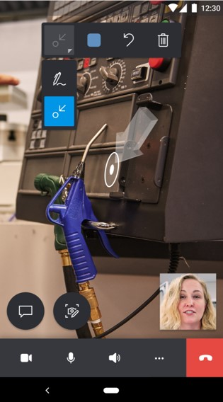
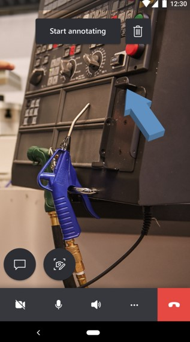
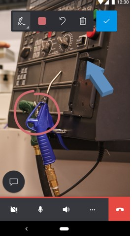
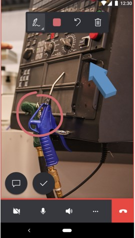
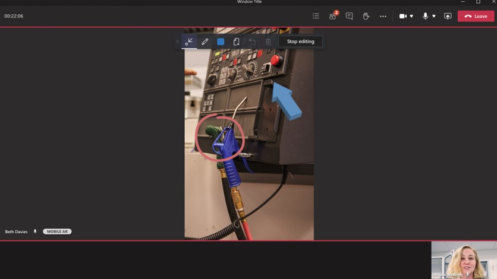

# Annotate the technician's shared environment

In Dynamics 365 Remote Assist mobile, mixed-reality annotations give technicians and remote collaborators the power to visually specify an area or a particular asset in their environment to look at or manipulate. During a Dynamics 365 Remote Assist mobile video call, the technician shares their environment with the remote collaborator through their rear-facing camera. The technician can instantly place mixed-reality annotations in the shared environment. The remote collaborator  places mixed-reality annotations on a snapshot of the technician's shared environment. 

## Learn the annotation tools

### Mobile app

If you're using the Dynamics 365 Remote Assist mobile app, you'll see the following annotation toolbar.

If you select the down arrow next to the left-most button (the active tool), the button drops down. 

The following table describes each of the buttons in the mobile app annotation toolbar.

|Button|Description|
|--------|-----------------------------------------------|
||Add an arrow.|
||Add ink (draw).|
||Select a color for the annotation.|
||Undo the last annotation that you placed in your environment.|
||Delete all of the annotations that you placed in your environment. Note that you can't delete annotations placed by the remote collaborator.|

### Teams desktop app

If you're the remote collaborator and you're using Teams desktop, you'll see the following annotation toolbar.

The following table describes each of the buttons in the Teams desktop annotation toolbar.

|Button|Description|
|--------|-----------------------------------------------|
||Add an arrow|
||Add ink|
||Pick a color|
||Undo the last action|
||Delete all annotations|

### Add an arrow annotation 

1. Make sure the arrow is selected in the annotation toolbar. 

2. Move your device around to position the dot on the object or area you want to highlight.

3. Tap to place the ghost arrow on your device screen.

    

4. To rotate the arrow, tap and drag the arrow in a circular motion (360 degrees).

### Add an ink annotation 

1. Make sure the **Ink** tool is selected in the annotation toolbar.
 
2. Tap and drag on your screen to start drawing. 

## Add an annotation if you're a technician using Dynamics 365 Remote Assist mobile

- As the technician, you can place your annotations in your shared environment. The remote collaborator will see your annotations in real time on their device.

    

## Add an annotation if you're a remote collaborator using Dynamics 365 Remote Assist mobile

1. To add annotations, select **Start annotating**.    

    
    
    > [!TIP]
    > To delete all annotations you add during an editing session, select **Delete All**.

2. You'll see a snapshot of the technician's environment. You can add your annotations to that snapshot.

     |Technician|Remote collaborator|
     |------------------------------------------------|------------------------------------------------|
     ||| 

3. To stop adding annotations to the snapshot, select the **Check mark** button. You'll return to the technician's live video feed and your annotations will automatically appear in the technician's environment.

## Add an annotation if you're a remote collaborator using Teams desktop

1. The annotation toolbar allows remote collaborators to place Arrows and Drawings into their environment. The Color Picker changes the color of your annotations. The Undo icon allows remote collaborators to remove the last annotation that they placed in their environment. The **Delete All** button allows remote collaborators to remove all annotations that they placed in their environment (they cannot remove the technician’s annotations).

2. To add annotations, you must select **Start editing**.

    

3. You'll see a snapshot of the technician's environment. You can add your annotations to the snapshot.

    |Technician|Remote collaborator|
    |----------------------------------|--------------------------------------------------------------------|
    |||    

4. To stop adding annotations to the snapshot, select **Stop editing**. You'll return to the technician's live video feed and your annotations will automatically appear in the technician's environment.

    

[!INCLUDE[footer-include](../../includes/footer-banner.md)]
