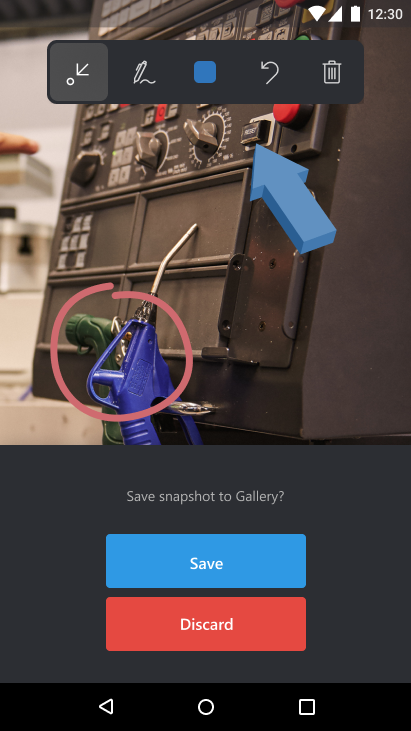

# Capture and annotate snapshots 

Remote Assist Mobile provides technicians with the ability to capture and annotate snapshots of their environment during a call.

Snapshots are critical in situations where a still image might help communicate what a technician is looking at. Annotations provide additional tools to emphasize specific elements in the snapshot. These snapshots can then be used later for reference or work validation, and can provide relief in low-bandwidth scenarios where video just isn't cutting it.  

## How it works

1.	During a Remote Assist Mobile call, select the **Snapshot** icon to snap your photo. 

2. The snapshot is shared to the expert's screen on Microsoft Teams.

3. If the technician wants to capture a snapshot of their environment without annotations, you can skip to Step 5.

4. Both the technician and expert can add annotations to the snapshot. The expert has to select **Start Editing** to add annotations to the snapshot. 

5.	After both the technician and expert are finished annotating on the snapshot, the technician selects the **Check Mark** to save their snapshot to their mobile device's Photo Gallery.

6.	The technician is prompted to save the snapshot to their mobile device's photo gallery or discard the snapshot.

1. The technician is taken back to the live video call and can select the snapshot icon to take more snapshots.

8.	At the end of the call, the technicians can now go to their mobile device’s **Photo Gallery** and view the snapshots. They can share it with others or include it on their Dynamics 365 Field Service work order. 
