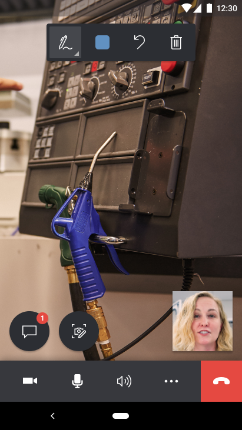
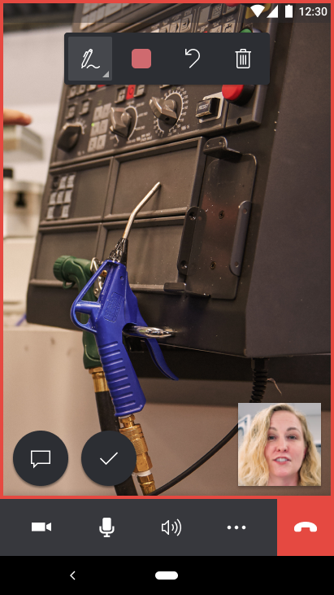
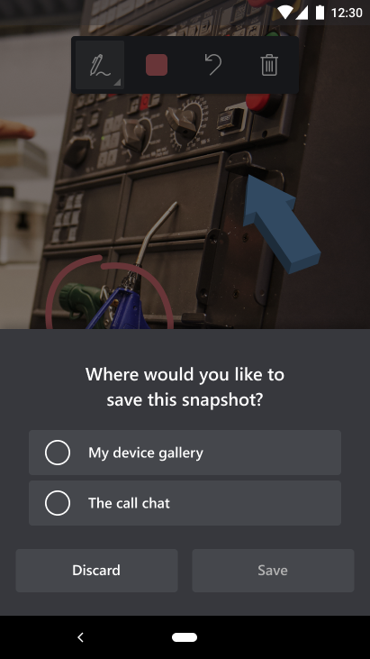
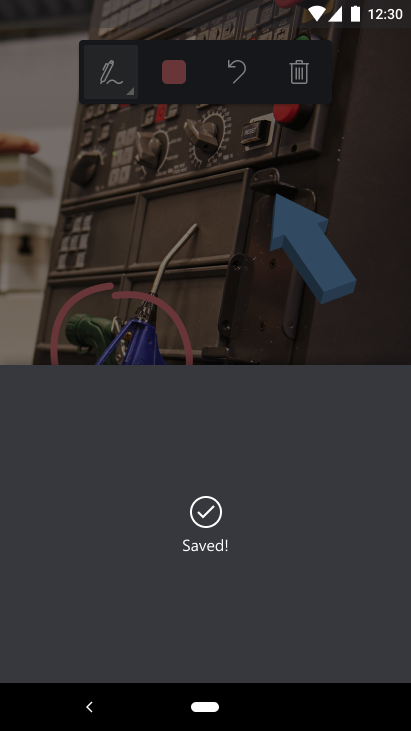

# Capture and annotate snapshots in Dynamics 365 Remote Assist mobile 

Snapshots are critical in situations where a still image might help communicate what a technician is looking at. Placing 2D annotations on snapshots provides emphasis on specific elements in the technician's environment. These snapshots can be used later for reference or work validation, and can help in low-bandwidth scenarios where live video isn't possible or on devices without augmented reality support. [Learn more about using snapshots in low-bandwidth scenarios](./poor-network-connectivity.md) and on [devices without augmented reality support](./calls-using-devices-without-AR.md). 

Dynamics 365 Remote Assist mobile users can capture and annotate snapshots of their environment during a call. Users can then save the snapshot to their mobile device gallery, the in-call text chat, or both.

If the technician is using Dynamics 365 Field Service, they can also [post snapshots to an associated Dynamics 365 Field Service work order](./fs-integration.md).

## How it works

1. The technician, who is using Dynamics 365 Remote Assist mobile, selects the **Snapshot** button to snap a photo. 

    

    A **red border** appears on the technician's screen to indicate that the app is in Snapshot mode. The snapshot is automatically shared to the remote collaborator's screen on Microsoft Teams.

    

2. Both the technician and remote collaborator can place 2D annotations on the snapshot. 

    

3.	When the technician and remote collaborator are finished annotating the snapshot, the technician selects the **Check mark** button.  

    

4.	The technician is prompted to save the snapshot to the mobile device gallery, text chat, or both. 

    

5. IF the technician selects **Save**, the technician is notified that the snapshot has been successfully saved or failed. If the snapshot has not been saved, the technician can take another snapshot. 

    

6. The technician returns to the live video call and can select the **Snapshot** button again to take more snapshots. 
   
    >[!NOTE] 
    > Annotations added on a snapshot do not appear in the technician's environment after the snapshot has been saved or discarded. 

7. If the technician successfully saved the snapshot, at the end of the call, they can view the snapshot in the mobile device gallery and/or Microsoft Teams text chat. 

8. If the technician is a Dynamics 365 Field Service customer and saved their snapshot to the text chat, after the call ends, the technician can post their snapshot(s) to an associated work order and view the snapshot there. [Learn more about Dynamics 365 Field Service integration](./fs-integration.md).

    

[!INCLUDE[footer-include](../../includes/footer-banner.md)]
