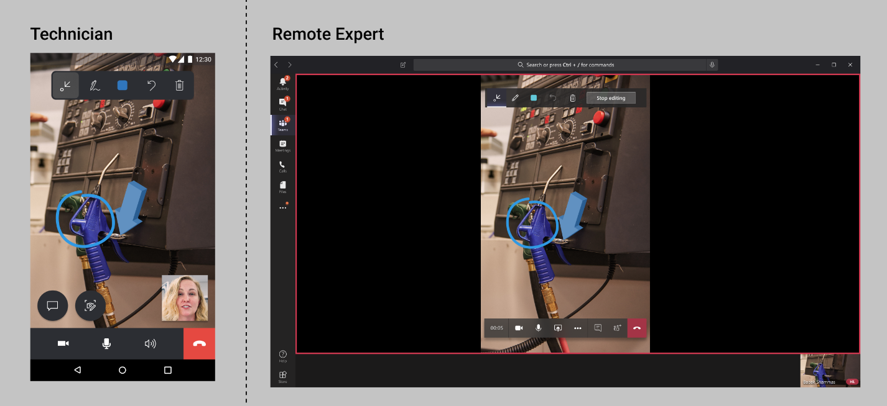

# Annotate your environment 

In Dynamics 365 Remote Assist mobile, annotations make it so technicians and remote experts can visually specify an area or particular asset in their environment to look at or manipulate. Both the technician and expert can add annotations to what they're looking at, and share with each other during a video call. 

Let's take a look at what this looks like in action. In this article, we assume that a **field technician** is using **Remote Assist mobile** in the field, while the **remote expert** is elsewhere on a desktop using **Microsoft Teams**.

## Annotating for technicians

1. The annotation toolbar allows technicians to place **Arrows** and **Drawings** into their environment. The **Color picker** changes the color of your annotations. The **Undo** icon allows technicians to remove the last annotation that they placed in their environment. The **Delete All** icon allows technicians to remove all annotations that they placed in their environment (they cannot remove the expert's annotations). 

2. Place your annotations to your environment. The expert will see your annotations in real-time on Microsoft Teams. 
###

###

## Annotating for remote experts

1. The annotation toolbar allows experts to place **Arrows** and **Drawings** into their environment. The **Color Picker** changes the color of your annotations. The **Undo** icon allows experts to remove the last annotation that they placed in their environment. The **Delete All** icon allows experts to remove all annotations that they placed in their environment (they cannot remove the technician’s annotations).

2. To add annotations, you must click **Start editing**. 

3. You will enter a **frozen frame** of the technician's environment and then add your annotations. Your annotations will automatically appear on the technician's environment.

4. To stop adding annotations to the snapshot, you must select **Stop editing**. You will return to the technician's live video feed.

###
