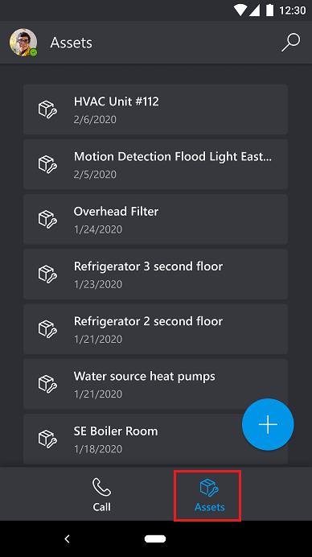
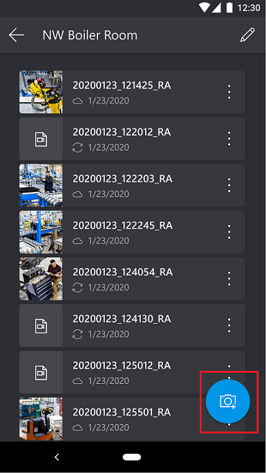
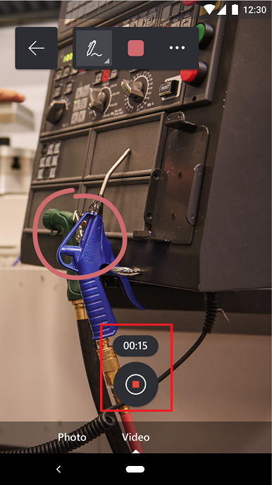

# Capture asset conditions with spatial markup on mobile devices

You can use Dynamics 365 Remote Assist to capture procedures and defects during jobs such as an inspections or repairs. For example, a technician can use the Dynamics 365 Remote Assist mobile app to capture photos or videos of the equipment they're inspecting, to highlight defects like wear and corrosion. The captures can then be viewed and downloaded from the Dynamics 365 Remote Assist model-driven app by stakeholders within the organization, such as a service manager or site superintendent.

This article shows how to use the mobile app to view asset records created from the Dynamics 365 Remote Assist model-driven app and capture photos and videos of assets with spatial markup.

## Prerequisites

To capture and view assets you need:

- **Access to the environment that Dynamics 365 Remote Assist is installed in**. The account you use to sign in to Dynamics 365 Remote Assist needs access to the environment created in the first step and an active Dynamics 365 Remote Assist license.

- **Dynamics 365 Remote Assist mobile app**. Make sure to:

    - Download the latest update to Dynamics 365 Remote Assist from the app store. 

    - Select the [correct environment from the app settings](.././asset-capture-add-users.md#select-the-right-environment-on-android-or-ios).

## Capture asset conditions

### View the asset list

- Select the **Assets** tab. The list of assets entered through the Dynamics 365 Remote Assist model-driven app are displayed in descending order by the last-modified date. You can search for assets by using the **Name** field or by selecting the search button.

    > [!NOTE]
    > The **Assets** tab is currently **not** accessible while you're on a call in the mobile app.

### Capture photos or videos with spatial markup

1. On the **Assets** tab, select an asset from the list. You can also use the search button at the top of the page.

    

2. Once you have selected an asset, you'll see a list of previously captured photos or videos associated with that asset. You can select any of the captures to view photos or playback videos. You can also delete the captures from this list view. To record a new capture, select the **Camera** tool near the bottom.

    

3. While recording a new capture, you can use ink or arrow tools to mark up the asset in your environment. For example, you can circle a defect on an asset. When you're done annotating, select the capture button to take a photo of the asset, which will include the mixed-reality annotations you added.

    

4. You can also switch to the video capture view and tap the capture button to initiate video recording. The capture button will change and show a countdown timer from the maximum video length available. You can add further mixed-reality mark-up during the video capture. Tap the capture button again to stop recording.

    

> [!NOTE]
> Captured photos and videos are saved both locally to the mobile device and to Microsoft Dataverse, where they're viewable from the Dynamics 365 Remote Assist model-driven app.

## Next step

[Review the captured data in the Dynamics 365 Remote Assist model-driven app](./../asset-capture-review.md).

## Troubleshooting

### No assets appear when I select the Assets tab

1. Make sure that the environment you're using has asset records. More information: [Create asset records](./../asset-capture-create-asset.md).

2. If you added the asset records from the model-driven app while the Dynamics 365 Remote Assist app was already open on your mobile device, close the app and reopen it to pull in the latest updates.

### The asset records I see aren't what I expected

The user account might have access to more than one environment with Dynamics 365 Remote Assist installed. If this is the case, you need to select the correct environment.

1. Select **Settings** > **Dynamics 365 environment**.

2. Select the environment you want from the list.

3. Select the **Assets** tab. You might need to select **Retry** if prompted.

[!INCLUDE[footer-include](../../includes/footer-banner.md)]
