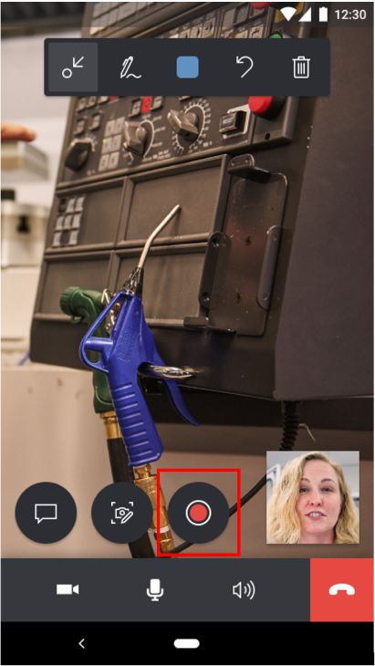
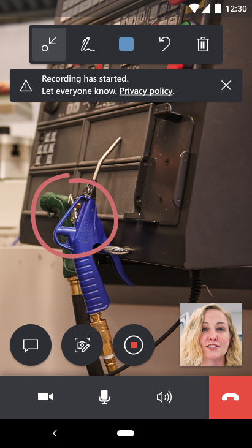
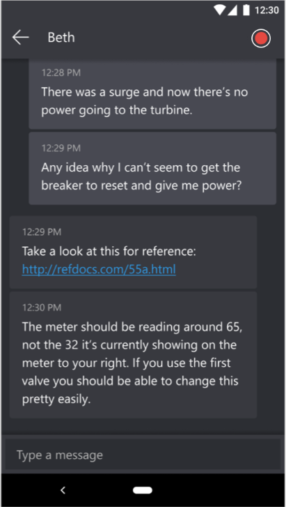

# Capture session history through call recordings in Dynamics 365 Remote Assist mobile

With call recording, technicians can comprehensively document their Dynamics 365 Remote Assist mobile video calls with remote collaborators. For businesses, it's important to keep a record of different incidents on a daily basis. Often, these records are kept through paper trails or text-based collateral. By capturing and tracking Dynamics 365 Remote Assist video sessions, operations managers, technicians, and business decision makers can use call recordings for:

- Reference for **follow-up work**.
- **Validation** that the maintenance and repair process was completed correctly.
- **Training material** for their workers.

This feature is only available for **one-to-one or group calls** with Dynamics 365 Remote Assist mobile. After the call recording ends, it's automatically uploaded to **Microsoft Stream**. After the recording is uploaded, all call participants can access it via their Dynamics 365 Remote Assist mobile call text chat or the Microsoft Teams chat. The Dynamics 365 Remote Assist mobile user, who started the call recording, can also see it in their [Microsoft Stream videos folder](https://web.microsoftstream.com/studio/videos).

The following chart explains which call participant can initiate a call recording in each type of call with a Dynamics 365 Remote Assist mobile user:

| In a...  |Can a Dynamics 365 Remote Assist mobile user record?     |Can a Dynamics 365 Remote Assist HoloLens user record?     | Can a Teams desktop user record? |  Can a Teams mobile user record?  |  
|---|---|---|---|---|
|  One-to-one call |  Yes |  Yes |  Yes | Yes |
|  Group call |  Yes | Yes | Yes | N/A - calling scenario not currently supported |  

## How it works

1. The technician selects the record button to **start** the call recording.

2. The technician will receive privacy notification with Microsoft’s privacy policy and the call recording will begin. The notification can be dismissed.

3. During all parts of the call, the technician can see that the call recording is in progress as seen in the **call recording indicator** in the text chat.

4. The technician can select the record button to **stop** the call recording at any point in their call. Afterwards, both call participants will receive a notification that the call recording will be available in Microsoft Stream. The notification can be dismissed at any time. Once the call recording has been uploaded to Microsoft Stream, both participants can access it through the **Dynamics 365 Remote Assist mobile call text chat**, **Microsoft Teams text chat**, or on the **Microsoft Stream video folder**.

[!INCLUDE[footer-include](../../includes/footer-banner.md)]
