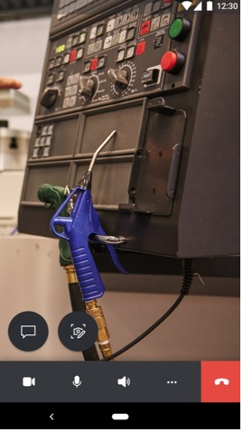
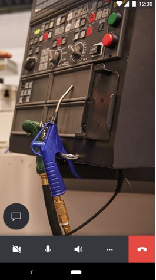
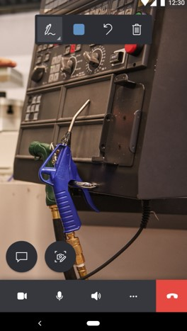
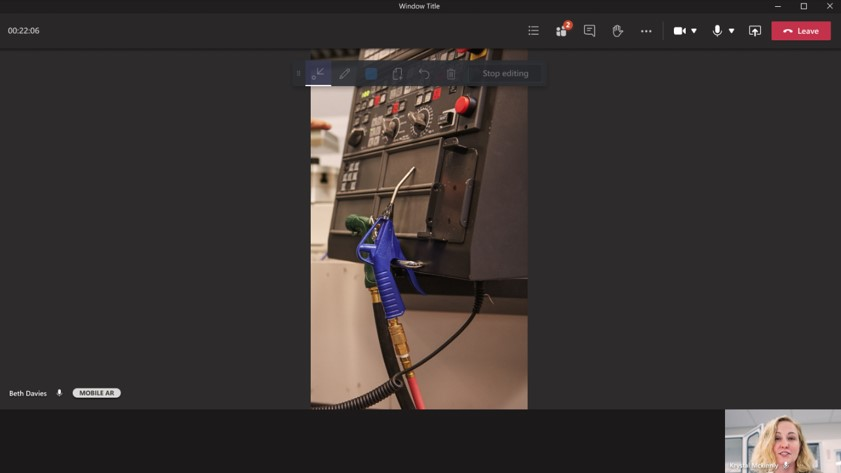
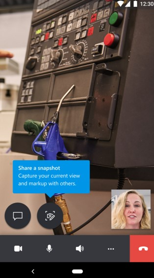
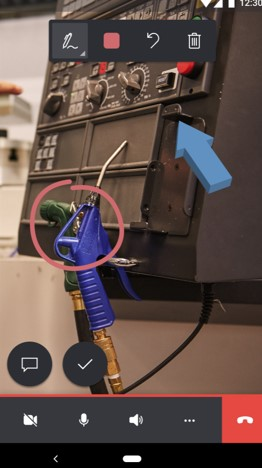
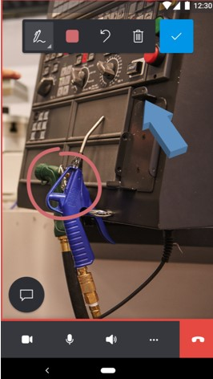
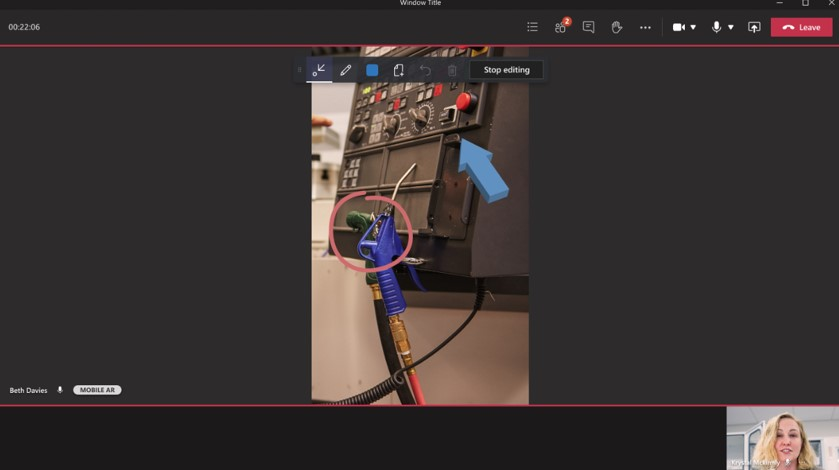

# Dynamics 365 Remote Assist mobile calls on mobile devices without augmented reality support

Microsoft Dynamics 365 Remote Assist mobile makes conducting repairs and remote inspections easy by providing technicians with the ability to launch one-to-one and group video calls with remote collaborators inside or outside of their organization, even if either or both users are using mobile devices **without** ARCore or ARKit support.

Due to limitations of mobile devices without ARCore or ARKit support, technicians and remote collaborators cannot provide instructions using 3D annotations on a live video feed. Technicians can share their live video feed of their environment and both technicians and remote collaborators can provide instructions on **snapshots** using 2D annotations. Learn about the [snapshot feature capabilities](./annotate-snapshot.md).

## Prerequisites

- This article is designed to help users who have a mobile device without ARCore or ARKit support. [Learn about Dynamics 365 Remote Assist device requirements](../requirements.md). If your device is *not* listed on the [Android/ARCore supported devices list](https://developers.google.com/ar/discover/supported-devices) or [iOS/ARKit supported devices list](https://developers.google.com/ar/discover/supported-devices#ios), your device does not support augmented reality.
- Technicians must have a [Dynamics 365 Remote Assist free trial](../try-remote-assist.md) or a [Dynamics 365 Remote Assist subscription](../buy-remote-assist.md).
- Remote collaborators must have a Dynamics 365 Remote Assist free trial or subscription and a Microsoft Teams [free trial or subscription](https://www.microsoft.com/microsoft-365/microsoft-teams/group-chat-software). Learn how to set up Dynamics 365 Remote Assist with [Teams desktop](../teams-pc-all.md) and [Teams mobile](../teams-mobile-all.md).

## How it works

1. Launch and sign in to Dynamics 365 Remote Assist on your iOS or Android phone or tablet.

2. After you sign in, you'll receive a notification about using Dynamics 365 Remote Assist on a mobile device without augmented reality support.

   

3. When you dismiss the notification, you'll see the **Contacts** page.

   

4. Select the remote collaborator's name, and then select **Launch call**.   

   
   
   > [!NOTE]
   > If the remote collaborator receives the call on a mobile device with both Dynamics 365 Remote Assist mobile and Teams mobile installed, the remote collaborator can only answer on Teams mobile. Both users will have the same capabilities.

5. If the remote collaborator answers the call on Dynamics 365 Remote Assist mobile, the technician's live video feed is shared to the remote collaborator's mobile app screen.

    |Technician|Remote collaborator|
    |------------------------------------------------|------------------------------------------------|
    |||  

   > [!NOTE]
   > Technicians can't place mixed-reality annotations on the live video feed; they can only place annotations on the in-call snapshots.

   If the remote collaborator answers the call on Teams desktop, the technician's live video feed is shared to the remote collaborator's device screen.
   
   |Technician|Remote collaborator|
   |----------------------------------|--------------------------------------------------------------------|
   |||  

   > [!NOTE]
   > Technicians can't place mixed-reality annotations on the live video feed; they can only place annotations on the in-call snapshots.

6. The technician is directed to use the snapshot feature to add 2D annotations on a frozen video frame of their shared environment.

   

7. If the remote collaborator is using Dynamics 365 Remote Assist mobile, when the technician selects the **Snapshot** button, the technician enters Snapshot mode, which captures a frozen frame of the technician's environment and shares it to the remote collaborator's screen. Both the technician and the remote collaborator will see the mixed-reality toolbar and can  place 2D annotations on the frozen frame of the technician's environment.

   |Technician|Remote collaborator|
   |------------------------------------------------|------------------------------------------------|
   |||  

   If the remote collaborator is using Teams desktop, when the technician selects the **Snapshot** button, the technician enters Snapshot mode, which captures a frozen frame of the technician's environment and shares it to the remote collaborator's screen. Both the technician and the remote collaborator will see the mixed-reality toolbar and can place 2D annotations on the frozen frame of the technician's environment.

   |Technician|Remote collaborator|
   |----------------------------------|--------------------------------------------------------------------|
   ||| 

9. After both the technician and remote collaborator are finished annotating on the snapshot, the technician selects the **Check mark** button to save or discard the snapshot.

10. The technician is prompted to discard the snapshot or save it to the device gallery, text chat, or both. The technician then selects **Save**.

    

11. If the technician successfully saved the snapshot to the text chat, the snapshot can be viewed in the Dynamics 365 Remote Assist mobile text chat and the Microsoft Teams text chat.

    

12. The technician is then taken back to the live video call and can select the **Snapshot** button again to take more snapshots.

    > [!NOTE]
    > Annotations added on a still snapshot will *not* appear in the technician's environment after they have been saved or discarded.

13. Both the technician and remote collaborator can send and receive messages and files from their local device in the text chat. [Learn more about the file sharing](./file-sharing.md).

    

14. Both the technician and remote collaborator can record the one-to-one Dynamics 365 Remote Assist call as long as the remote collaborator is using Microsoft Teams desktop. The recording will be saved to Microsoft OneDrive or SharePoint and the link to the recording will be sent to the Microsoft Teams text chat. [Learn more about call recording](./call-recording.md).

    

15. If the technician is a Dynamics 365 Field Service customer, at the end of the call, the technician can choose to post the call logs, files, and snapshots shared in the text chat to an associated work order. [Learn more about Dynamics 365 Field Service integration(./fs-integration.md).

    

[!INCLUDE[footer-include](../../includes/footer-banner.md)]
