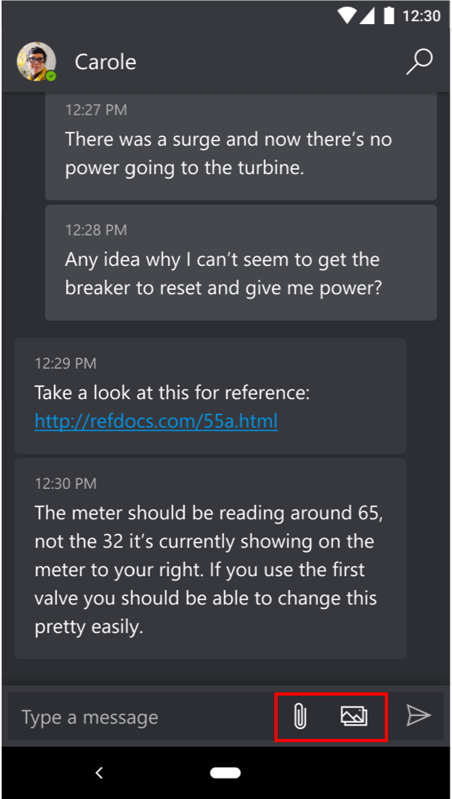
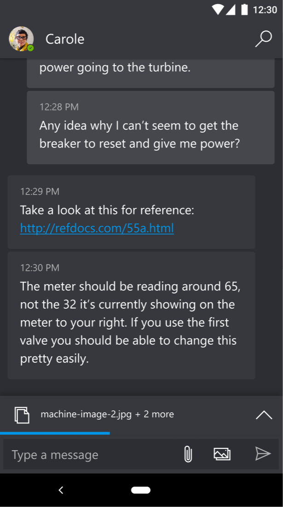
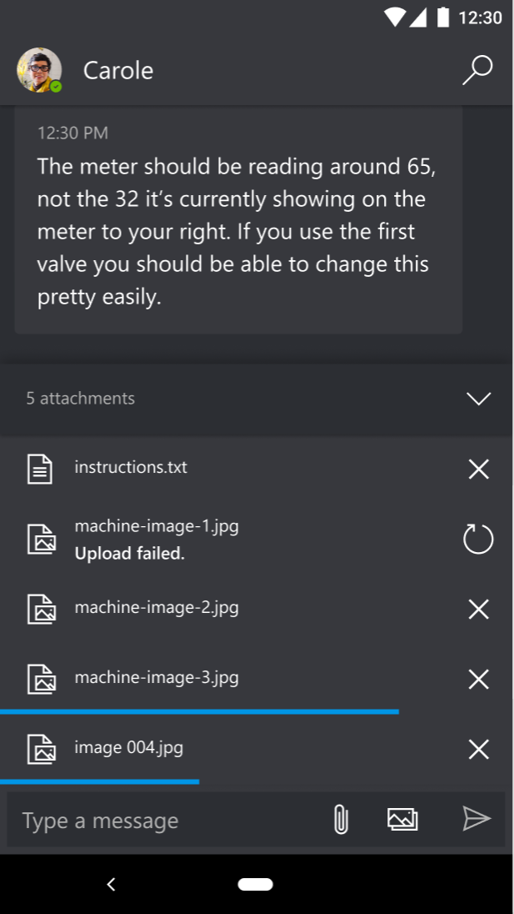
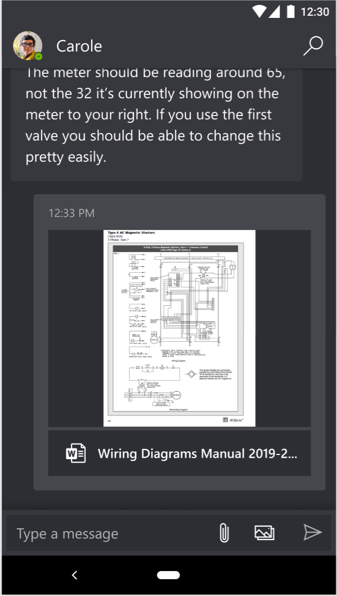

# Share files to improve collaboration in Dynamics 365 Remote Assist mobile

Dynamics 365 Remote Assist mobile provides technicians and remote collaborators with document-sharing capabilities. Sharing documents promotes collaboration during a call by adding more context and information (such as visual aids or schematics) to the technician's environment. Sharing files can help technicians have richer conversations with remote collaborators and solve problems more quickly.  
 
Both the technician and remote collaborators can send *any* file type to each other. File types include, but are not limited to: 

- .jpg 
- .png 
- .tiff 
- .mp4 
- .pdf 
- .docx 
- .xlsx 
- .pptx
- .txt 
 
They can upload files and images from their local device or OneDrive. Once the files and/or images are shared, they will be accessible in the [OneDrive account](https://onedrive.live.com/about/signin/) in the **Files** > **RemoteAssistMobile** folder. Also, once the user selects and opens a file or image, it will be downloaded to the user's local **Downloads** folder. In order for technicians to open and access these different file types, they will need the corresponding app that supports the file type. In-app previews may be available, depending on the file type and size.

For Dynamics 365 Field Service users, the files shared during the Dynamics 365 Remote Assist mobile call can be linked to a work order. For more information, see [Field Service integration](./fs-integration.md).

## Send a file 

1. The technician selects **text chat** to start sharing files with the remote collaborator. The **Attachment** and **Image** buttons appear at the bottom of the text chat.

   

2. The technician:

    - Selects the **Attachment** button to select files from the mobile device's file chooser or files app. 

       > [!Note]
       > For iOS, the technician sees the files app. On Android, the technician sees a file chooser or a menu to choose an app to use as the file chooser.

    - Selects the **Image** button to select images from the mobile device's photo gallery or files app. 
   
       > [!Note] 
       > For iOS, the technician sees the photos app. On Android, the technician sees a photo gallery or a menu to choose an app to use as the picture chooser.

   The technician can select up to five files or images at a time to send to the remote collaborator. The technician sees a progress indicator until the files or images are ready to be sent.

   

3. If some of the files or images are not successfully uploaded in the text chat, the technician can select the **retry icon** to upload a file or image again or can discard any files or images before sending. 

   

5. The technician selects the **Send** button.

    Once sent, the file link and image preview are sent to the remote collaborator through **OneDrive**, which sets the permission to share the file. Afterwards, the remote collaborator on Microsoft Teams receives a link to the document in OneDrive in the Microsoft Teams text chat. The remote collaborator has full access to the files and images sent. 

   

## Receive files 

- When the remote collaborator sends a file or image to the technician, the technician can select the file's link or image preview to open it. After selecting and opening the file or image, it's automatically downloaded to the mobile device's **Downloads** folder. 

   If the technician selects the remote collaborator's image preview, the default application opens the image. If more than one app supports this file type, the technician can use a menu to choose the application to open the image. 

   If the technician selects the remote collaborator's file and the technician has an app that can open that file type, the default application opens the file. If more than one app supports this file type, the technician can use a menu to choose the application to open the image. 
 
   If the technician doesn't have an app that can open that file type, the technician can't view the file. The technician is prompted on how to open the file and can download the corresponding app to open the file.

[!INCLUDE[footer-include](../../includes/footer-banner.md)]
