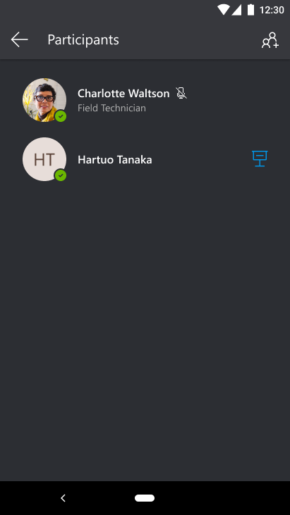
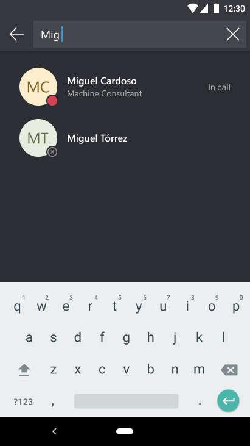
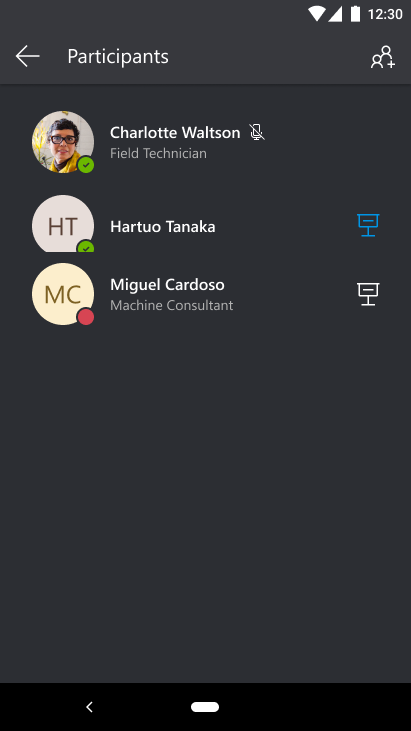
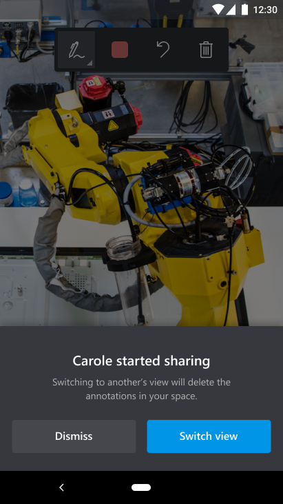
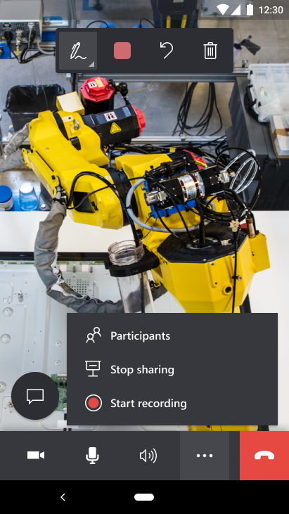
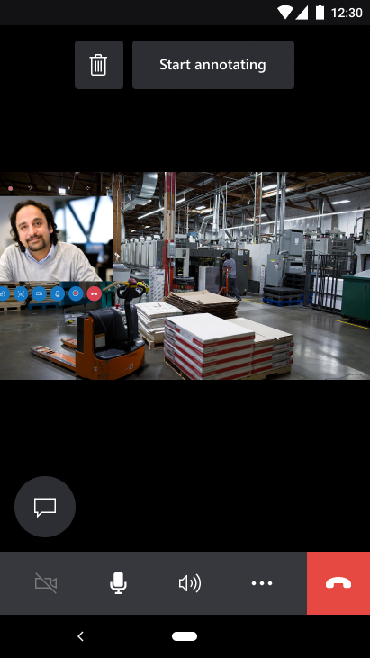

# Group calls with Dynamics 365 Remote Assist mobile

Many problems often require more than one specialist from around the world with different knowledge domains. Having multiple perspectives on a problem is crucial in providing technicians with the ability to accurately resolve problems. With the ability to join Dynamics 365 Remote Assist mobile calls with three or more participants, technicians can collaborate with more than one specialist for guidance, validation, or knowledge sharing purposes.

A group call on Dynamics 365 Remote Assist mobile begins as a one-to-one call, and any call participant can add someone to the call. During a group call, there can be any combination at least three or more participants using Dynamics 365 Remote Assist mobile, Dynamics 365 Remote Assist HoloLens, or Microsoft Teams desktop. For instance, there can be two users on Dynamics 365 Remote Assist mobile and one user on Teams desktop, or two users on Dynamics 365 Remote Assist mobile and two users on Teams desktop.

> [!NOTE]
> Dynamics 365 Remote Assist mobile does **not** support group calls with Teams mobile at this time. The Teams mobile user can join the group call, but will not be able to add mixed reality annotations in the shared environment.

## Viewing + adding call participants

1. In a one-to-one call with a remote collaborator, a Dynamics 365 Remote Assist mobile user can add more participants in the call by selecting the  > **Participants**.

> [!NOTE]
> Group calls on Dynamics 365 Remote Assist mobile can only be initiated from a one-to-one call.

2. Select **+ Participants** in the top right of the screen.

3. Search for the remote collaborator's name that you want to call and select their name to add them to your call. You can wait to see if they have joined or declined the call with these loading notifications: **Connecting...** > **In call** or **Declined**.

4. You can also view their name in the **Participants** pane contact list and see if they have joined the call.

5. Return to the live video feed to continue to collaborate with all call participants.

## Sharing your space + viewing others shared space

### On Dynamics 365 Remote Assist mobile

1. You can view other Dynamics 365 Remote Assist mobile users' spaces when they start sharing them. Select **Switch view** or **Dismiss**.

2. You can also choose which call participant's shared space to view by selecting their name in the **Participants** pane contact list, when there are multiple presenters.

> [!NOTE] 
> On the **Participants** pane, the presenter icon in **blue** shows you which participant's space you are currently viewing. The presenter icon in **white** shows you which participants who are currently sharing their space. You may choose to switch to another participant who is sharing their space.  

3. You can stop sharing your space by selecting  > **Stop sharing**. You will be taken to an audio call. 

### On Remote Assist HoloLens

1. You can **only** share your environment to all call participants on Remote Assist mobile, Remote Assist HoloLens, or Teams desktop.

### On Teams desktop

1. You can **only** view the shared space of the Remote Assist mobile and Remote Assist HoloLens users. 

## Adding + receiving annotations

### On Dynamics 365 Remote Assist mobile

1. You can add mixed reality annotations to other Dynamics 365 Remote Assist mobile and Dynamics 365 Remote Assist HoloLens users. 

2. You can receive mixed reality annotations from Dynamics 365 Remote Assist mobile and Team desktop users. 

### On Remote Assist HoloLens 

1. You can add mixed reality annotations in your own environment. 

2. You can receive mixed reality annotations from Dynamics 365 Remote Assist mobile and Teams desktop users. 

### On Teams desktop

1. You can add mixed reality annotations to the Dynamics 365 Remote Assist mobile and Dynamics 365 Remote Assist HoloLens users' shared space. 

## Other capabilities

1. During a group call, all call participants can send chat messages and share files with each other. 

2. A group call can be recorded and uploaded through Microsoft Stream. All call participants can start recording the call. 

## FAQs

### What is the difference from a group call and a meeting?
A group call is a one-to-one call that call participants can add more participants to. A meeting is scheduled via Microsoft Teams or Outlook. At this time, Dynamics 365 Remote Assist mobile does not support meetings.

### Can Teams mobile join a group call?
Yes, but the Teams mobile user will not be able to add mixed reality annotations in the shared environment. 

### Can a Remote Assist HoloLens user annotate in another call participant's environment?
No. They can only add mixed reality annotations in their own environment and receive mixed reality annotations from other users.

### How many customers can join a Dynamics 365 Remote Assist mobile group call? 

Right now, there are no limitations to the number of participants in a group call. However, with a large number of participants, you may experience some performance issues, such as delays in viewing annotations.
