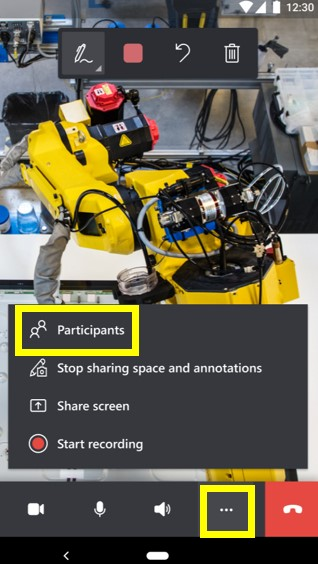
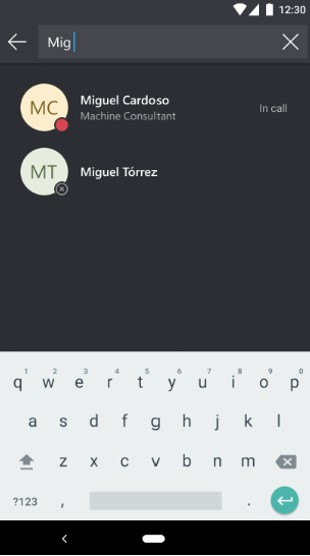
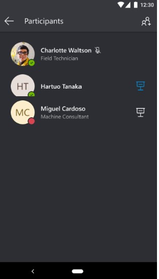
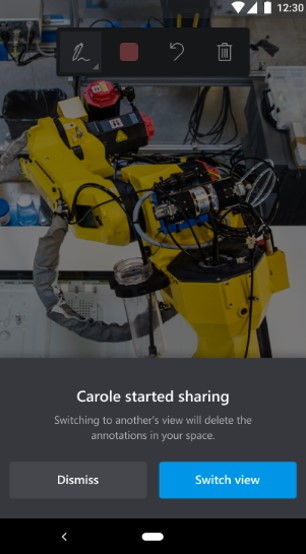
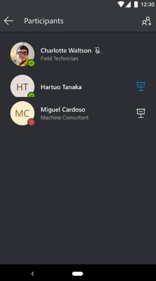
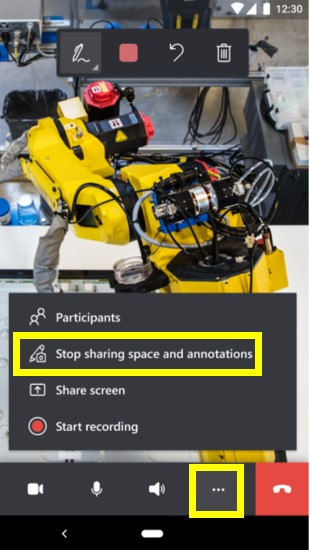

# Group calls in Dynamics 365 Remote Assist mobile

Many problems are easier to solve if you can bring together specialists from around the world with different knowledge sets. Having multiple perspectives is crucial in providing technicians with the ability to accurately resolve problems. With the ability for three or more participants to join Dynamics 365 Remote Assist mobile calls, technicians can collaborate with more than one specialist for guidance, validation, or knowledge-sharing purposes.

A group call in Dynamics 365 Remote Assist mobile begins as a one-to-one call. Any call participant can then add an additional participant to the call. During a group call, there can be any combination of three or more participants using Dynamics 365 Remote Assist mobile, Dynamics 365 Remote Assist HoloLens, or Microsoft Teams desktop. For example, there can be two users on Dynamics 365 Remote Assist mobile and one user on Teams desktop, or two users on Dynamics 365 Remote Assist mobile and two users on Teams desktop.

> [!NOTE]
> Dynamics 365 Remote Assist mobile does not support group calls with Teams mobile at this time. The Teams mobile user can join the group call, but can't add mixed-reality annotations in the shared environment.

## Viewing and adding call participants

1. In a one-to-one call with a remote collaborator, a Dynamics 365 Remote Assist mobile user can add more participants to the call by selecting  > **Participants**.   

   
   
   > [!NOTE]
   > Group calls on Dynamics 365 Remote Assist mobile can only be initiated from a one-to-one call.

2. Select **+ Participants** in the top right corner of the screen.

   

3. Search for the remote collaborator's name, and then select their name to add them to your call. You can wait to see if they have joined or declined the call with these loading notifications: **Connecting...** > **In call** or **Declined**.

   

   You can also view their name in the **Participants** pane contact list to see if they have joined the call.

   

4. Return to the live video feed to continue collaborating with all call participants.

## Sharing your space and viewing other shared spaces

### On Dynamics 365 Remote Assist mobile

1. You can view other Dynamics 365 Remote Assist mobile users' spaces when they start sharing. Select **Switch view** to view their space.

   

   If there are multiple presenters, you can choose which shared space to view by selecting the participant's name in the **Participants** pane contact list.

   > [!NOTE] 
   > In the **Participants** pane, the blue presenter icon shows the participant's space that you're viewing. The white presenter icon indicates other participants that are sharing their spaces. You can switch to another participant's space.  

   

2. To stop sharing your space, select  > **Stop sharing**. You'll switch to an audio-only call. 

   

### On Dynamics 365 Remote Assist HoloLens

- You can only share your environment with all call participants on Dynamics 365 Remote Assist mobile, Dynamics 365 Remote Assist HoloLens, or Teams desktop.

### On Teams desktop

- You can only view the shared space of Dynamics 365 Remote Assist mobile and Dynamics 365 Remote Assist HoloLens users. 

## Adding and receiving annotations

### On Dynamics 365 Remote Assist mobile

- You can add mixed-reality annotations to other Dynamics 365 Remote Assist mobile and Dynamics 365 Remote Assist HoloLens users' shared space. 

- You can receive mixed-reality annotations from Dynamics 365 Remote Assist mobile and Team desktop users. 

### On Dynamics 365 Remote Assist HoloLens 

- You can add mixed-reality annotations in your own environment. 

- You can receive mixed-reality annotations from Dynamics 365 Remote Assist mobile and Teams desktop users. 

### On Teams desktop

- You can add mixed-reality annotations to Dynamics 365 Remote Assist mobile and Dynamics 365 Remote Assist HoloLens users' shared space. 

## Other capabilities

- During a group call, all call participants can send chat messages and share files with each other. 

- A group call can be recorded and uploaded to Microsoft OneDrive for Business or SharePoint. Any call participant can start the call recording. 

## FAQ

### What is the difference between a group call and a meeting?
A group call is a one-to-one call that call participants can add more participants to. A meeting is scheduled via Microsoft Teams or Outlook. At this time, Dynamics 365 Remote Assist mobile does not support meetings.

### Can Teams mobile users join a group call with Dynamics 365 Remote Assist users?
Yes, but Teams mobile users can't add mixed-reality annotations in the shared environment. 

### Can a Dynamics 365 Remote Assist HoloLens user annotate in another call participant's environment?
No. They can only add mixed-reality annotations in their own environment and receive mixed-reality annotations from other users.

### How many participants can join a Dynamics 365 Remote Assist mobile group call? 

[Learn about the number of participants that can join a Microsoft Teams call](/MicrosoftTeams/limits-specifications-teams#meetings-and-calls). 

> [!NOTE]
> With a large number of participants, you may experience performance issues, such as delays in viewing annotations.

[!INCLUDE[footer-include](../../includes/footer-banner.md)]
