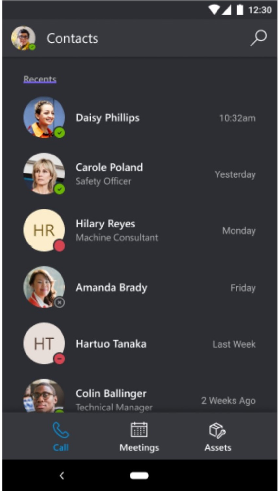
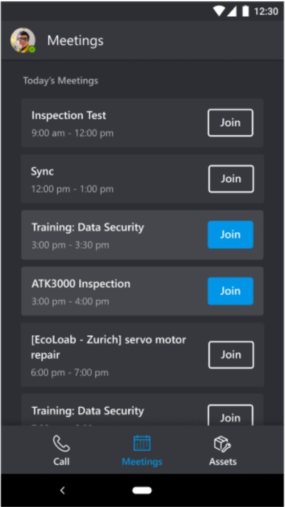

# Join a meeting from the Dynamics 365 Remote Assist mobile app

You can join a scheduled Microsoft Teams meeting, which can involve any number of participants, from the Dynamics 365 Remote Assist mobile app. Meetings are useful for maintenance and repairs that are scheduled in advance. They're also useful for inspections and other recurring scenarios.

## Join a meeting

1. In the **Contacts** screen, select **Meetings** at the bottom of the screen.  

    

2. In the **Meetings** screen, select the **Join** button next to the meeting you want to join.

    

> [!Note]
> If a remote collaborator joins a meeting, you will not receive a call or notification. You must select the **Join** button as described above to join the meeting. In addition, calling the participants involved in a scheduled meeting will not enable you to join the meeting; you must select the **Join** button. 

After you join a meeting, Teams users can add more people to the meeting.

> [!NOTE]
> If you're unable to join a meeting, you can ask a Teams user to join the meeting and use the **Open Participants** feature to call you. You'll receive an incoming call notification. 
> 
> You might not be able to join scheduled meetings between different companies if link-rewriting (URL-rewriting services) are used to fight spam. Your admin can resolve this problem by adding an exception so that links from teams.microsoft.com are not rewritten.  

