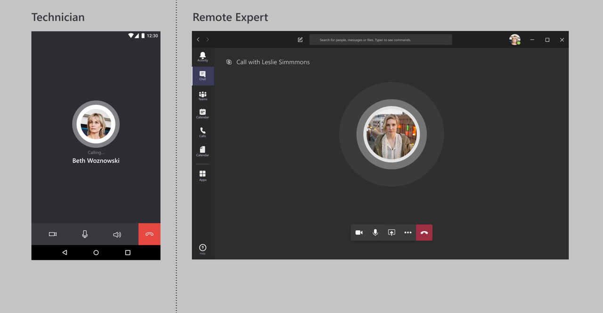
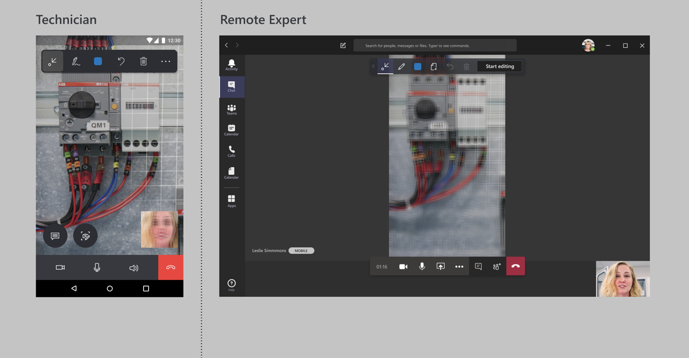
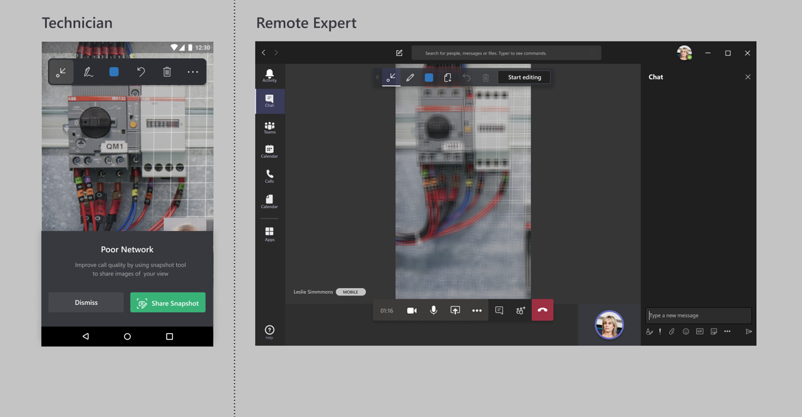
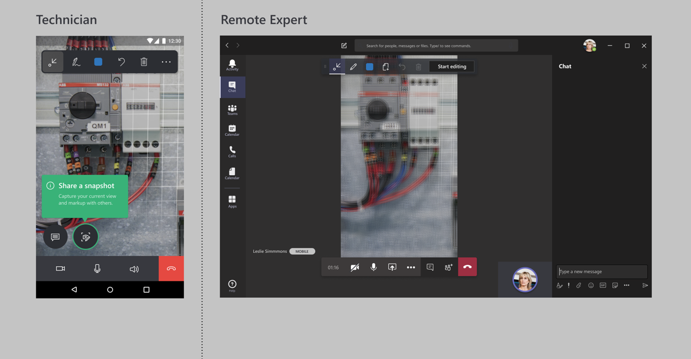
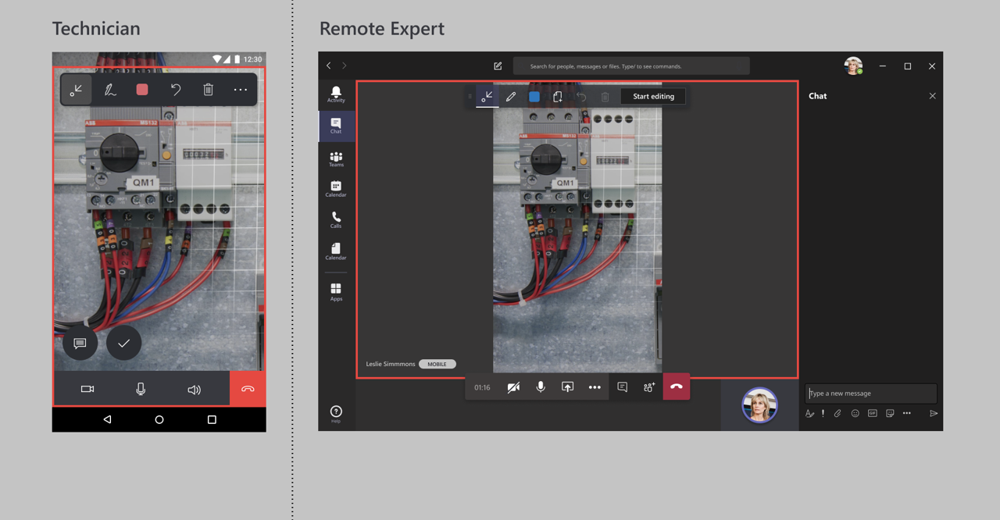
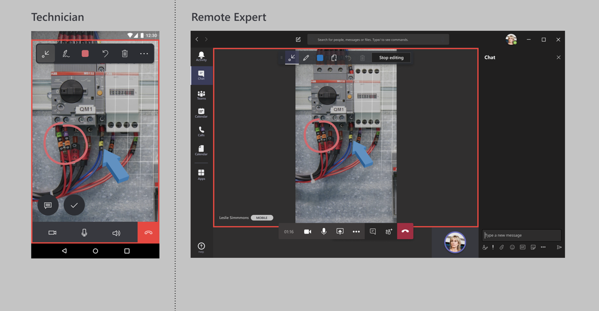
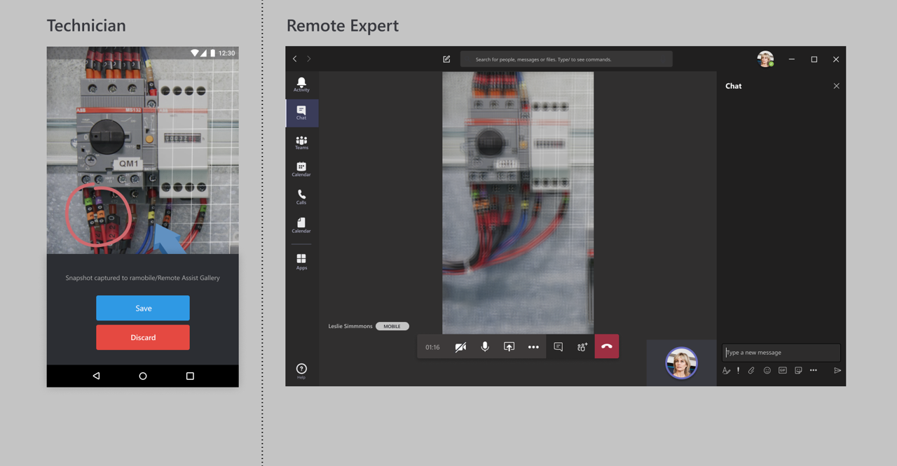

# Using Dynamics 365 Remote Assist in low bandwidth scenarios

Technicians sometimes find themselves on factory floors or remote locations with poor network connectivity. Without strong network connectivity (bandwidth (up/down) of 1.5 Mbps or higher), technicians may have trouble troubleshooting and resolving problems in real time. Dynamics 365 Remote Assist mobile now gives technicians the ability to discuss, diagnose, and resolve issues with remote collaborators even in low bandwidth scenarios.

### Poor network connectivity is determined by the following conditions: 

- The bandwidth is between 150 kbps and 1.5 Mbps
- The latency is higher than 1,000 ms
- The packet loss higher than 10 percent

Dynamics 365 Remote Assist mobile **autodetects** if the technician is experiencing poor network conditions. If so, the technician is prompted to **share snapshots** with the remote expert to collaborate, instead of transmitting a live video feed. This way, the expert can view and annotate images of better quality, instead of viewing a low-quality video feed.

### Individual poor network requirements
	
Poor network may take into account the interaction of the three components: **bandwidth**, **latency**, and **packet loss**:

- Minimum bandwidth (in/out) - 150 kbps / 150 kbps
- Maximum latency (in/out) - 500 ms / 500 ms (1,000 ms) 
- Maximum packet loss (in/out) - 10% / 10%  

 Here's an example of a poor network profile that allows users to sign into Dynamics 365 Remote Assist mobile and connect to a call with an expert.
    
| Variables  | Measurements |
| ------------- | ------------- |
| Bandwidth  | 150 kbps / 150 kbps  |
| Latency  | 400 ms / 400 ms = 800 ms  |
| Packet loss  | 10% / 10%  |

> [!NOTE]
> Given the above known values for **Bandwidth** and **Packet Loss**, exceeding a round trip **Latency** of 800 ms will result in a slower in-app experience. These variables are interdependent and change in one variable can affect the other variables. 

## How it works

Let's take a quick look at what happens in a field scenario when a technician encounters poor network connectivity. In this scenario, the technician is our field worker, while the  remote collaborator is elsewhere with good network conditions. 

1. The technician launches a video call with a remote collaborator.

 

2. In the call, Dynamics 365 Remote Assist mobile autodetects if the technician is experiencing poor network conditions. 

 

3. It prompts the technician to use the **snapshot tool** to share images to the expert.

 

4. The technician is instructed to use the **snapshot tool**.

 
 
5. The technician takes a snapshot, which is shared to the remote expert's screen. The remote collaborator now sees a snapshot of better quality!

 

6. The technician and remote collaborator can annotate simultaneously on the snapshot.

 

7. After sharing a snapshot, the technician can save it to the mobile device's **Photo Gallery** or **discard it**.

 

8. The technician now returns to the video call and can continue to send snapshots to the remote collaborator.

 

[!INCLUDE[footer-include](../../includes/footer-banner.md)]