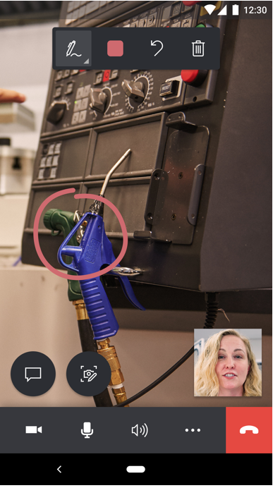
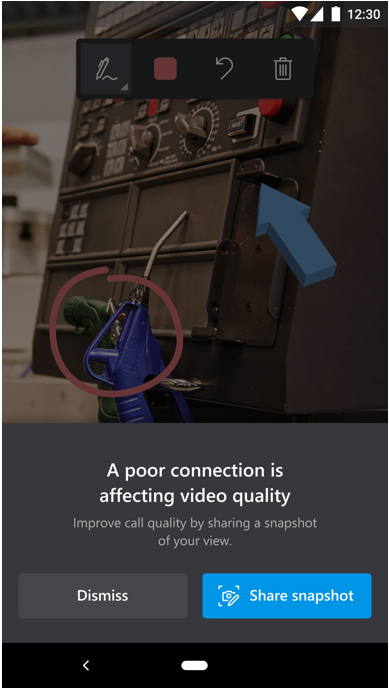
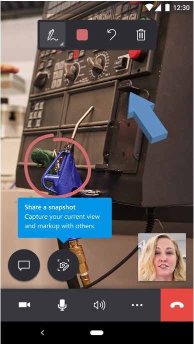
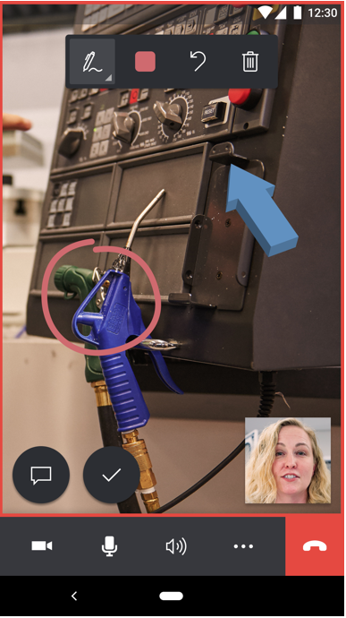
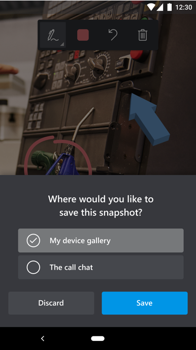
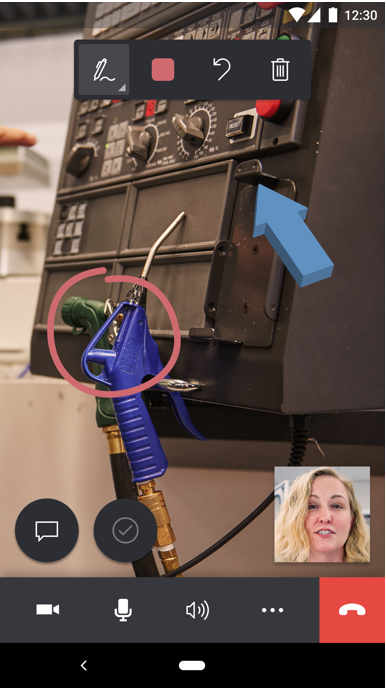

# Use the Dynamics 365 Remote Assist mobile app in low-bandwidth situations

Technicians sometimes find themselves on factory floors or remote locations with poor network connectivity. Without strong network connectivity (bandwidth (up/down) of 1.5 Mbps or higher), technicians might experience difficulty troubleshooting and resolving problems in real time. Dynamics 365 Remote Assist mobile now gives technicians the ability to discuss, diagnose, and resolve issues with remote collaborators even in low bandwidth scenarios.

## What determines poor network connectivity

Poor network connectivity is determined by the following conditions:

- The bandwidth is between 150 kbps and 1.5 Mbps

- The latency is higher than 1,000 ms

- The packet loss is higher than 10 percent

Dynamics 365 Remote Assist mobile **autodetects** if the technician is experiencing poor network conditions. If so, the technician is prompted to **share snapshots** with the remote expert to collaborate, instead of transmitting a live video feed. This way, the expert can view and annotate images of better quality, instead of a low-quality video feed.

## How it works

Let's take a quick look at what happens in a field scenario when a technician encounters poor network connectivity. In this scenario, the technician is a field worker. The remote expert is elsewhere with good network conditions. 

1. The technician launches a video call with a remote expert.

     

2. In the call, Dynamics 365 Remote Assist mobile autodetects if the technician is experiencing poor network conditions. If so, the technician is prompted to use the **Snapshot** tool to share images with the remote expert. 

     

3. The technician is instructed to use the **Snapshot** tool.

     

4. The technician takes a snapshot, which is shared to the remote expert's screen. The expert now sees a high-quality snapshot. The technician and expert can annotate simultaneously on the snapshot.

     
 
5. After sharing a snapshot, the technician can save it to the mobile device's photo gallery or call chat, or can discard it. 

     

6. The technician returns to the video call and can continue to send snapshots to the expert.	

      

> [!NOTE]
> The low-bandwidth feature is not supported in group calling scenarios. 

