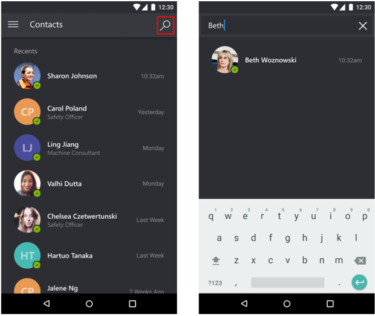

# Make Dynamics 365 Remote Assist mobile calls with augmented reality supported devices

Dynamics 365 Remote Assist mobile makes conducting repairs and remote inspections easy by providing technicians with the ability to launch one-to-one video calls with remote collaborators inside or outside of their organization. Experts can also use the mobile app to add annotations.

Calls with Dynamics 365 Remote Assist mobile is available for calls between:

- Two Dynamics 365 Remote Assist mobile users
- A Dynamics 365 Remote Assist mobile user and a Teams desktop user
- A Dynamics 365 Remote Assist mobile user and a Teams mobile user

> [!NOTE]
> The following scenarios are **not** supported on Dynamics 365 Remote Assist mobile at this time:
>
> - Making calls to browser-based Teams.
> - Participating in Dynamics 365 Remote Assist mobile to Dynamics 365 Remote Assist on HoloLens calls.

## Prerequisites

- In order to follow along with this guide, you must use a mobile device with ARCore or ARKit support. [Learn about Dynamics 365 Remote Assist's device requirements](../requirements.md).
- Technicians must have a Dynamics 365 Remote Assist [free trial](../try-remote-assist.md) or [subscription](../buy-remote-assist.md).
- Remote collaborators must have a Dynamics 365 Remote Assist free trial or subscription and/or Microsoft Teams [free trial or subscription](https://www.microsoft.com/microsoft-365/microsoft-teams/group-chat-software). [Learn how to set up Dynamics 365 Remote Assist with Teams desktop](../teams-pc-all.md) and [Teams mobile](../teams-mobile-all.md).

## How it works

1. Launch and sign into Dynamics 365 Remote Assist on your iOS or Android device.

2. Search for the remote collaborator's name.

   

3. Select the remote collaborator's name and launch a call.

   > [!NOTE]
   > If the remote collaborator is receiving the call on a mobile device with both Dynamics 365 Remote Assist mobile and Teams mobile installed, the remote collaborator can only answer on Teams mobile. Both users will have the same capabilities.

   

4. If the remote collaborator answers the call on **Dynamics 365 Remote Assist mobile**, the technician's live video feed will be shared to the remote collaborator's device screen.

   

   If the remote collaborator answers the call on **Teams desktop**, the technician's live video feed will be shared to the remote collaborator's device screen.

   

5. The technician can use the call controls toolbar to disable the video call (enter an audio-only call), mute themselves in a call, turn on their speakers, or end the call. 

   

6. During the call, both call participants can place mixed-reality annotations in the shared environment, capture and annotate snapshots, share files, record the call, and more.

## See also

- [Make calls on Dynamics 365 Remote Assist mobile **without** ARCore or ARKit support](./calls-using-devices-without-ar.md).
- [Place mixed-reality annotations in the shared environment](./annotate-shared-environment.md).

[!INCLUDE[footer-include](../../includes/footer-banner.md)]
