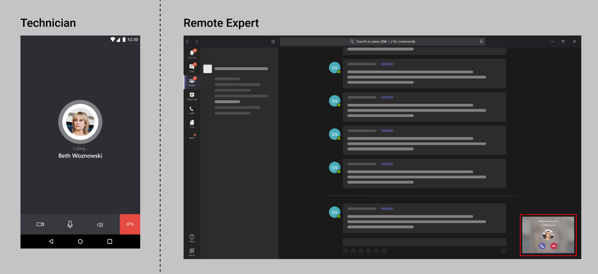
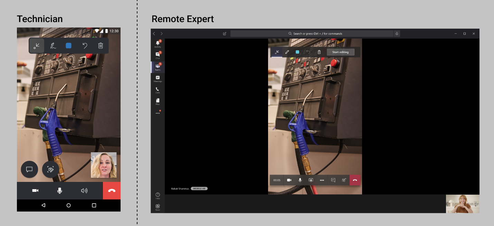
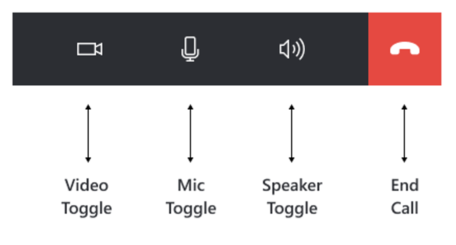

# Making calls in Dynamics 365 Remote Assist mobile 

Remote Assist mobile makes receiving expert help easy by providing technicians with the ability to launch video calls with remote collaborators who are using Microsoft Teams desktop or mobile. Technicians can make calls to a remote collaborator inside or outside of their company. To learn more about how the remote collaborators communicate via Teams, visit our documentation on [using Teams with Remote Assist](../teams-pc-all.md).

For a successful calling experience, **only a Remote Assist mobile user (technician) can initiate an outgoing call to either one Teams desktop user (remote collaborator) or one Teams mobile user (remote collaborator)**.

> [!NOTE] 
> The following scenarios are **not** supported on Remote Assist mobile at this time:
> - Joining Teams meetings.
> - Making calls to browser-based Teams.
> - Participating in calls with three or more participants.
> - Participating in Remote Assist mobile to Remote Assist mobile calls.
> - Participating in Remote Assist mobile to Remote Assist on HoloLens calls.

## Prerequisites
- In order to follow along with this guide, you must be using a mobile device with AR support. Learn more about device requirements [here](https://docs.microsoft.com/dynamics365/mixed-reality/remote-assist/requirements).
- Technicians must have a Remote Assist license. Visit our additional documentation to learn more about the [free trial licenses](../try-remote-assist.md) or [subscriptions](../buy-remote-assist.md).
- Experts must have a Microsoft Teams license. Learn more [here](../teams-pc-all.md).

## How it works

1. Launch and sign into Remote Assist mobile on your iOS or Android device. 
   
2. Search for the remote collaborator's name. 

3. Select the remote collaborator's name and launch a call with the expert. 

4. The remote collaborator will receive the call on Microsoft Teams. 

5. The remote collaborator will be taken to the technician's live video feed. 

6. With the call controls toolbar, Remote Assist mobile users can disable the video call (enter an audio-only call), mute themselves in call, turn on their speakers, or end the call. 

