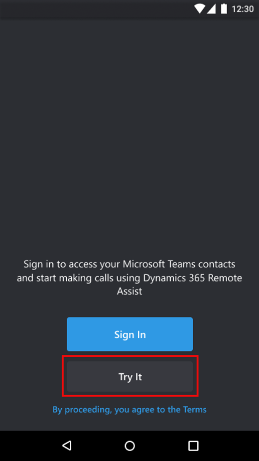
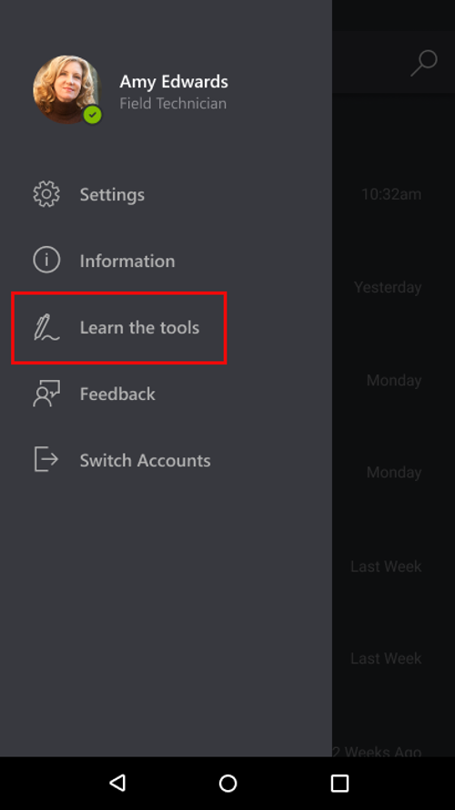
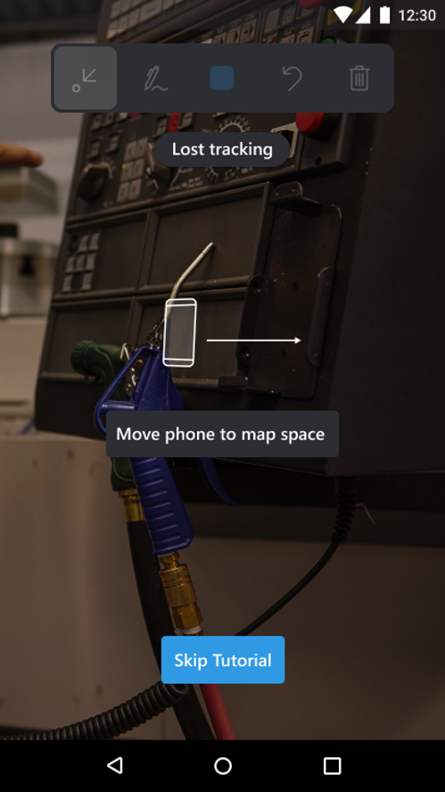
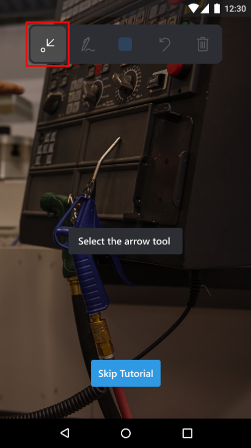
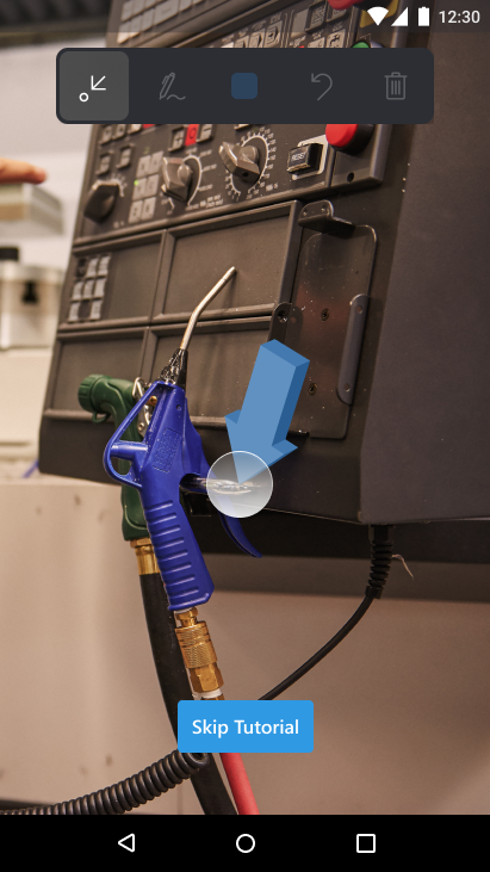
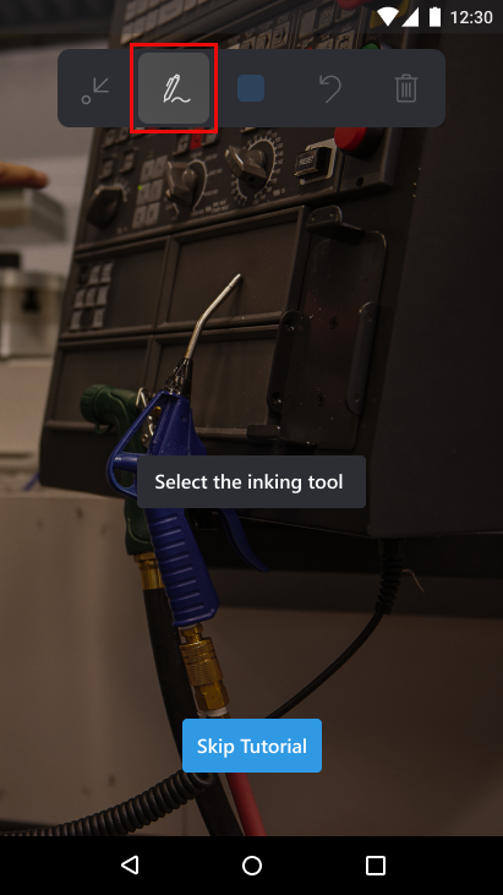
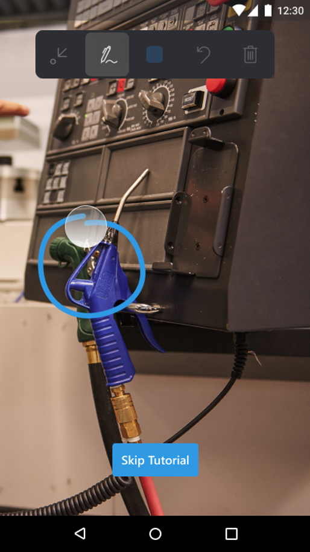
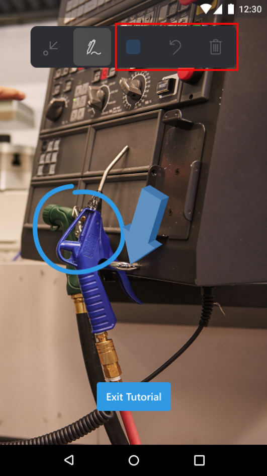

# Using the Remote Assist Mobile tutorial

Dynamics 365 Remote Assist Mobile includes an in-app, guided tutorial for technicians to jumpstart their ability to use the app. This tutorial shows technicians how to:

-	map their environment for better tracking of surfaces
-	place and manipulate annotations, such as the arrow and the ink tool

## Prerequisites 
- Allow Remote Assist Mobile to access your device's camera. 

## How to use the tutorial

1. To launch the tutorial, select **Try It** on the **Sign in** screen.

2. If you're already signed in and wish to launch the tutorial, you can also go to **Menu** > **Try the Tools**. 

3. Once you have begun the tutorial, you're prompted to move your phone to **map your space**.  

4. Select the **Arrow tool**.

5. Tap and drag to place an arrow. 

6. Select the **Inking tool**.

7. Draw a line or circle. 

8. Practice placing and using other annotations. You can use the **Color picker**, **Undo** annotations, or **Delete all** annotations icons. 

## Additional notes 

### What are the yellow tracking dots?
- Yellow tracking dots are feature points that detect visually distinct features in your video calls. These dots help with your tracking experience and the placing of annotations. 

### Techniques to improve the tracking experience
- Map your environment area at the beginning of a video call.
- Avoid rapid camera movements.
- Avoid frequently minimizing the app and reopening it while there are annotations present.

### Tracking limitations

Limitations that may hinder accurate understanding of surfaces or facilitate in losing tracking include:
- Flat surfaces without texture, such as a white desk
- Environments with dim lighting or extremely bright lighting
- Transparent or reflective surfaces like glass
- Dynamic or moving surfaces
