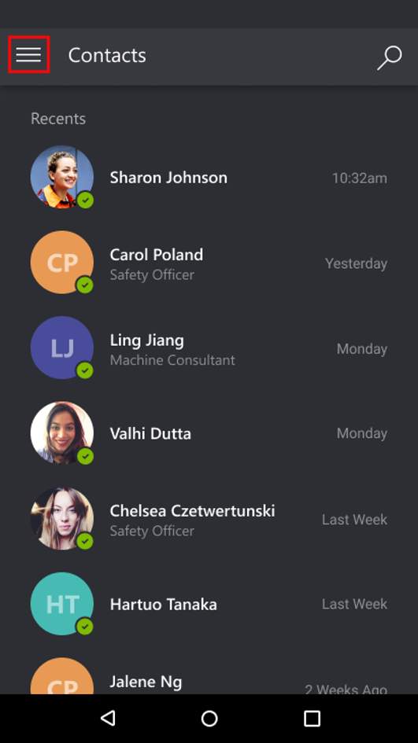
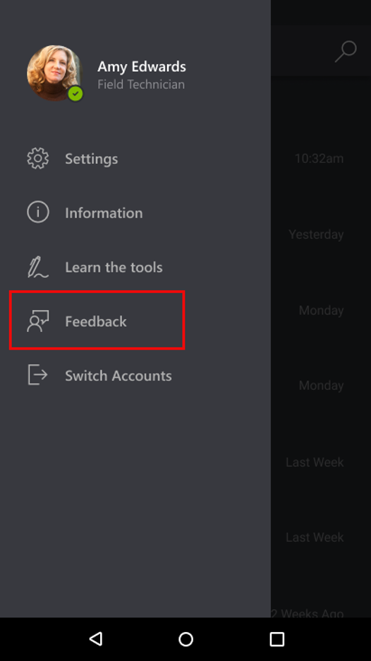

# Provide feedback in the Dynamics 365 Remote Assist mobile app

Technicians can provide feedback or make requests directly in the Dynamics 365 Remote Assist mobile app. Providing in-app feedback is the best way for the Dynamics 365 Remote Assist mobile team to troubleshoot your issue because we can use your applications logs to see if there is an issue on our side. The Dynamics 365 Remote Assist mobile team values your feedback and strives to make significant improvements to the app. 

>[!Note]
> Dynamics 365 Remote Assist mobile users can also provide feedback to our team in the [Dynamics 365 Community Forum](https://community.dynamics.com/365/remoteassist) for Dynamics 365 Remote Assist or in the [Dynamics 365 Application Ideas](https://experience.dynamics.com/ideas/categories/list/?category=81a97e52-9c54-e911-a963-000d3a4f33c1&forum=4323c621-52bc-e811-a975-000d3a1bec70) for Remote Assist mobile.

## How it works
1. Select the **Main Menu** icon.

2. Select **Feedback**. 

>[!Note]
> To provide feedback, you'll need to have the native iOS Mail app set up if you're on an iPhone. On Android devices, you'll be able to select which mail app you'd like to open.

3. Provide your feedback.

[!INCLUDE[footer-include](../../includes/footer-banner.md)]