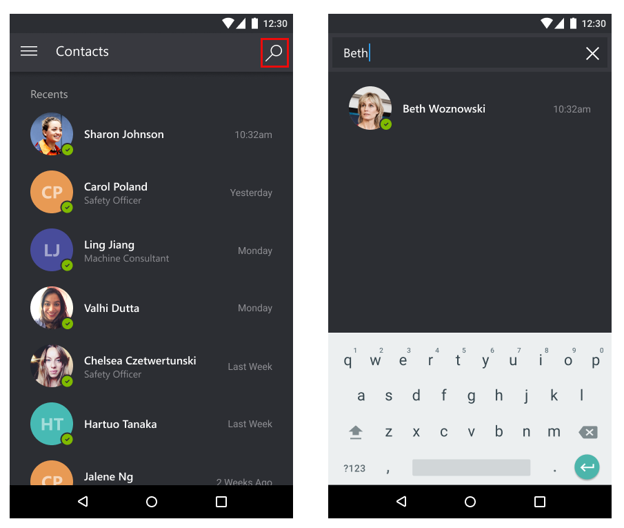
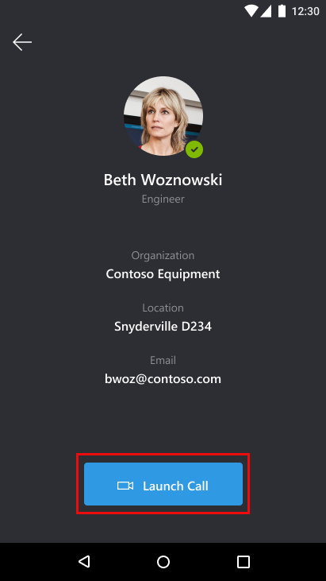
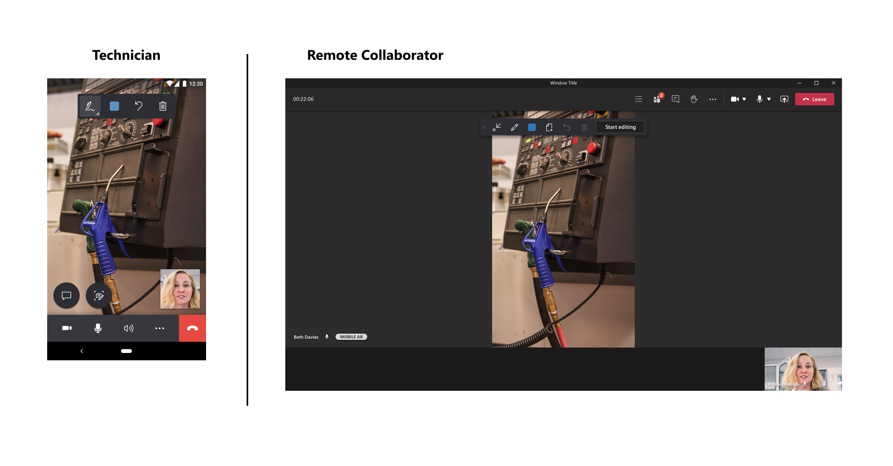
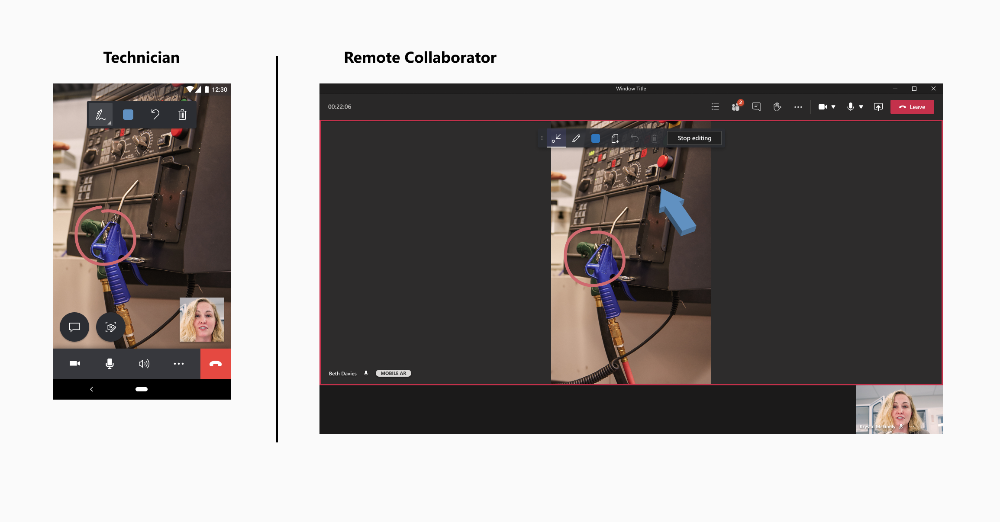

# Make calls between Dynamics 365 Remote Assist mobile and Microsoft Teams

Technicians using Dynamics 365 Remote Assist mobile can diagnose and resolve issues with remote specialists or collaborators using Microsoft Teams desktop or the Teams mobile app. Both call participants can place mixed-reality annotations in each other's space to collaborate effectively. 

> [!NOTE]
> This article shows how to make a one-to-one call between a Dynamics 365 Remote Assist mobile user and a Teams desktop or mobile user. [Learn about group calls with at least two Teams desktop users](group-calling.md).

## Prerequisites

- Technicians must have a [Dynamics 365 Remote Assist free trial](../try-remote-assist.md) or a [Dynamics 365 Remote Assist subscription](../buy-remote-assist.md).

- Remote collaborators must have a Dynamics 365 Remote Assist free trial or subscription and/or [Microsoft Teams free trial or subscription](https://www.microsoft.com/microsoft-365/microsoft-teams/group-chat-software). [Learn how to set up Dynamics 365 Remote Assist with Teams desktop](../teams-pc-all.md) or [Teams mobile](../teams-mobile-all.md).

## How it works

1. Launch and sign into Dynamics 365 Remote Assist on an iOS or Android phone or tablet.

    > [!IMPORTANT]
    > The mixed reality toolbar will not appear if the Dynamics 365 Remote Assist user joins the call from two different devices.

2. Search for the remote collaborator's name.

    

3. Select the remote collaborator's name, and then select **Launch Call**.

    > [!NOTE]
    > If the remote collaborator receives the call on a mobile device with both Dynamics 365 Remote Assist mobile and Teams mobile installed, the remote collaborator can only answer on Teams mobile. 

    

4. If the remote collaborator answers the call on **Teams desktop or mobile**, the technician's live video feed is shared with the remote collaborator's device screen.

    

5. Both call participants can place annotations in the shared environment either in their own environment or by selecting **Start editing**. 

    > [!NOTE] 
    > After the remote collaborator selects **Start editing**, the remote collaborator can add mixed-reality annotations on a frozen frame of the shared environment. When the remote collaborator selects **Stop editing**, the annotation appears in the technician's shared environment. 

    

6. The technician can use the call controls toolbar to stop the video call, mute or unmute the microphone, turn the volume up, add participants, share spaces, or start a recording. The following table describes the buttons in the call controls toolbar.

    |Button|Description|
    |--------|--------------------------|
    ||Disable video call (enter audio-only call)|
    ||Mute or unmute the microphone|
    ||Turn speakers on or off|
    ||Display the **More** menu to add participants, share spaces, or start a recording|
    ||End the call|
    
7. During the call, call participants can capture and annotate snapshots, send messages, share files, record the call, and more.

[!INCLUDE[footer-include](../../includes/footer-banner.md)]
