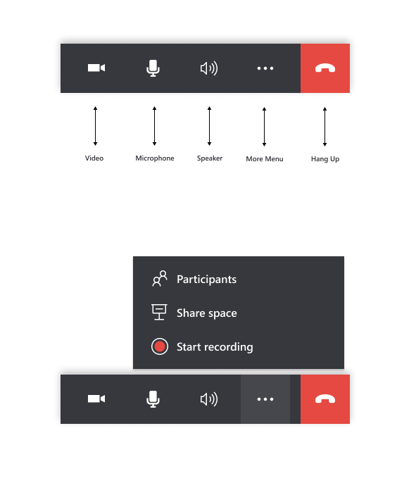

# Make calls between Dynamics 365 Remote Assist mobile and Microsoft Teams

Technicians using Dynamics 365 Remote Assist mobile can diagnose and resolve issues with remote specialists or collaborators using **Microsoft Teams desktop or mobile**. Both call participants can place mixed reality annotations in each other's space to effectively collaborate. 

> [!NOTE]
> This guide documents a one-to-one call between a Dynamics 365 Remote Assist mobile user and a Teams desktop or mobile user; learn about group calls with at least two Teams desktop users [here](group-calling.md).

## Prerequisites

- Technicians must have a Dynamics 365 Remote Assist [free trial](https://docs.microsoft.com/dynamics365/mixed-reality/remote-assist/try-remote-assist) or [subscription](https://docs.microsoft.com/dynamics365/mixed-reality/remote-assist/buy-remote-assist).
- Remote collaborators must have a Dynamics 365 Remote Assist free trial or subscription and/or Microsoft Teams [free trial or subscription](https://www.microsoft.com/microsoft-365/microsoft-teams/group-chat-software). Learn to set up Dynamics 365 Remote Assist with [Teams desktop](https://docs.microsoft.com/dynamics365/mixed-reality/remote-assist/teams-pc-all) and [Teams mobile](https://docs.microsoft.com/dynamics365/mixed-reality/remote-assist/teams-mobile-all).

## How it works

1. Launch and sign into Dynamics 365 Remote Assist on your iOS or Android phone or tablet.

2. Search for the remote collaborator's name.

3. Select the remote collaborator's name and launch a call.

  > [!NOTE]
  > If the remote collaborator is receiving the call on a mobile device with both Dynamics 365 Remote Assist mobile and Teams mobile installed, the remote collaborator can only answer on Teams mobile. 

4. If the remote collaborator answers the call on **Teams desktop or mobile**, the technician's live video feed will be shared to the remote collaborator's device screen.

5. Both call participants can place annotations in the shared environment either in their own environment or by selecting **Start Editing**. 

> [!NOTE] 
> After the remote collaborator selects **Start Editing**, they can add mixed reality annotations on a frozen frame of the shared environment. Afterwards, they can select **Stop Editing** and then the annotation will appear in the technician's shared environment. 

6. With the call controls toolbar, the technician can disable the video call (enter an audio-only call), mute themselves in call, turn on their speakers, record the call, share their environment, or end the call. 

7. During the call, call participants capture and annotate on snapshots, send messages, share files, record the call, and more!

[!INCLUDE[footer-include](../../includes/footer-banner.md)]