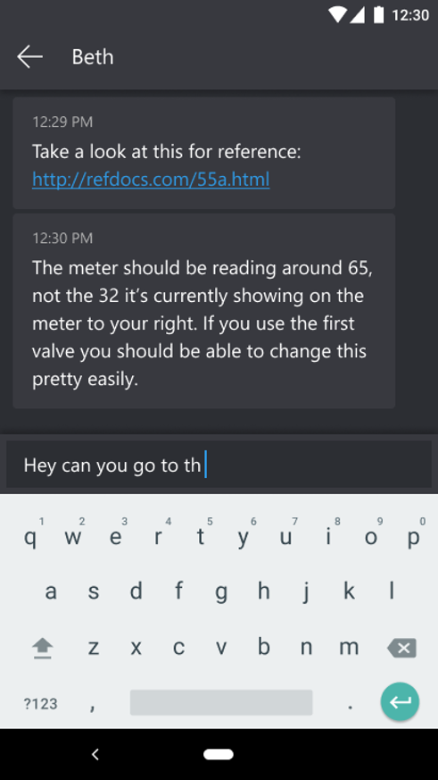
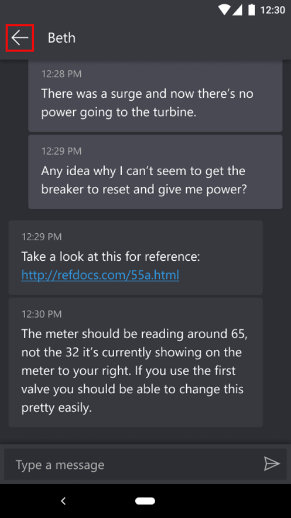
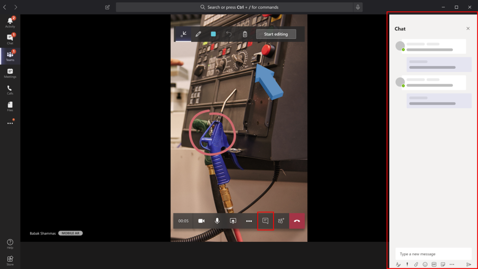

# Send chat messages in Dynamics 365 Remote Assist mobile

With the text chat, technicians can send and receive chat messages on Dynamics 365 Remote Assist mobile from remote collaborators on Microsoft Teams.

## Sending chat messages for technicians

During a Dynamics 365 Remote Assist mobile call, technicians can send chat messages to experts through the text chat. 

1.	Select the **Text Chat** icon.

2. In the text chat, technicians can send and receive text messages from experts on Microsoft Teams. Dynamics 365 Remote Assist mobile’s live video is not available while the technician is in the chat. 

3. To exit out of the text chat, select the **Back** icon.

4. Technicians will return directly back to the live video feed.

## Sending chat messages for remote collaborators 

1. In the text chat on Microsoft Teams, remote collaborators can send and receive text messages from technicians on Dynamics 365 Remote Assist mobile.

[!INCLUDE[footer-include](../../includes/footer-banner.md)]
