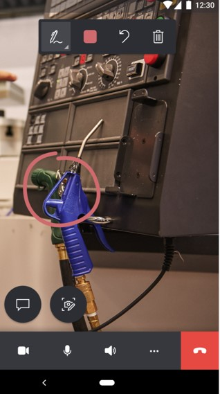

# Send chat messages in Dynamics 365 Remote Assist mobile

Technicians on Dynamics 365 Remote Assist mobile can send chat messages to remote collaborators on Microsoft Teams and receive chat messages from them.

## Send a chat message (technicians)

1.	Select the **Text chat** button.

    

2. Use the keyboard to compose the message, and then select the **Send** button when ready. The Dynamics 365 Remote Assist mobile live video is not available during the chat. 

    

   > [!NOTE]
   > To exit the text chat, select the **Back** button.

    

  Technicians return directly back to the live video feed after sending the message.

    

## Send a chat message (remote collaborators) 

- In the text chat on Microsoft Teams, remote collaborators can send and receive text messages from technicians on Dynamics 365 Remote Assist mobile.

    

[!INCLUDE[footer-include](../../includes/footer-banner.md)]
