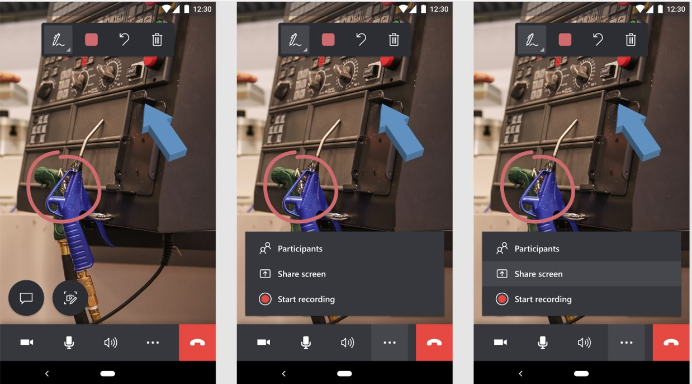

# Share your screen in Dynamics 365 Remote Assist mobile

If you're on a call using Microsoft Dynamics 365 Remote Assist mobile, you can share your screen with remote collaborators on the call to share real-time information.

> [!NOTE]
> For optimal screen sharing, make sure that you're using the latest version (version 2022.4.13 or later) of the Dynamics 365 Remote Assist mobile app. 

## Share your screen

> [!IMPORTANT]
> If you're using a person device, make sure to turn off any private notifications on your device before sharing your screen. 

1. Tap the ellipsis (...) button. 

2. Tap **Share screen**.

   

## Stop screen sharing

1. Tap the ellipsis (...) button. 

2. Tap **Stop screen sharing**. 

   When screen sharing has ended, you'll see a notification that says "Screen sharing ended."
