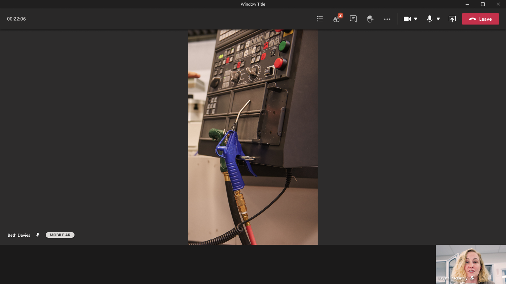

# Using Remote Assist on a mobile device without augmented reality (AR) support

Technicians and remote collaborators can conduct repairs and inspections together and provide instructions using annotations, even if technicians are using mobile devices **without** augmented reality (AR) support! In these scenarios, technicians and remote collaborators are unable to provide instructions using 3D annotations on a live video feed. However, technicians can still share their **live video feed** of their environment and both the technicians and remote collaborators can provide instructions on **snapshots** using 2D annotations. Learn more about the snapshot feature [here](https://docs.microsoft.com/dynamics365/mixed-reality/remote-assist/mobile-app/annotate-snapshot). 

## Prerequisites 
- To follow along with this article, technicians must be using a mobile device **without** AR support. If your device is *not* listed on the [Android/ARCore supported devices](https://developers.google.com/ar/discover/supported-devices) or [iOS/ARKit supported devices](https://developers.google.com/ar/discover/supported-devices#ios), then your device does not support AR. 

## How it works 
1. As a technician using Remote Assist on a mobile device without ARCore/ARKit support, you can launch and sign in with your credentials. After you select **Sign In**, you'll receive a notification about using a mobile device with augmented reality support.

2. After dismissing the notification, you'll be taken to the **Contacts** page.

3. Select the remote collaborator you want to call; on the video card, launch the call. 

 -  After the remote collaborator accepts the call, the technician will enter a video call. 
> [!NOTE]	
> Technicians can't place mixed reality annotations on the live video feed; they can only place annotations on the in-call snapshots.

- The remote collaborator will see the technician's video feed. 
> [!NOTE]	
> Remote collaborators can't place mixed reality annotations on technician's live video feed; they can only place annotations on the in-call snapshots.

4. The technician will receive a tooltip notification directing the use of still snapshots to add 2D annotations on a frozen video frame. 

-  After selecting the **snapshot** icon, the technician will enter snapshot mode, which captures a frozen frame of the technician's environment and shares it to the remote collaborator's screen. 

- The remote collaborator will see a frozen frame of the technician's video feed. 

5. Both the technician and remote collaborator can add 2D annotations to the snapshot. 

> [!NOTE]	
> Both the technician and remote collaborator will see the mixed reality toolbar on the frozen frame and can add 2D annotations.

6. After both the technician and remote collaborator are finished annotating on the snapshot, the technician selects the **check mark** to save or discard the snapshot.

7. The technician is prompted with the options to discard the snapshot or save the snapshot to either the mobile device's photo gallery, the text chat, or both. Select your choice and then select **Save**.

8. If the technician successfully saved the snapshot to the text chat, then the snapshot can be viewed in Remote Assist mobile's text chat and Microsoft Teams' text chat.

9. The technician is then taken back to the live video call and can select the snapshot icon again to take more snapshots.
    
> [!NOTE] 
> Annotations added on a still snapshot will *not* appear in the technician's environment after it has been saved or discarded.

10. Both the technician and remote collaborator can send and receive messages and share files and images from their local device in the text chat. Learn more about the file sharing feature [here](https://docs.microsoft.com/dynamics365/mixed-reality/remote-assist/mobile-app/file-sharing).

11.  Both the technician and remote collaborator can record the one-to-one Remote Assist call, as long as the remote collaborator is using Microsoft Teams desktop. The recording will be saved to Microsoft Stream and the link to the recording will be sent to the Microsoft Teams text chat. Learn more about the call recording feature [here](https://docs.microsoft.com/dynamics365/mixed-reality/remote-assist/mobile-app/call-recording).

12. If the technician is a Dynamics 365 Field Service customer, at the end of the call, the technician can choose to automatically post the call logs and the images, files, and snapshots shared in the text chat to an associated work order. Learn more about Field Service integration [here](https://docs.microsoft.com/dynamics365/mixed-reality/remote-assist/mobile-app/fs-integration).

