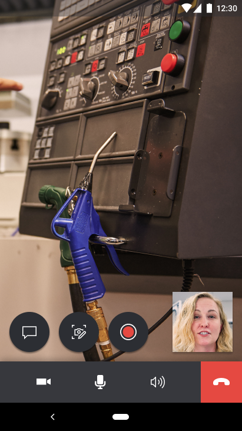
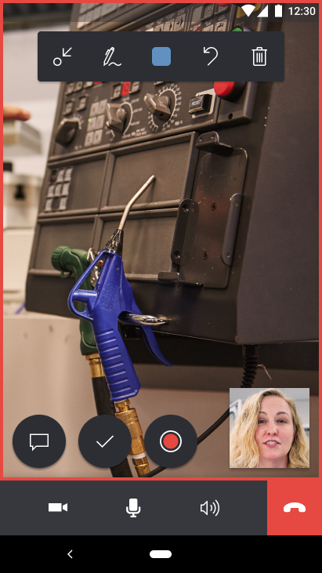
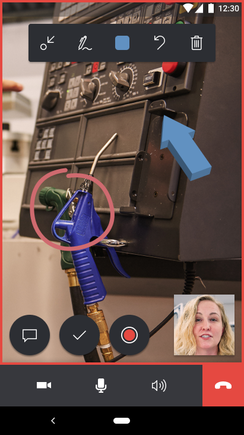
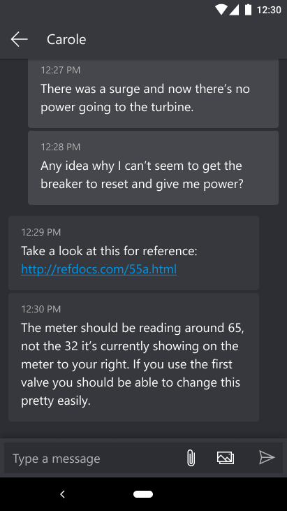

# Using Remote Assist mobile on your mobile device without augmented reality (AR) support 

Technicians and remote collaborators can still connect and conduct repairs and inspections together on mobile devices **without** augmented reality (AR) support, too! Without a device with AR support, technicians and remote collaborators are unable to provide virtual annotations to the the real world as seen through the technician's device camera. However, technicians can still use the **live video feed** to share their environment and use the **snapshot feature** to provide instructions using 2D annotations along with the remote collaborator. Learn more about the snapshot feature, [here](https://docs.microsoft.com/dynamics365/mixed-reality/remote-assist/mobile-app/annotate-snapshot). 

## Prerequisites 
- In order to follow along with this guide, technicians must be using a mobile device **without** AR support. If your device is not listed on the [Android/ARCore](https://developers.google.com/ar/discover/supported-devices) supported devices or [iOS/ARKit](https://developers.google.com/ar/discover/supported-devices#ios) supported devices, then your device does not support AR. 
- Remote collaborators on Microsoft Teams desktop or Teams mobile can use devices with or without AR support; this has no impact on their AR experience. 

## How it works 
1. As a technician using Remote Assist on a mobile device without ARCore/ARKit support, you can launch and sign in with your credentials. After you select **Sign In**, you will receive a notification about using a mobile device with augmented reality support.

2. After dismissing the notification, you will be taken to the **Contacts** page.

3. Select the remote collaborator you want to call and on the video card you can launch the call. 

4. After the remote collaborator accepts the call, you will enter a video call. 

5. You will receive a tool tip notification directing the use of still snapshots to add 2D annotations on a frozen video frame. 

6. After selecting the **snapshot** icon, you will enter snapshot mode, which captures a frozen frame of your environment and shares it to the remote collaborator's screen. 

7. Both the technician and remote collaborator can add 2D annotations to the snapshot. 
> [!NOTE]	Both the technician and remote collaborator will see the MR toolbar on the frozen frame and can add 2D annotations.

8. After both the technician and remote collaborator are finished annotating on the snapshot, the technician selects the Check Mark to save or discard the snapshot.

9. The technician is prompted with the options to discard the snapshot or save the snapshot to either the mobile device's Photo Gallery, Remote Assist mobile's text chat, or both. Select your choice(s) and then select **Save**.

10. The technican is notified when the snapshot has been successfully saved or failed. If the snapshot has not been saved, then you can try taking another snapshot and saving it again. If the technican successfully saved the snapshot, then the snapshots can be viewed in the mobile device’s Photo Gallery and/or Microsoft Teams text chat.

11. Afterwards, the technician is taken back to the live video call and can select the snapshot icon again to take more snapshots.
> [!NOTE] Annotations added on a still snapshot will **not** appear in the technician's environment after it has been saved or discarded.

12. The technician can send and receive messages, images, and files in the text chat from the remote collaborator. 

13. The technician can record the one-to-one call with the remote collaborator, if the remote collaborator is using Microsoft Teams desktop only. The recording will be saved to Microsoft Stream and the link can be viewed in the Microsoft Teams text chat. 

14. If the technician is a Dynamics 365 Field Service customer, at the end of the call the technician can choose to automatically post the call logs and the images, files, and snapshots shared in the text chat to an associated work order.

