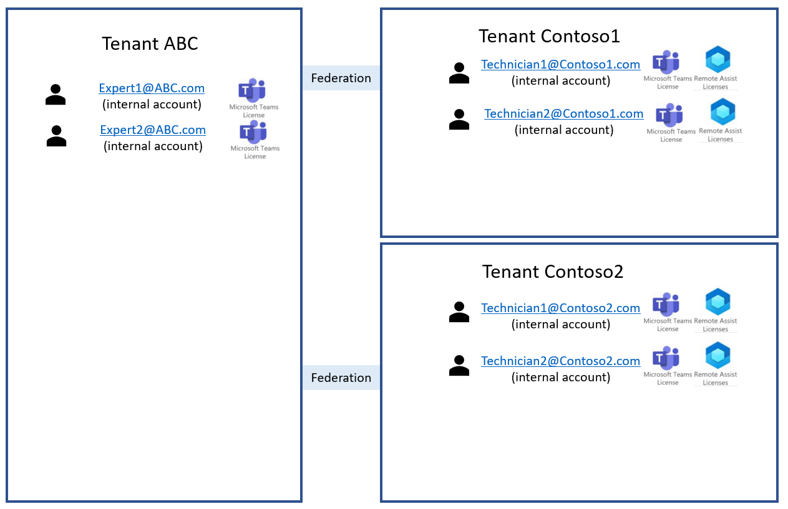

# Multi-tenant collaboration

A Dynamics 365 Remote Assist call involves one party using Dynamics 365 Remote Assist (a "Remote Assist user") and the other using Microsoft Teams (a "Teams user"). In most cases, employees who want to use Dynamics 365 Remote Assist and employees who want to use Teams belong to the same tenant, and thus a [standard deployment of Dynamics 365 Remote Assist](deploy-remote-assist.md) and [standard deployment of Teams](set-up-teams.md) is all you need. 

However, there are certain scenarios where this may not be the case: 

1. **Multi-tenant company deployments**: A company has multiple organizations or business units, each with their own tenant, that want to collaborate using Dynamics 365 Remote Assist. Or, multiple companies want to collaborate using Dynamics 365 Remote Assist. Users who want to use Dynamics 365 Remote Assist already have Dynamics 365 Remote Assist licenses, and users who want to use Teams already have Teams licenses. They want to initiate ad hoc calls and meetings with each other. This document focuses on this scenario.

2. **Vendors and contractors use Dynamics 365 Remote Assist app**: A company wants vendors and contractors who do not already have Dynamics 365 Remote Assist and aren’t part of the company tenant to use Dynamics 365 Remote Assist. [Learn more about this scenario.](vendor-use-ra.md) 

3. **Vendors and contractors use Teams app**: A company wants to provide employees with a quick and easy way to use Dynamics 365 Remote Assist HoloLens to receive assistance from out-of-tenant collaborators who may or may not have Teams. The company does not want to set up guest access or external access. [Learn more about this scenario.](vendor-use-teams.md) 

## Account types

Throughout this article, we'll be referring to a few account types: 

1. **Internal account**: An Azure Active Directory (Azure AD) account that is created in your tenant for internal users.
2. **Guest account**: An Azure AD account that is created in your tenant when you provide an out-of-tenant user with guest access in one or more Teams teams or channels. You can "guest" an out-of-tenant user into your tenant using their email.
    1. If that user's email is already associated with an Azure AD account in one other tenant, that user is now part of two tenants: that user is a member of their native tenant and a guest in your tenant.
    2. If that user's email is not already associated with an Azure AD account in any other tenant, that user is now part of one tenant: that user is a guest in your tenant.

## Scenario overview

In this scenario, which is represented in Figure 1.1, a company leverages multiple tenants through different organizations and business units, all within the same company. Teams users in Tenant ABC want to collaborate with Dynamics 365 Remote Assist users in Tenant Contoso1 and Tenant Contoso2.

Additional details:

- Each technician in Tenant Contoso1 and Tenant Contoso2 already has a Dynamics 365 Remote Assist license and Teams license.
- Each expert in Tenant ABC already has a Teams license. Experts who use Teams do not need a Dynamics 365 Remote Assist license. 
- Teams users in Tenant ABC want to search and collaborate with Dynamics 365 Remote Assist users in Tenant Contoso1, and vice versa.
- Teams users in Tenant ABC want to search and collaborate with Dynamics 365 Remote Assist users in Tenant Contoso2, and vice versa.
- Remote Assist users in Tenant Contoso1 do not want to search or collaborate with Dynamics 365 Remote Assist users in Tenant Contoso2, and vice versa.

**Figure 1.1**

Now, set up **External access** or **Guest access** to enable users in different tenants to collaborate with each other.

### Solution 1: External access (federation)

[!NOTE] At this time, external access is not supported for calls with Dynamics 365 Remote Assist mobile users.

**External access** is a Teams feature that allows Teams users from an entire external tenant to use Teams to find, call, chat, and set up meetings with users in your tenant. See examples of when you may want to use external access [here](https://docs.microsoft.com/microsoftteams/manage-external-access).

There are three external access options: 

- Open federation (default setting in Teams)
- "Allow specific" domains
- "Block specific" domains

In Figure 1.2, Tenant ABC and Tenant Contoso1 have enabled external access with each other, and Tenant ABC and Tenant Contoso2 have enabled external access with each other. Tenant Contoso1 and Tenant Contoso2 have **not** enabled external access with each other. Now:

- Teams users in Tenant ABC can search and collaborate with Dynamics 365 Remote Assist users in Tenant Contoso1, and vice versa.
- Teams users in Tenant ABC can search and collaborate with Dynamics 365 Remote Assist users in Tenant Contoso2, and vice versa.
-_Dynamics 365 Remote Assist users in Tenant Contoso1 cannot search or collaborate with Dynamics 365 Remote Assist users in Tenant Contoso2, and vice versa.

**Figure 1.2**

#### External access pros and cons 

| Pros                                                                  | Cons                                                                                                                                                                                                                                                                                                                                                                                                                                                                                                                                  |
| --------------------------------------------------------------------- | ------------------------------------------------------------------------------------------------------------------------------------------------------------------------------------------------------------------------------------------------------------------------------------------------------------------------------------------------------------------------------------------------------------------------------------------------------------------------------------------------------------------------------------- |
| Open federation is typically on by default.                           | Tenant management may be more involved if not using open federation.                                                                                                                                                                                                                                                                                                                                                                                                                                                                  |
| If open federation is not enabled by default, it's easy for your tenant to configure. | Open federation requires configuration on the additional tenants' side.                                                                                                                                                                                                                                                                                                                                                                                                            |
|                                                                       | External access has fewer control features than guest access. When you provide a user with guest access in a specific Teams team or channel, that user can only search and collaborate with people in the specific team or channel they were "guested" into. When a tenant enables external access for another tenant, every user in each tenant can search and collaborate with every user in the other tenant. |
|                                                                       | External access enables fewer features than guest access. For example, when using external access, Dynamics 365 Remote Assist users and Teams users in different tenants cannot join group calls with each other and cannot share files with each other. See [this article](https://docs.microsoft.com/microsoftteams/communicate-with-users-from-other-organizations#compare-external-and-guest-access) for a detailed comparison between external access and guest access features. |

 >[!NOTE]
 >Tenants do *not* need to have the same external access configuration. Tenant ABC can have **Open federation** while Tenant Contoso1 and Tenant Contoso2 have **"Block"** or **"Allow"** settings.
 
 >[!NOTE]
 >If an user wants to initiate a Dynamics 365 Remote Assist call with a collaborator outside their tenant, that user will need to type out the full email address of the collaborator outside their tenant.

#### External access (federation) implementation

If you are following the steps in the [Deploy HoloLens in a commercial environment](https://docs.microsoft.com/hololens/hololens-requirements#apps) article, go back to that document before implementing this solution.

Learn how to implement the three types of external access and test your setup [here](https://docs.microsoft.com/microsoftteams/manage-external-access#allow-or-block-domains). 

### Solution 2: Guest access

Guest access enables Teams admins or members to add individual users from outside their tenant into specific Teams teams and channels.

Figure 1.3 shows the tenant architecture when guest access is set up. Each tenant that has Dynamics 365 Remote Assist users who want to collaborate with Expert1@ABC.com and Expert2@ABC.com has "guested" each expert into a specific Teams team or channel. Now:

- When Expert1@ABC.com uses Teams in Tenant ABC, Expert1@ABC.com can only search and collaborate with internal users and other guests in Tenant ABC. Same for Expert2@ABC.com.
- When Expert1@ABC.com uses Teams in Tenant Contoso1, Expert1@ABC.com can only search and collaborate with internal users and other guests in Tenant Contoso1. Same for Expert2@ABC.com.
- When Expert1@ABC.com uses Teams in Tenant Contoso2, Expert1@ABC.com can only search and collaborate with internal users and guests in Tenant Contoso2. Same for Expert2@ABC.com.

> [!NOTE]
> Unlike Teams users, Dynamics 365 Remote Assist users can only use Dynamics 365 Remote Assist in one tenant. Thus, we do not recommend Teams users to guest Dynamics 365 Remote Assist users into the Teams users' tenant. 

**Figure 1.3**

| Pros                                                                                                                                                                                                                                                                                                                                                                                                                                       | Cons                                                                                     |
| ------------------------------------------------------------------------------------------------------------------------------------------------------------------------------------------------------------------------------------------------------------------------------------------------------------------------------------------------------------------------------------------------------------------------------------------ | ---------------------------------------------------------------------------------------- |
| Tenant Contoso1 and Tenant Contoso2 can provide guest access to specific Teams users instead of enabling collaboration with everyone in Tenant ABC.                                                                                                                                                                                             | Compared to external access, guest access may require more user management. |
| Guest access offers more control features. For example, an out-of-tenant user who is "guested" into a specific Teams team or channel and can only search and collaborate with others who are inside the same Teams team or channel. See [this article](https://docs.microsoft.com/microsoftteams/communicate-with-users-from-other-organizations#compare-external-and-guest-access) for a detailed comparison between guesting and external access features. | A Teams user can only use Teams in one tenant at a time, which means that the expert can only communicate with technicians in a certain tenant if the expert is currently using Teams in the technician's tenant. In our example, Expert1@ABC.com is in a member in their native tenant (Tenant ABC), a guest in Tenant Contoso1, and a guest in Tenant Contoso2. Thus, Expert1@ABC.com can only collaborate with technicians in Tenant Contoso1 if Expert1@ABC.com is using Teams in Tenant Contoso1.    To switch tenants when using the Teams desktop application, navigate to the top-right corner of Teams, select the name of the tenant you are currently in (it will be shown to the left of your profile picture), then select the tenant you'd like to switch to.     To switch tenants when using the Teams mobile application, navigate to the top-left corner of Teams, select the menu, then select the tenant you'd like to switch to. |

For more information, see this Microsoft Teams article about [how guest access works](https://docs.microsoft.com/microsoftteams/guest-access).

#### Guest access implementation

See this [Microsoft Teams guest access checklist](https://docs.microsoft.com/microsoftteams/guest-access-checklist) for full implementation instructions.
