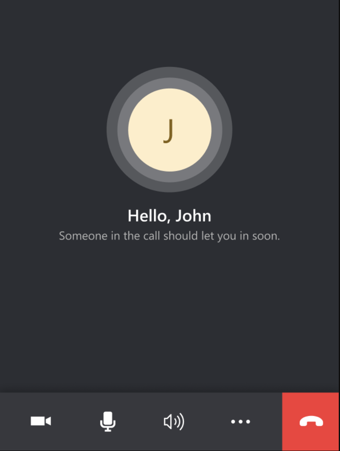
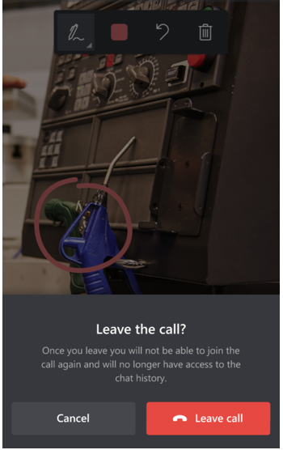

# Invite a user to join a one-time call in Dynamics 365 Remote Assist

[!INCLUDE[try-guides-ra](../includes/try-guides-ra.md)]

As a Dynamics 365 Remote Assist user, you might want an external user without a Dynamics 365 Remote Assist license or Teams license to join a Dynamics 365 Remote Assist call on an ad-hoc, one-time basis. Some scenarios include:

- A customer service agent wants to transition from a phone call to a mixed-reality video call to visually assess a product, and overlay mixed-reality instructions to guide their customer through the repair in real time.

- A customer service agent receives a request from a customer for a contactless design consultation before remodeling their kitchen. The agent wants to view their customer’s kitchen and provide ideas for products that would look good together. The agent provides their customer with a link to join the scheduled consultation via a Dynamics 365 Remote Assist call.

- A technician is repairing an asset and wants to receive assistance from the asset’s original equipment manufacturer (OEM).

In these scenarios, the external user only needs to **join** a Dynamics 365 Remote Assist call on an ad-hoc, one-time basis. The external user doesn't need to initiate a call or use Dynamics 365 Remote Assist’s out-of-call asset capture functionalities.

Any licensed Dynamics 365 Remote Assist user can use the Dynamics 365 Remote Assist model-driven app with their browser to generate a one-time call link. The licensed Dynamics 365 Remote Assist user can share the link with an external user who is using their preferred communication platform (for example, email, SMS, or [Dynamics 365 Omnichannel channels](/dynamics365/omnichannel/introduction-omnichannel#channels-available-with-omnichannel-for-customer-service)). The external user can join the call using the Teams desktop or mobile app. The external user can also view files sent from a Dynamics 365 Remote Assist user. To ensure external users can view shared files, the Dynamics 365 Remote Assist user needs to [adjust their OneDrive sharing settings](/sharepoint/turn-external-sharing-on-or-off).

> [!NOTE]
> Joining a one-time call without a Dynamics 365 Remote Assist account/license isn't supported for Dynamics 365 Remote Assist HoloLens users. Users joining the one-time call won't be shown on the Calls Dashboard.

## Requirements  

In this article, "agent" refers to the licensed Remote Assist user; "customer" refers to the unlicensed external user.

To generate links for one-time calls:

- You must install the [Dynamics 365 Remote Assist model-driven app](ra-webapp-install.md).

- The agent must use the Dynamics 365 Remote Assist model-driven app on a [compatible browser](/power-platform/admin/web-application-requirements).

- Pop-ups must be enabled for `https://mixedreality.dynamics.com` and for your organization’s tenant-specific environment URL on the browser the agent will use to access the Dynamics 365 Remote Assist model-driven app. Pop-ups are used for authentication purposes.

- The agent’s organization must [enable anonymous users to join a Teams meeting](/microsoftteams/meeting-settings-in-teams#allow-anonymous-users-to-join-meetings).

- If an agent wants to manually admit a customer into the call, the agent’s organization must [configure their Teams meetings settings](/microsoftteams/meeting-policies-in-teams#automatically-admit-people) so that **Everyone in your organization and federated organizations bypasses the lobby**, or enable **Everyone in your organization bypasses the lobby**.

> [!NOTE]
> [Learn more about how to set up one-time calls](/microsoftteams/teams-add-in-for-outlook).

## The agent's experience

### Before selecting Create a one-time call link in the model-driven app

### After selecting Create a one-time call link in the model-driven app

### Step 1: Generate a call link

1. Go to your organization’s environment (contact your administrator for your tenant-specific environment URL), sign in, and then select **Dynamics 365 Remote Assist**.

2. Select **One-time Call**.

3. Select **Create a one-time call link** to generate a link for your customer to join the call.

    When you select **Create a one-time call link**, you might see two pop-ups appear and then close automatically. In addition, a meeting appears on your Teams calendar. By default, the meeting is named "EventTitle" and is scheduled to start immediately. You can change the time and duration in your calendar.

### Step 2: Share the instructions

After you successfully create a one-time link, you can share the link in two ways. To share by email, select **Copy message** to copy the text with the links, and then paste it into your email. To share by text message, select **Copy join link** to copy a link you can paste into a text message.

> [!IMPORTANT]
> Anyone who receives the link can enter the lobby, so it's important for your organization to have a process and security strategy to minimize the chance of links being shared with unknown people.

### Step 3: Admit your customer into the call

After your customer launches the call and enters their name, they enter the call lobby. You can then admit them into the call. Your customer can't show you their environment and use annotations until you admit them into the call.

## Your customer’s experience

[Dynamics 365 Remote Assist device requirements](./requirements.md) apply to your customer as well.

**Step 1**: If your customer wants to join the call from their mobile device, they must select the first link to download the app.

**Step 2**: If your customer selects the second link using their mobile device, they join the call from the Dynamics 365 Remote Assist mobile app. If your customer selects the second link using their computer, they receive a prompt to join the call from the Teams desktop app. If they're already logged in to the app they're using, they join the call as an authenticated user.

**Step 3**: Your customer is prompted to enter their name.

**Step 4**: Your customer waits for you to admit them into the call.

**Step 5**: After your customer selects **End call**, they confirm that they want to leave the call.

After your customer leaves the call, they can't rejoin the call or view the chat history.

## FAQ

### Agent experience

**Does the agent need a special Dynamics 365 Remote Assist license to use the one-time call feature?**

No.

**Can an organization customize which licensed Dynamics 365 Remote Assist users can access the Dynamics 365 Remote Assist model-driven app?**

No.

**Can a one-time call user join the call from Dynamics 365 Remote Assist on HoloLens?**

No. At this time, joining a one-time call without a Dynamics 365 Remote Assist account/license isn't supported for Dynamics 365 Remote Assist HoloLens users.

**Can I embed the Dynamics 365 Remote Assist model-driven app in Teams?**

Yes. You can [embed the Dynamics 365 Remote Assist model-driven app in Teams](/dynamics365/teams-integration/teams-install-app#in-microsoft-teams-set-up-the-personal-dashboard). Embedding the app in Teams gives you access to the Dynamics 365 Remote Assist features from Teams. For example, to easily [access assets](asset-capture-overview.md) or the [Calls dashboard](calls-dashboard.md).

**Why are no pop-ups appearing when the agent generates a link?**

Each browser handles pop-ups differently. Refer to browser-specific instructions to enable pop-ups for `https://mixedreality.dynamics.com` and for your organization’s tenant-specific environment URL. Contact your administrator for your tenant-specific environment URL.

**Can an agent modify the instructions they copy and share with their customer?**

Your organization’s administrator isn't able to modify the instructions that appear when an agent selects **Create a one-time call link**. However, after the agent copies the instructions, they can modify it before sharing it with their customer.

When an agent sets up the call in a desktop browser and selects **Join the call** through the Teams desktop app, the customer can join the call only through the Dynamics 365 Remote Assist mobile app. The customer can't join through the Teams desktop because the Dynamics 365 Remote Assist app isn't available on the desktop. A Dynamics 365 Remote Assist call can't take place between two Teams desktop users.

However, when an agent sets up the call using a mobile browser and selects **Join the call** with the Dynamics 365 Remote Assist mobile app, the customer can join the call with the Dynamics 365 Remote Assist mobile app or the Teams desktop app.

**After the agent generates a one-time call link, the call appears on their Teams calendar. They can select that meeting through the Teams desktop to join the one-time call with the Teams desktop app. However, can they select that meeting with Teams mobile or Dynamics 365 Remote Assist mobile to join the one-time call using Teams mobile or Dynamics 365 Remote Assist mobile, respectively?**

No. The agent can't join a one-time call with the Teams mobile app. In addition, the only way an agent can join the one-time call through the Dynamics 365 Remote Assist mobile app is by using the Dynamics 365 Remote Assist model-driven app to generate the call link, and then selecting **Join the call**.

**When the agent selects Create a one-time call link, a meeting will appear on their Teams calendar. Can a licensed Dynamics 365 Remote Assist user join the meeting from Dynamics 365 Remote Assist on HoloLens?**

Yes. A licensed user can join the meeting from the HoloLens app.

**What’s the difference between the agent creating a meeting using Teams and forwarding it to their customer, versus setting up a call using the Dynamics 365 Remote Assist model-driven app and sending their customer the one-time call link?**

There are two main differences. First, setting up the call with the Dynamics 365 Remote Assist model-driven app and selecting **Join call** enables the agent to join the call using Dynamics 365 Remote Assist mobile. Second, setting up the call with the Dynamics 365 Remote Assist model-driven app enables the agent to send a link that their customer can use to join the call using Dynamics 365 Remote Assist mobile.

**How many people can join a one-time call?**

Two people.

### Customer experience

Is the Dynamics 365 Remote Assist mobile app that a customer uses the same app that a licensed Dynamics 365 Remote Assist user uses?

Yes.

**If the customer is signed into Teams when they select the call link using their computer, will they join the call as an authenticated user?**

Yes.

**What Dynamics 365 Remote Assist features are not available for your customer if they join the call as an unauthenticated call participant?**  

If your customer joins the call as an unauthenticated user, they can't:

- Add 2D annotations through snapshots. An external user using Dynamic 365 Remote Assist on a non-AR mobile device can't share or receive annotations.

- Send OneDrive files.

- Receive a prompt to use snapshots when they're experiencing poor network conditions.

- Record a call.  

- View the call participant list and invite people to join the call.

**After the call ends, can an authenticated user access the chat history?**

No.

**The call disconnected and the customer received a new link to join the call. When they select the link, they view the “Call ended” page instead of joining the new call. How can they join the new call?**

Your customer must fully close the app and select the new link again.

|     User action    |     Next step   |  
|-----------------------------------------------------------------|--------------------------------------------------------------------------|
| User accidentally selects the second link (the call link) before downloading the Dynamics 365 Remote Assist mobile app. | The customer should select the first button on this page to download the Dynamics 365 Remote Assist mobile app. Then they can select the second link in the agent’s message, or the second button on the page to join the call.|
|User enters the call link into a Chrome or Microsoft Edge browser, instead of selecting the link from the agent’s message. |The customer should select the second button on this page to join the call.|

[!INCLUDE[footer-include](../includes/footer-banner.md)]
