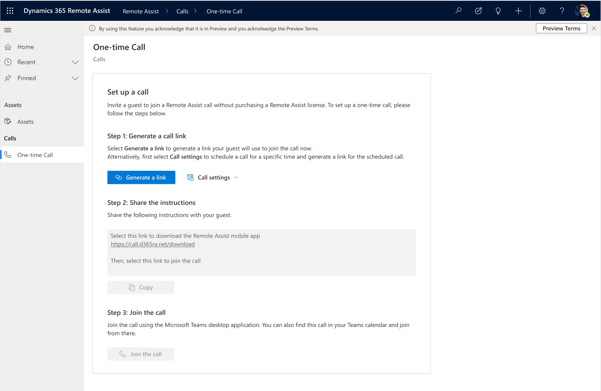
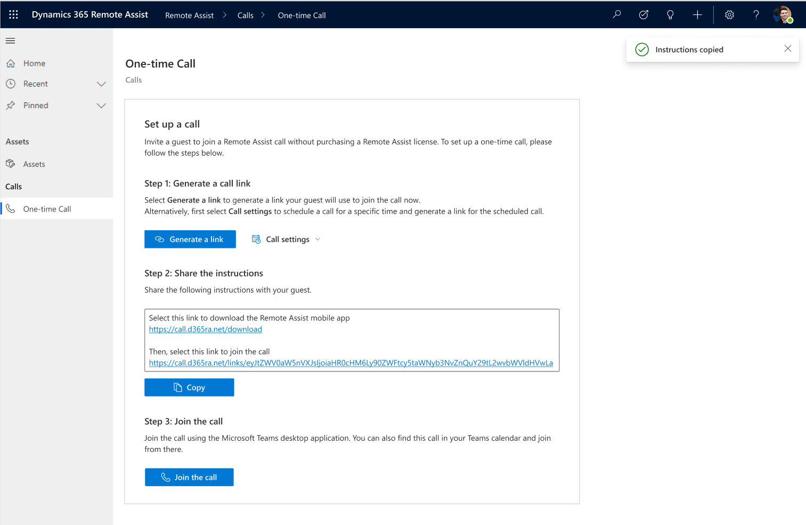
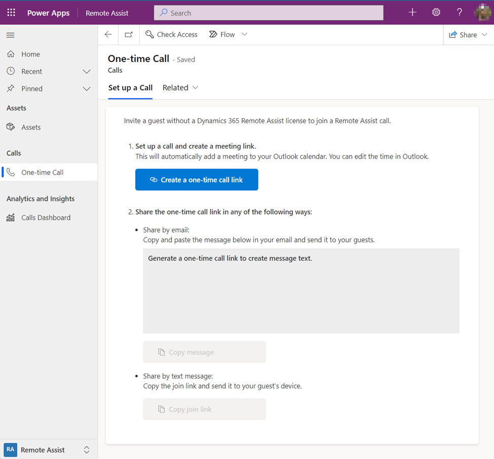
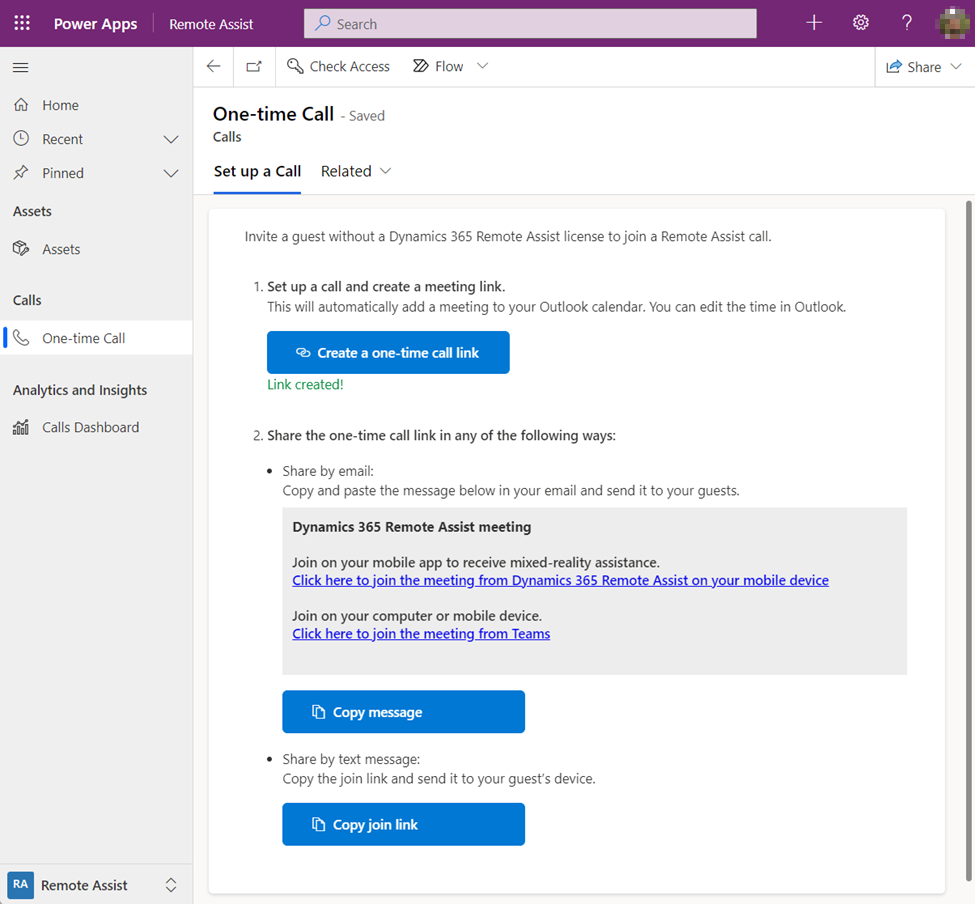
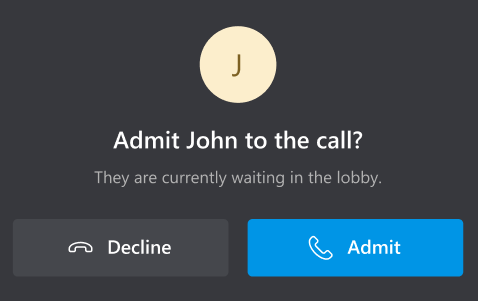
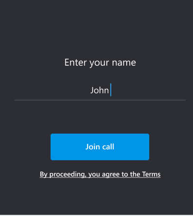
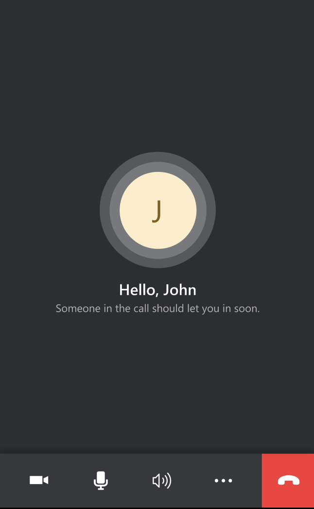
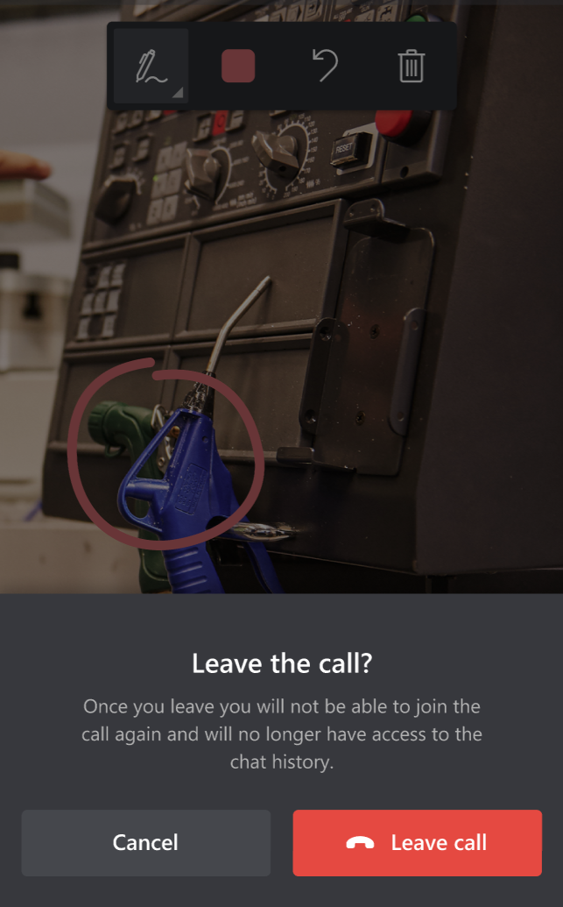
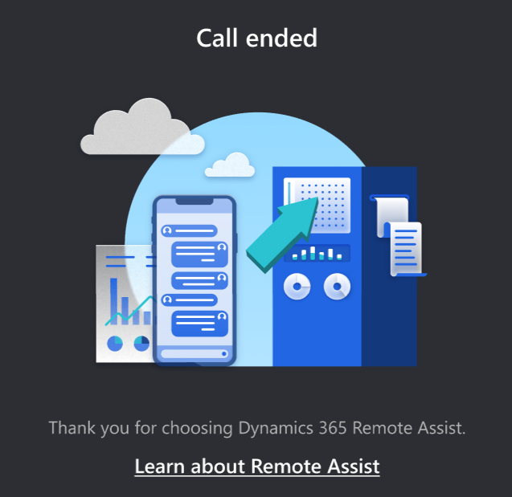
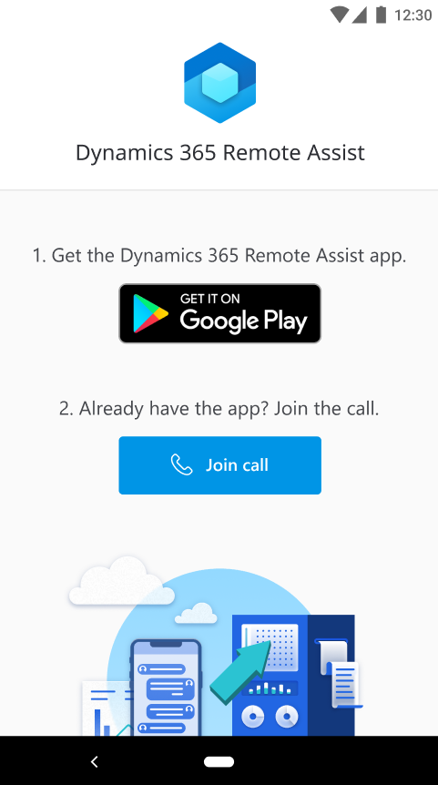

# Invite a user to join a one-time call (public preview) in Dynamics 365 Remote Assist 

There are several scenarios in which a Dynamics 365 Remote Assist user may want to enable an external user without a Dynamics 365 Remote Assist license or Teams license (such as a B2B vendor, B2B customer, or B2C customer) to join a Dynamics 365 Remote Assist call on an ad-hoc, one-time basis. Examples:

- A customer service agent wants to transition from a phone call to a mixed-reality video call to visually assess a product, and overlay mixed-reality instructions to guide their customer through the repair in real time. 

- A customer service agent receives a request from a customer for a contactless design consultation before remodeling their kitchen. The agent wants to view their customer’s kitchen and provide ideas for products that would look good together. The agent provides their customer with a link to join the scheduled consultation via a Dynamics 365 Remote Assist call.

- A technician is repairing an asset and wants to receive assistance from the asset’s original equipment manufacturer (OEM).

> [!IMPORTANT] 
> A preview feature is a feature that is not complete, but is made available before it’s officially in a release so customers can get early access and provide feedback. Preview features aren’t meant for production use and may have limited or restricted functionality. Microsoft doesn't provide support for this preview feature. Microsoft Dynamics 365 Technical Support won’t be able to help you with issues or questions. Preview features aren't meant for production use and are subject to a [separate supplemental terms of use](https://docs.microsoft.com/dynamics365/legal/supp-dynamics365-preview).

Note that in these scenarios, the external user only needs to **join** a Dynamics 365 Remote Assist call on an ad-hoc, one-time basis. The external user does not need to initiate a call or use Dynamics 365 Remote Assist’s out-of-call asset capture functionalities. 

Any licensed Dynamics 365 Remote Assist user can use the Dynamics 365 Remote Assist model-driven app with their desktop (or mobile) browser to generate a one-time call link. The licensed Dynamics 365 Remote Assist user can share the link with an external user who is using their preferred communication platform (for example, email, SMS, or [Dynamics 365 Omnichannel channels](https://docs.microsoft.com/dynamics365/omnichannel/introduction-omnichannel#channels-available-with-omnichannel-for-customer-service)). The external user can join the call using the Dynamics 365 Remote Assist mobile app (or, in some scenarios, the Teams desktop app).

## Requirements  

> [!NOTE]
> In this article, "agent" refers to the licensed Remote Assist user; “customer” refers to the unlicensed external user.

To generate links for one-time calls:

- You must install the [Dynamics 365 Remote Assist model-driven app](ra-webapp-install.md).
 
- The agent must use the Dynamics 365 Remote Assist model-driven app on a [compatible browser](https://docs.microsoft.com/power-platform/admin/web-application-requirements).

- Pop-ups must be enabled for https://call.d365ra.com and for your organization’s tenant-specific environment URL on the browser the agent will use to access the Dynamics 365 Remote Assist model-driven app. Pop-ups are used for authentication purposes.

- The agent’s organization must [enable anonymous users to join a Teams meeting](https://docs.microsoft.com/microsoftteams/meeting-settings-in-teams#allow-anonymous-users-to-join-meetings).

- If an agent wants to manually admit a customer into the call, the agent’s organization must [configure their Teams meetings settings](https://docs.microsoft.com/microsoftteams/meeting-policies-in-teams#automatically-admit-people) so that **Everyone in your organization and federated organizations bypasses the lobby**, or enable **Everyone in your organization bypasses the lobby**.

> [NOTE
> [Learn more about how to set up one-time calls](https://docs.microsoft.com/microsoftteams/teams-add-in-for-outlook).

## Agent experience 

### Before selecting Generate a link on the desktop web app

### After selecting Generate a link and Copy on the desktop web app 

|     Before selecting Generate a link on the desktop web app     |     After selecting Generate a link and Copy on the desktop web app    |  
|-----------------------------------------------------------------|--------------------------------------------------------------------------|
|  | | 

	 
### Step 1: Generate a call link

1. Go to your organization’s environment (contact your administrator for your tenant-specific environment URL), sign in, and then select **Dynamics 365 Remote Assist**. 

2. Select **One-time Call**. 

3. Select **Generate a link** to generate a link your customer will use to join the call. 

    When you select **Generate a link**, you may see two pop-ups appear and then close automatically. In addition, a meeting will appear on your Teams calendar. By default, the meeting is named "Remote Assist call", and is scheduled to start at the upcoming 15-minute mark and last for 15 minutes. 

> [!NOTE]
> Alternatively, you can select **Call settings** to schedule a call for a specific time and generate a link for the scheduled call. When you select **Generate a link**, a meeting will appear on your Teams calendar with the name, date, start time, and end time you selected.  

### Step 2: Share the instructions

After you successfully generate a link, the text box in step 2 will populate with two links. The first link enables your customer to download the Dynamics 365 Remote Assist mobile app. The second link enables your customer to join the call. Select **Copy** to copy the text box content. Then, share the instructions with your customer by using your preferred communication platform. 

> [!NOTE]
> The customer can use the Dynamics 365 Remote Assist mobile app on [both AR and non-AR devices](https://docs.microsoft.com/dynamics365/mixed-reality/remote-assist/requirements#device-options-and-requirements-for-a-dynamics-365-remote-assist-user). However, some older mobile device models may truncate SMS messages, making it difficult for your customer to receive the two links via SMS.

### Step 3: Join the call 

Select **Join the call** to launch the app available on your device to join the one-time call.

If you are setting up the call using your desktop, **Join the call** will launch the Teams desktop app. 

If you are setting up the call using your mobile device, **Join the call** will launch the Dynamics 365 Remote Assist mobile app.

### Step 4: Admit your customer into the call

After your customer launches the call and enters their name, they will enter the call lobby. You can then admit them into the call. Your customer will not be able to show you their environment and use annotations until you admit them into the call. 

If you're joining the call using Teams desktop, you'll receive a notification that looks like [this](https://docs.microsoft.com/microsoftteams/meeting-policies-in-teams#automatically-admit-people) when your customer is waiting in the lobby. 

If you're joining the call using the Dynamics 365 Remote Assist mobile app, you'll receive a notification that looks like the following image when your customer is waiting in the lobby.  

Select **Admit**.
 
## Your customer’s experience 

Note that [Dynamics 365 Remote Assist device requirements](https://docs.microsoft.com/dynamics365/mixed-reality/remote-assist/requirements#licensing-requirements-per-role) apply to your customer as well. 

**Step 1**: If your customer wants to join the call from their mobile device but has not downloaded the Dynamics 365 Remote Assist mobile app, they must select the first link to download the Dynamics 365 Remote Assist mobile app.

**Step 2**: If your customer selects the second link using their mobile device, they will join the call from the Dynamics 365 Remote Assist mobile app. If your customer selects the second link using their computer, they will be prompted to join the call from the Teams desktop app. If they're already logged in to the app they're using, they will join the call as an authenticated user. 

**Step 3**: Your customer is prompted to enter their name. 

**Step 4**: Your customer waits for you to admit them into the call.

 
**Step 5**: 

|     After your customer selects **End call**, they are prompted to confirm that they want to leave the call.	   |     After your customer leaves the call, they will not be able to rejoin the call or view the chat history.    |  
|-----------------------------------------------------------------|--------------------------------------------------------------------------|
|  | | 

## FAQ

### Agent experience 

#### Does the agent need a special Dynamics 365 Remote Assist license to use the one-time call feature? 

No.

#### Can an organization customize which licensed Dynamics 365 Remote Assist users can access the Dynamics 365 Remote Assist model-driven app?   

No. 

#### Can an agent use the Dynamics 365 mobile app, instead of the mobile browser, to generate one-time call links?

No – you can only access the model-driven app through the desktop web browser or mobile web browser.

#### Can I embed the Dynamics 365 Remote Assist model-driven app in Teams?

If you want to join the one-time call from your desktop, you might want to [embed the Remote Assist model-driven app in Teams](https://docs.microsoft.com/dynamics365/teams-integration/teams-install-app#in-microsoft-teams-set-up-the-personal-dashboard) to minimize switching between the Dynamics 365 Remote Assist model-driven app and the Teams desktop app.

> [!NOTE]
> You can't generate a link from the Teams desktop app. You can, however, select the **Go to website** command from the Teams desktop app, and then generate the link.
> 
> 

#### When the agent selects “Generate a link,” no pop-ups appear, and the agent is unable to copy the link to send to their customer

Each browser handles pop-ups differently. Refer to browser-specific instructions to enable pop-ups for https://call.d365ra.com and for your organization’s tenant-specific environment URL. Contact your administrator for your tenant-specific environment URL. 

#### Can an agent modify the instructions they copy and share with their customer?

Your organization’s administrator is not able to modify the instructions that appear when an agent selects **Generate a link**. However, after the agent copies the instructions, they can modify it before sharing it with their customer. 

> [!NOTE]
> The instructions the agent copies when they’re using the Dynamics 365 Remote Assist desktop model-driven app differs slightly from the message they copy when they’re using the Dynamics 365 Remote Assist mobile  app. 

When an agent sets up the call in a desktop browser and selects **Join the call** through the Teams desktop app, the customer can join the call only through the Dynamics 365 Remote Assist mobile app. The customer cannot join through the Teams desktop. This is because the Dynamics 365 Remote Assist app is not available on the desktop, and a Dynamics 365 Remote Assist call cannot take place between two Teams desktop users.

However, when an agent sets up the call using a mobile browser and selects **Join the call** with the Dynamics 365 Remote Assist mobile app, the customer can join the call with the Dynamics 365 Remote Assist mobile app or the Teams desktop app.

#### After the agent generates a call link, the call appears on their Teams calendar. They can select that meeting through the Teams desktop to join the one-time call with the Teams desktop app. However, can they select that meeting with Teams mobile or Dynamics 365 Remote Assist mobile to join the one-time call using Teams mobile or Dynamics 365 Remote Assist mobile, respectively? 

No. The agent cannot join a one-time call with the Teams mobile app. In addition, the only way an agent can join the one-time call through the Dynamics 365 Remote Assist mobile app is by using the Dynamics 365 Remote Assist model-driven app to generate the call link, and then selecting **Join the call**.

#### When the agent selects Generate a link, a meeting will appear on their Teams calendar. Can a licensed Dynamics 365 Remote Assist user join the meeting from Dynamics 365 Remote Assist on HoloLens? 

Yes. However, the Dynamics 365 Remote Assist HoloLens user cannot admit people from the lobby into the call. Follow instructions listed at the end of [this document](https://docs.microsoft.com/dynamics365/mixed-reality/remote-assist/join-meeting-hololens) to modify the meeting before inviting guests to join the meeting. 

#### What’s the difference between the agent creating a meeting using Teams and forwarding it to their customer, versus setting up a call using the Dynamics 365 Remote Assist model-driven app and sending their customer the one-time call link? 

There are two main differences. First, setting up the call with the Dynamics 365 Remote Assist model-driven app and selecting **Join call** enables the agent to join the call using Dynamics 365 Remote Assist mobile. Second, setting up the call with the Dynamics 365 Remote Assist model-driven app enables the agent to send a link that their customer can use to join the call using Dynamics 365 Remote Assist mobile.

#### How many people can join a one-time call?

Two people.

### Customer experience 

Is the Dynamics 365 Remote Assist mobile app that a customer uses the same app that a licensed Dynamics 365 Remote Assist user uses? 

Yes.

#### How big is the Dynamics 365 Remote Assist mobile app?

Learn more [here.](https://docs.microsoft.com/dynamics365/mixed-reality/remote-assist/mobile-app/faq-mobile#what-is-the-size-of-the-dynamics-365-remote-assist-mobile-app)

#### If the customer already has Dynamics 365 Remote Assist mobile downloaded, can they skip downloading the app and directly select the second link to join the call?

Yes.  

#### If the customer is signed into Dynamics 365 Remote Assist when they select the call link using their mobile device, will they join the call as an authenticated user?

Yes.  

#### If the customer is signed into Teams when they select the call link using their computer, will they join the call as authenticated user?

Yes.

#### What Dynamics 365 Remote Assist features are not available for your customer if they join the call as an unauthenticated call participant?  

If your customer joins the call as an unauthenticated user, they will not be able to:

- Add 2D annotations through snapshots. This means that an external user using Dynamic 365 Remote Assist on a non-AR mobile device will not be able to share or receive annotations.

- Send or receive OneDrive files.

- Receive a prompt to use snapshots when they are experiencing poor network conditions.

- Record a call.  

- View the call participant list and invite people to join the call. 

#### After the call ends, can an authenticated user access the chat history? 

No.

#### The call disconnected and the customer received a new link to join the call. When they select the link, they view the “Call ended” page instead of joining the new call. How can they join the new call?

Your customer must fully close the app and select the new link again.

If the customer has Chrome or Edge set as their default browser on their Android mobile device, in some circumstances, they may see this screen and need to take an extra step to join the call.

|     User action    |     Next step   |  
|-----------------------------------------------------------------|--------------------------------------------------------------------------|
| User accidentally selects the second link (the call link) before downloading Dynamics 365 Remote Assist mobile app | The customer should select the first button on this page to download the Dynamics 365 Remote Assist mobile app. Then, they can select the second link in the agent’s message, or the second button on the page shown above, to join the call.| 
|User enters the call link into a Chrome or Edge browser, instead of selecting the link from the agent’s message. |The customer should select the second button on this page to join the call.|

[!INCLUDE[footer-include](../includes/footer-banner.md)]
