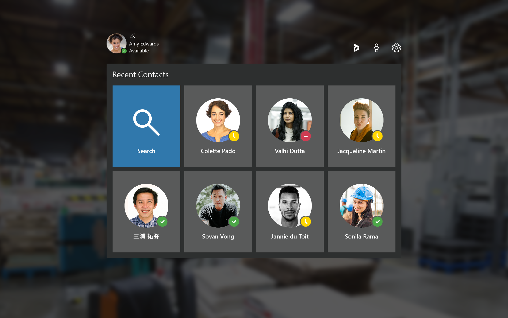
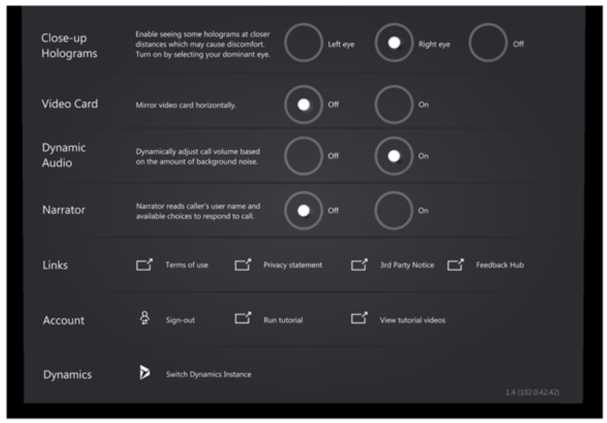
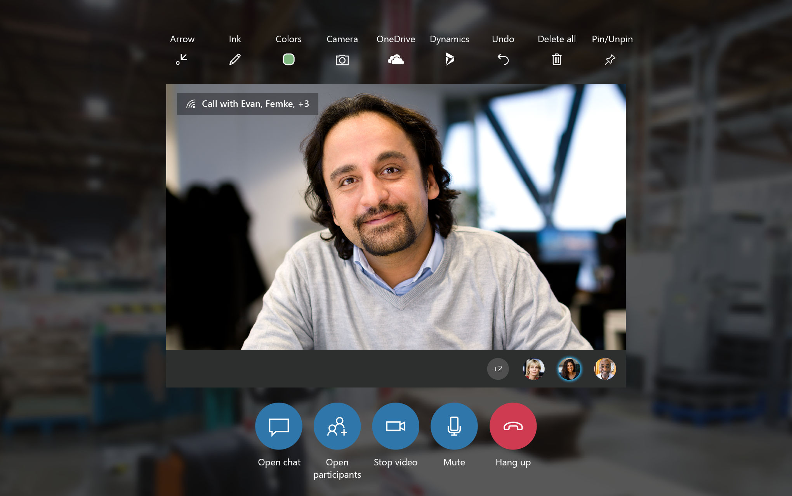

# Overview of Dynamics 365 Remote Assist on HoloLens 1 and 2

When you use Remote Assist on HoloLens 1 or HoloLens 2, you can collaborate with one or more Teams desktop users or one Teams mobile user. Remote Assist on HoloLens 1 and HoloLens 2 offer the same capabilities; however, there are slight differences in the way you interact with holograms. Those differences are called out throughout this document. 

To learn how to use these features, watch these [how-to-videos](videos.md) and read this article for additional details.  

## Overview of core features

When you launch Remote Assist, you’ll see your recent contacts. When you join a call or meeting, you will see a video card.  

The previous screenshot shows the **Recent Contacts** screen. You can use the tools in the top-right corner to access Dynamics 365 Field Service bookings, sign out, and adjust settings.

 

The previous screenshot shows the settings screen. When you’re outside a call, you can go to **Settings** to: 

- Configure various settings
- Provide feedback
- Watch the brief tutorial you saw the first time you used Remote Assist
- Find tutorials on Microsoft Docs
- Switch your Dynamics instance.  

 

The previous screenshot shows a video card. When you’re in a call, all the tools are along the top and bottom of the video card. The participant tray displays the avatars of all call participants.  

You can make a one-to-one or group call on Remote Assist call on HoloLens. You can also join a meeting scheduled using Teams or Outlook.  

Remote collaborators can use Microsoft Teams on PC (desktop app only; not web browser) or Microsoft Teams on mobile (iOS or Android).

In a call, remote collaborators can see everything you see – including holograms and the real world behind the holograms – and can annotate your world, insert files into your world, and more.   

A good way to learn Remote Assist features and voice commands is to say "Remote Assist." When you’re in a call, the app will show what it believes you said by showing a check mark and "Remote Assist." Then, the app will show the name of each button, as you see in the previous video call screenshot. After a few seconds, these labels will automatically disappear. 

If you'd like to see the button labels after they disappear: 
- If you’re using Remote Assist on HoloLens 1, extend your arm and hover the ray over the buttons.
- If you’re using Remote Assist on HoloLens 2 and Remote Assist UI is within your reach, hover your finger over the buttons. If Remote Assist UI is out of reach, extend your arm and hover the ray over the buttons.

You have many options for communicating with remote collaborators. Everyone in the call can: 
- Annotate your world with arrows with this icon  
- Annotate your world with drawings with this icon  
- Change annotation colors with this icon 
- Undo their actions with this icon  
- Delete all their annotations with this icon 
- Everyone is also able to send files, which will pop up in your space.  

You can also take a photo of what you see using the Camera icon, as seen here: . 

Finally, place the call window wherever you want in your world by toggling **Pin** and **Unpin** . 

Remote Assist supports different languages on HoloLens 1 versus HoloLens 2. Check if your language is supported in Remote Assist in [our FAQs](https://docs.microsoft.com/dynamics365/mixed-reality/remote-assist/faq#what-languages-is-dynamics-365-remote-assist-hololens-available-in).

> [!Note]
> Remote Assist on HoloLens 1 and HoloLens 2 offer the same capabilities. However, HoloLens 1 gestures differ from HoloLens 2 gestures. Learn how to [navigate HoloLens 1 gestures](https://docs.microsoft.com/hololens/hololens1-basic-usage) or [navigate Hololens 2 gestures](https://docs.microsoft.com/hololens/hololens2-basic-usage) before reading the rest of this document.

## Collaborating with a Teams desktop user versus a Teams mobile user

The only difference between collaborating with one or more Teams desktop users versus collaborating with one Teams mobile user is that a Teams desktop user can initiate a Teams cloud-based recording of a group meeting. Teams mobile user can't initiate cloud-based recordings of a group meeting. The difference is indicated in bold in the following table. 

| In a...  |Can a Remote Assist HoloLens user record?     |  Can a Teams desktop user record? |  Can a Teams mobile user record?  |  
|---|---|---|---| 
|  One-to-one call |  Available April 2020 |  Only if Teams desktop user initiates call using [**Meet Now** feature](https://docs.microsoft.com/dynamics365/mixed-reality/remote-assist/teams-pc-all#method-2-cloud-based-recording-for-one-to-one-calls-using-teams-meet-now-feature) |  No |   
|  Group call |  No | **Yes** |  **No**|   
|  Meeting | No  |  Yes | Yes  |   

## Prerequisites

- Subscription to Dynamics 365 Remote Assist and Microsoft Teams
- HoloLens running the Windows 10 April 2018 Update
- You'll need a contact using the latest version of [Microsoft Teams](https://products.office.com/microsoft-teams/group-chat-software?rtc=1) on a PC running Windows 10 or Microsoft Teams on mobile. 
- An internet connection. At least [1.5 MB of bandwidth is recommended](https://docs.microsoft.com/microsoftteams/upgrade-prepare-environment-prepare-network#bandwidth-planning).
- To connect to Dynamics 365 Field Service from within Dynamics 365 Remote Assist, you’ll need a Dynamics 365 license. 
- Know your credentials for signing into the HoloLens and Remote Assist 
- Installed Remote Assist app on your HoloLens 1 or 2 

## Using HoloLens 1 gestures in Remote Assist 

HoloLens 1 offers several ways to interact with holograms as you navigate the device and various applications. Read [this HoloLens 1 basics guide](https://docs.microsoft.com/hololens/hololens1-basic-usage) to learn how to:

- Navigate the Start menu using bloom
- Select holograms with gaze, air tap, and voice
- Move, resize, and rotate apps

## Using HoloLens 2 gestures in Remote Assist 

Compared to HoloLens 1, HoloLens 2 offers more ways for you to navigate the device and various applications. Read [this HoloLens 2 basics guide](https://docs.microsoft.com/hololens/hololens2-basic-usage) to learn how to:

- Navigate the Start menu by tapping your wrist
- Select holograms with gaze, air tap, voice, and touch
- Move, resize, and rotate apps

You can interact with Remote Assist just like you do with the HoloLens 2 operating system features. For example, in Remote Assist, you can select something a few different ways:

- If it’s out of your reach, extend your arm, aim your hand ray, and air tap.    
- If it’s within your reach, touch it directly. 
- To use your voice, say "Remote Assist' followed by voice command for that button. A full list of voice commands can be found at the end of the document. The easiest way to see the voice command for Remote Assist features is to say "Remote Assist." Then, the app will display the name of each button. After a few seconds, these labels will automatically disappear. 
