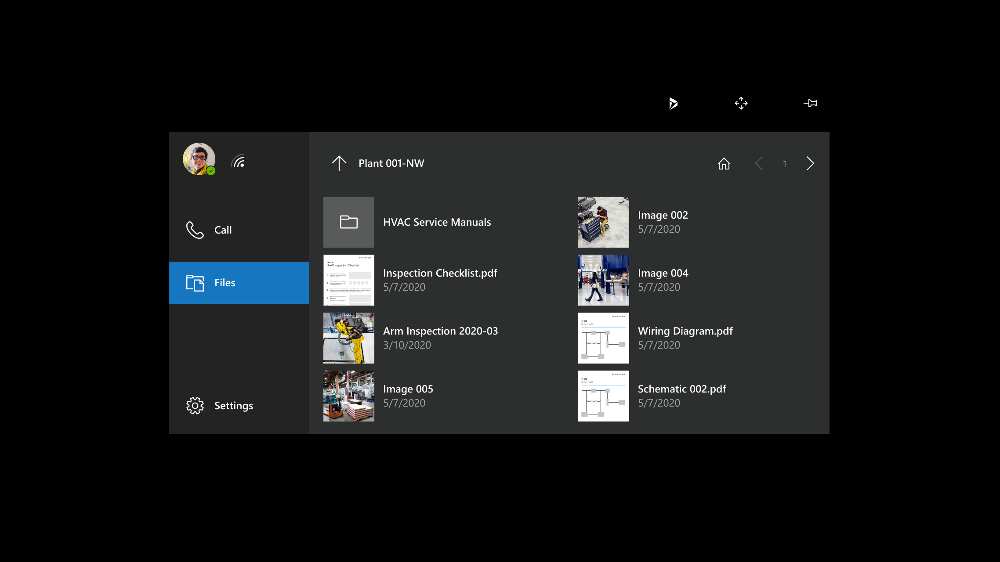

# Overview of Dynamics 365 Remote Assist on HoloLens and HoloLens 2

When you use Dynamics 365 Remote Assist on HoloLens or HoloLens 2, you can collaborate with one or more Teams desktop users or one Teams mobile user. Remote Assist on HoloLens and HoloLens 2 offer the same capabilities; however, there are slight differences in the way you interact with holograms. Those differences are called out throughout this document.

## Overview of core features

When you launch Dynamics 365 Remote Assist, you'll be in the **Call** tab where you'll see your recent contacts. When you join a call or meeting, you'll see a video card.  

The previous screenshot shows the **Call** tab. You can use the tools in the top-right corner to access Dynamics 365 Field Service bookings, move the window, and pin the window in place.

 

 The previous screenshot shows the Files tab. You can select the **Files** tab at any time (before, during, or after a call) to access service-related documents from your OneDrive for Business and place them into your field of view.

The previous screenshot shows the Settings tab. You can select the **Settings** tab at any time to:

- Configure various settings
- Provide feedback
- Watch the brief tutorial you saw the first time you used Dynamics 365 Remote Assist
- Find tutorials on Microsoft Docs
- Switch your Dynamics instance.  

The previous screenshot shows a video card. When you're in a call, all the tools are along the top and bottom of the video card. The participant tray displays the avatars of all call participants.  

As a Dynamics 365 Remote Assist HoloLens user, you can make or join a one-to-one call, group call, or meeting scheduled using Teams or Outlook.

Remote collaborators can join the call using Microsoft Teams desktop application or mobile application.  

In a call, remote collaborators can see everything you see – including holograms and the real world behind the holograms – and can add annotations, insert files into your world, and more.

A good way to learn Dynamics 365 Remote Assist features and voice commands is to say "Remote Assist." When you're in a call, the app will show what it believes you said by showing a check mark and "Remote Assist." Then, the app will show the name of each button, as you see in the previous video call screenshot. After a few seconds, these labels will automatically disappear.

If you'd like to see the button labels after they disappear:

- If you're using Dynamics 365 Remote Assist on HoloLens, hover your gaze cursor over each button.
- If you're using Dynamics 365 Remote Assist on HoloLens 2 and Dynamics 365 Remote Assist UI is within your reach, hover your finger over the buttons. If Dynamics 365 Remote Assist UI is out of reach, extend your arm and hover the ray over the buttons.

You have many options for communicating with remote collaborators. Everyone in the call can:

- Annotate your world with arrows with this icon .
- Annotate your world with drawings with this icon .
- Change annotation colors with this icon .
- Undo their actions with this icon .
- Delete all their annotations with this icon .
- Everyone is also able to send files, which will pop up in your space.  

You can also take a photo of what you see using the Camera icon, as seen here: .

Finally, place the call window wherever you want in your world by toggling **Pin** and **Unpin** .

Dynamics 365 Remote Assist supports different languages on HoloLens versus HoloLens 2. Check if your language is supported in Dynamics 365 Remote Assist in [our FAQs](faq-hololens.md).

> [!Note]
> Dynamics 365 Remote Assist on HoloLens and HoloLens 2 offer the same capabilities. However, HoloLens gestures differ from HoloLens 2 gestures. Learn how to [navigate HoloLens gestures](/hololens/hololens1-basic-usage) or [navigate Hololens 2 gestures](/hololens/hololens2-basic-usage) before reading the rest of this document. You may also watch how-to videos showing how to use Dynamics 365 Remote Assist features on HoloLens.

## Collaborating with a Teams desktop user versus a Teams mobile user

A Dynamics 365 Remote Assist HoloLens user can be in one-to-one call, group call, or meeting with a Teams desktop user.

A Dynamics 365 Remote Assist HoloLens user can be in one-to-one call with a Teams mobile user.

## Prerequisites

- Subscription to Dynamics 365 Remote Assist and Microsoft Teams.
- HoloLens or HoloLens 2 running the [Windows 10 April 2018 update](requirements.md).
- Remote collaborator using Teams desktop app or Teams mobile app.  
- An internet connection. At least [1.5 mpbs of bandwidth is recommended](/microsoftteams/upgrade-prepare-environment-prepare-network#bandwidth-planning).
- (Optional) To connect to Dynamics 365 Field Service from within Dynamics 365 Remote Assist, you'll need a Dynamics 365 license.
- Know your credentials for signing into the HoloLens and Dynamics 365 Remote Assist.
- Dynamics 365 Remote Assist is installed on your HoloLens or HoloLens 2.

## Using HoloLens gestures in Dynamics 365 Remote Assist

HoloLens offers several ways to interact with holograms as you navigate the device and various applications. Read [the HoloLens basics guide](/hololens/hololens1-basic-usage) to learn how to:

- Navigate the Start menu using bloom
- Select holograms with gaze, air tap, and voice
- Move, resize, and rotate apps

## Using HoloLens 2 gestures in Dynamics 365 Remote Assist

Compared to HoloLens, HoloLens 2 offers more ways for you to navigate the device and various applications. Read [this HoloLens 2 basics guide](/hololens/hololens2-basic-usage) to learn how to:

- Navigate the Start menu by tapping your wrist
- Select holograms with gaze, air tap, voice, and touch
- Move, resize, and rotate apps

You can interact with Dynamics 365 Remote Assist just like you do with the HoloLens 2 operating system features. For example, in Dynamics 365 Remote Assist, you can select something a few different ways:

- If it's out of your reach, extend your arm, aim your hand ray, and air tap.
- If it's within your reach, touch it directly.
- To use your voice, say "Remote Assist" followed by voice command for that button. A full list of voice commands can be found [here](voice-commands-hololens.md). The easiest way to see the voice command for Dynamics 365 Remote Assist features is to say "Remote Assist." Then, the app will display the name of each button. After a few seconds, these labels will automatically disappear.

## Benefits of integrating with Dynamics 365 Field Service

If your organization uses Dynamics 365 Field Service to manage work orders, the technician using HoloLens can view Dynamics 365 Field Service bookings from Dynamics 365 Remote Assist and do heads-up, hands-free calling in the context of a Field Service booking. For example, the technician can:

- View booking details
- Quickly call the assigned collaborator  
- Save snapshots to a booking
- Save call artifacts to the work order that the booking is associated with, including the call log and files shared during the call

[!INCLUDE[footer-include](../includes/footer-banner.md)]
