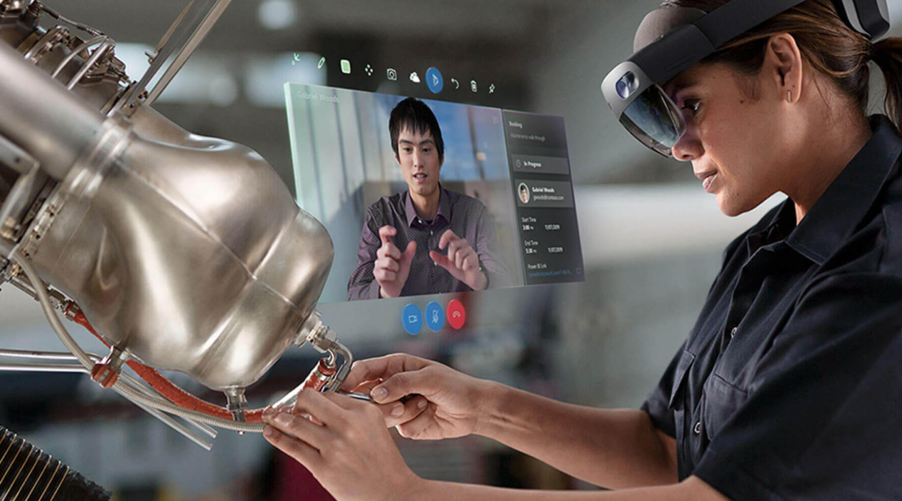
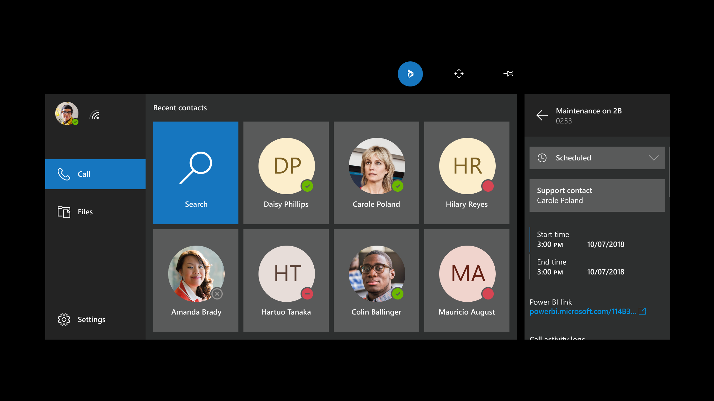

# Overview of Dynamics 365 Remote Assist

Empower technicians to collaborate more efficiently by working together from different locations with Dynamics 365 Remote Assist on HoloLens, HoloLens 2, Android, or iOS devices.

## Use cases

- **Collaborative maintenance and repair**: Empower technicians to solve problems faster the first time with Microsoft Dynamics 365 Remote Assist. By using heads-up video calling on [Microsoft HoloLens](overview-hololens.md) and mobile devices, technicians can receive guidance in context from remote collaborators.
- **Remote inspections**: Empower onsite inspectors to collaborate with remote inspectors to evaluate and document asset quality.
- **Knowledge sharing and training**: Document repairs via photos and videos and share them with the rest of your organization.

Watch a video about [Dynamics 365 Remote Assist on Hololens 2 and mobile](https://youtu.be/d3YT8j0yYl0).

> [!Note]
> Dynamics 365 Remote Assist is intended for facilitating communications and is not intended or made available for use as a medical device for the diagnosis of disease or other conditions, or in the cure, mitigation, treatment or prevention of disease or otherwise to be used as a component of any clinical offering or product, and Microsoft does not grant a license or right for such purposes. Dynamics 365 Remote Assist is not designed or intended to substitute for professional medical advice, diagnosis, treatment, or judgment and should not be used for medical emergencies or emergency communications. Microsoft does not warrant that Dynamics 365 Remote Assist will be sufficient for any medical purposes or meet the health or medical requirements of any person.

## Benefits

- **Solve problems in real time**: Technicians can share their real-time view with experts in remote locations to get the help they need, reducing travel time and cost.
- **Walk the site without being onsite**: Remote inspectors can assess product quality without traveling onsite by using Remote Assist or Microsoft Teams to collaborate with a  Remote Assist user.
- **Communicate detailed and complex instructions visually**: Rather than communicating instructions via audio call, onsite workers and remote collaborators can use drawings and arrows to refer to specific parts of a machine or asset. These annotations are anchored in the Remote Assist user's space.
- **Scale expert knowledge**: Enable experts to effectively share their knowledge from anywhere in the world.
- **Bring critical information into view**: Technicians and inspectors can pull in work order information from Dynamics 365 Field Service and call the resource assigned to support them. Furthermore, technicians and inspectors no longer need to carry around paper manuals to perform their repair or inspection. If the technician is using Remote Assist on HoloLens, remote collaborators can insert reference images, schematics, and other helpful information the technician's physical space so they can refer to the schematic while working heads-up and hands-free on HoloLens. If the technician is using Remote Assist on mobile, remote collaborators can share reference images, schematics, and other helpful information the technician can view in their mobile device.
- **Combine video, screenshots, and annotations for more seamless workflows on the devices you already use**: Remote Assist is available on non-AR-capable mobile devices. 
- **Navigate Remote Assist on HoloLens with your voice**: Remote Assist on HoloLens provides a hands-free experience by supporting [voice commands in these languages](https://docs.microsoft.com/dynamics365/mixed-reality/remote-assist/faq#what-languages-are-voice-commands-and-speech-recognition-available-for) for all features, even in a loud, industrial environment. 
- **Asset capture & process automation via Microsoft Power Platform**: Store mixed reality photos and videos in CDS, then integrate data with business processes via Power Automate.  
- **Offer best-in-class service via a click-to-join Remote Assist call**: Assist vendors and customers with a click-to-join mixed reality video call.

## Roles

- **Technician**: A technician uses Dynamics 365 Remote Assist on their HoloLens or mobile device to share what they are seeing and receive remote assistance.
- **Inspector or auditor**: An inspector or auditor uses Dynamics 365 Remote Assist on their HoloLens or mobile device to collaborate with remote inspectors and auditors. Together, they evaluate and document asset quality.
- **Remote collaborator**: A remote collaborator uses Teams on PC or mobile to join a Dynamics 365 Remote Assist call, see what a technician or inspector sees, and provide guidance in context.  

## Sample workflow for technicians and remote collaborators 

1. A technician arrives onsite to fix a machine, but encounters a complex machine that they're not familiar with. The technician puts on a HoloLens 2, signs in using iris scanning, and launches Dynamics 365 Remote Assist. (Or, they launch Dynamics 365 Remote Assist from their mobile device.)  

2. Because the technician's company has enabled Field Service integration, the technician selects a booking and views the recommended remote collaborator who has more experience with that machine.

3. A remote collaborator joins the mixed reality call on Microsoft Teams desktop and sees what the technician sees. They start recording the call so the technician can use it for future reference. 

4. The remote collaborator provides verbal instructions. When they want to draw attention to a specific part of the machine, they draw an arrow onto their PC screen. The arrow immediately appears in the HoloLens user's space and remains anchored to that part of the machine even when the technician walks around. When they want to point out the cable the technician should reattach, they draw along the cable. The line immediately appears in the HoloLens user's space.  he arrows and  collaborator adds drawings and arrows onto their PC screen. These drawings and arrows appear in the technician's space and remains anchored to the cable even when the technician walks around.

5. The remote collaborator then shares a schematic from OneDrive, and it appears in the technician's space. The collaborator can also pull up a training video up on their desktop and share their screen with the technician. 

6. The technician successfully repairs the machine, takes a snapshot of the repaired machine, and saves it to OneDrive. They thank the remote collaborator for their help, and end the call. Snapshots and files shared during the call are posted to the Field Service work order for the technician's manager to review, and the recording is saved online. The technician shares the recording with colleagues so they can learn how the technician and remote collaborator repaired the machine. 

## Learn more about mixed reality

* **[Mixed reality is a spectrum](https://docs.microsoft.com/windows/mixed-reality/#mixed-reality-is-a-spectrum)**: Mixed reality blends the physical world with the digital world. Mixed reality physically anchors holographic images, data, text, and other digital information onto the physical world and enables you to interact with these holograms. 
* **[What is a hologram?](https://docs.microsoft.com/windows/mixed-reality/#what-is-a-hologram)** HoloLens 1 and 2 display holograms, which are objects made of light and sound that appear in the world around you, as if they were real objects. Holograms respond to your gaze, gestures, and voice commands, and can interact with real-world surfaces around you. With holograms, you can create digital objects that are part of your world.
* **[Spatial anchoring](https://docs.microsoft.com/windows/mixed-reality/spatial-anchors)**: When a technician or remote collaborator makes drawings or adds arrows, these annotations are anchored in the physical world and stay in place as the Dynamics 365 Remote Assist user moves around. 
* **What is the HoloLens 2?** HoloLens 2 offers the most comfortable and immersive mixed reality experience available, with industry-leading solutions that deliver value in minutes—all enhanced by the reliability, security, and scalability of cloud and AI services from Microsoft. Learn more about HoloLens 2 features and technical specs [here](https://www.microsoft.com/hololens/hardware).
* **How is the HoloLens 2 improved from HoloLens?** HoloLens 2 offers a more immersive, ergonomic, and instinctual experience. 
* **Field of view (FOV)**: The greater the device's field of view, the more holograms you can see at once. During a Dynamics 365 Remote Assist call, the Teams user can see all the holograms in the Dynamics 365 Remote Assist HoloLens user's space, but the Dynamics 365 Remote Assist HoloLens user can only see the holograms that are within their field of view.

Learn more about [core concepts](https://docs.microsoft.com/windows/mixed-reality/core-concepts-landingpage) in mixed reality technology.

## Devices

Technicians and inspectors can use Remote Assist on [HoloLens](https://docs.microsoft.com/hololens/hololens1-hardware), [HoloLens 2](https://docs.microsoft.com/hololens/hololens2-hardware), or [Android](https://developers.google.com/ar/discover/supported-devices) and [iOS](https://www.apple.com/ios/augmented-reality/) mobile phones and tablets.

Remote collaborators can use the [Teams application on a Windows 10 PC](teams-pc-all.md) or [Teams application on a mobile device](teams-mobile-all.md), or Remote Assist on HoloLens, HoloLens 2, or mobile phones and tablets.

Learn more about the [technical requirements](requirements.md) for deploying and using Dynamics 365 Remote Assist.

## Integrate Dynamics 365 Field Service  

In addition to using Dynamics 365 Remote Assist to consult with remote collaborators and resolve issues faster, technicians and inspectors work even more effectively when they use Field Service to view their schedules, perform and track work orders, manage customer assets, and more. When Dynamics 365 Remote Assist and Field Service are integrated, technicians and inspectors can view bookings in Dynamics 365 Remote Assist and automatically attach relevant call details and artifacts to their work order associated with that booking.

## Next steps

### For administrators

- Learn the [technical requirements](requirements.md) for deploying and using Remote Assist. 
- Learn how to get a [free trial of Remote Assist](try-remote-assist.md).
- Learn how to [buy Remote Assist licenses](buy-remote-assist.md), either with or without Field Service licenses.
- Learn how to [deploy Remote Assist](deploy-remote-assist.md), including how to assign licenses and set up HoloLens and mobile devices.
- Learn how to [install the Remote Assist model-driven app](ra-webapp-install.md).
- (Optional) Learn about [additional deployment scenarios](common-deployment-scenarios.md).
- (Optional) Learn how to [set up multi-tenant collaboration](multi-tenant-deployment.md) for licensed users.
- (Optional) Learn how to [enable vendors and contractors to use Dynamics 365 Remote Assist](vendor-use-RA.md).
- (Optional) Learn how to [enable vendors and contractors to use Teams](vendor-use-RA.md).
- (Optional) Learn to [integrate Dynamics 365 Remote Assist with Field Service](troubleshoot-field-service.md).

### For technicians and inspectors
- Learn how to use [Dynamics 365 Remote Assist on HoloLens](overview-hololens.md) or [Dynamics 365 Remote Assist on mobile](./mobile-app/remote-assist-mobile-overview.md).

### For remote collaborators
- Learn how to use [Teams on PC](teams-pc-all.md) or [Teams on mobile](teams-mobile-all.md) to collaborate with a Dynamics 365 Remote Assist user.

### See also

- [Requirements](requirements.md)
- [Try Dynamics 365 Remote Assist for free](try-remote-assist.md) 
- [Buy Dynamics 365 Remote Assist](buy-remote-assist.md)
- [Deploy Dynamics 365 Remote Assist](deploy-remote-assist.md) 
- [Mixed reality](https://docs.microsoft.com/windows/mixed-reality/)
