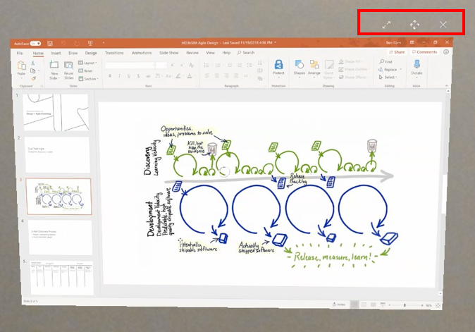

# Overview of Dynamics 365 Remote Assist

## Use cases

* **Collaborative maintenance and repair**: Empower technicians to solve problems faster the first time with Microsoft Dynamics 365 Remote Assist. By using heads-up, hands-free video calling on [Microsoft HoloLens](overview-hololens.md) and mobile devices, technicians can receive guidance in context from remote collaborators.
* **Remote inspections**: Empower onsite inspectors to collaborate with remote inspectors to evaluate and document asset quality.
* **Knowedge sharing and training**: Document repairs via photos and videos and share them with the rest of your organization.

Watch a video about [Dynamics 365 Remote Assist on Hololens 2 and mobile](https://www.youtube.com/watch?v=V732PXZHLiU).

## Benefits

* **Solve problems in real time**: Technicians can share their real-time view with experts in remote locations to get the help they need while keeping both hands free to work on their task. This reduces travel time and cost.
* **Communicate detailed and complex instructions visually**: Rather than communicating instructions via an audio call, onsite workers and remote collaborators can use drawings and arrows to refer to specific parts of a machine or asset. These annotations are anchored in the Remote Assist user's space.
* **Scale expert knowledge**: Enable experts from anywhere in the world to effectively share their knowledge. 
* **Walk the site without being onsite**: Reduce costs with remote inspections—combine video, screenshots, and annotations for more seamless workflows on the devices you already use
* **Bring critical information into view**: Technicians and inspectors can pull in work order information from Dynamics 365 for Field Service and call the resource assigned to support them. Furthermore, technicians and inspectors no longer need to carry around paper manuals they may need to perform their repair or inspection. Remote collaborators can insert reference images, schematics, and other helpful information in a technician or inspector's view, so they can refer to the schematic while working heads-up and hands-free.
* **Navigate Remote Assist on HoloLens with your voice**: Remote Assist on HoloLens 1 and 2 provides a truly hands-free experience. All features can be navigated using voice in (many languages)[link to FAQ about langauges] even in a loud, industrial environment. 
* **Offer your customers a differentiated service offering**: When selling a machine or equipment, include a Remote Assist subscription your customer can use to receive help from the experts who created the equipment. 

## Roles

* **Technician**: A technician uses Remote Assist on their HoloLens or mobile device to share what they are seeing and request remote assistance.
* **Inspector/auditor**: An inspector/auditor uses Remote Assist on their HoloLens or mobile device to evaluate and document asset quality.
* **Remote collaborator**: A remote collaborator uses Teams on PC or mobile to join a Remote Assist call, see what a technician or inspector sees, and provide guidance in context.  

## Sample workflow for technicians and remote collaborators 
(idk what these videos are, but i kept them...)

1. A technician arrives onsite to fix a machine, but encounters a particularly complex machine that he's not familiar with. He puts on a HoloLens, signs in using iris scanning, and launches Remote Assist. (Or, he launches Remote Assist from her mobile device.)  

2. Because the technician's company has enabeld Dynamics Field Service integration, the technician select a booking and views the recommended remote collaborator who has more experience with that machine.

<iframe src="https://www.microsoft.com/videoplayer/embed/RE2F6TI" frameborder="0" allowfullscreen=""></iframe>

3. A remote collaborator joins the mixed reality call on Microsoft Teams desktop and sees what the technician sees. She starts recording the call so the technician can use it for future reference. 

4. The remote collaborator provides verbal instructions. When she wants to draw attention to a part of the machine, she adds drawings and arrows onto her PC screen. These drawings and arrows appear in the technician's space and are anchored to the machine. 

<iframe src="https://www.microsoft.com/videoplayer/embed/RE2F6TF" frameborder="0" allowfullscreen=""></iframe>

<iframe src="https://www.microsoft.com/videoplayer/embed/RE2F6TK" frameborder="0" allowfullscreen=""></iframe>

5. The remote collaborator then shares a schematic from OneDrive, and it appears in the technician's space. She can also pull up the schematic and share her computer screen with the technician. The technician uses the schematic to finish the repair. 

<iframe src="https://www.microsoft.com/videoplayer/embed/RE2F9qy" frameborder="0" allowfullscreen=""></iframe>

  

6. The technician successfully repairs the machine, takes a snapshot of the repaired machine, and saves it to OneDrive. He thanks the remote collaboraotr for her help, and ends the call. Snapshots and files shared during the booking are posted to the Dynamics booking, and the recording is saved online and shared with call participants.  

## Learn more about mixed reality

* **[Mixed reality is a spectrum](https://docs.microsoft.com/en-us/windows/mixed-reality/#mixed-reality-is-a-spectrum)**: Mixed reality blends the physical world with the digital world. Mixed reality physically anchors holographic images, data, text, and other digital information onto the physical world and enables you to interact with these holograms. 
* **[What is a hologram?](https://docs.microsoft.com/en-us/windows/mixed-reality/#what-is-a-hologram)**: HoloLens 1 and 2 display holograms, which are objects made of light and sound that appear in the world around you, just as if they were real objects. Holograms respond to your gaze, gestures and voice commands, and can interact with real-world surfaces around you. With holograms, you can create digital objects that are part of your world.
* **[Spatial anchoring](https://docs.microsoft.com/en-us/windows/mixed-reality/spatial-anchors)**: When a technician or remote collaborator makes drawings or adds arrows, these annotations are anchored in the physical world and stay in place as the Remote Assist user moves around. 
* **What is the HoloLens 2?** HoloLens 2 offers the most comfortable and immersive mixed reality experience available, with industry-leading solutions that deliver value in minutes—all enhanced by the reliability, security, and scalability of cloud and AI services from Microsoft. Learn more about HoloLens 2 features and technical specs [here](https://www.microsoft.com/en-us/hololens/hardware).
* **How is the HoloLens 2 improved from Hololens 1?**: HoloLens 2 is offers a more immersive, ergonoic, and instinctual experience. 

Learn more about core concepts in mixed reality technology in the following topic on [core concepts](https://docs.microsoft.com/en-us/windows/mixed-reality/core-concepts-landingpage). 

## Devices

Technicians and inspectors use Remote Assist on [HoloLens 1](https://docs.microsoft.com/en-us/hololens/hololens1-hardware), [HoloLens 2](https://docs.microsoft.com/en-us/hololens/hololens2-hardware), or AR-capable iOS or Android devices. 

Remote collaborators use Microsoft Teams on a PC or a mobile device.

## Integrate Dynamics 365 Field Service  

In addition to using Remote Assist to consult with remote collaborators and resolve issues faster, technicians and inspectors work even more effectively when they use Dynamics 365 Field Service to view their schedules, perform and track work orders, manage customer assets, and more. When Remote Assist and Field Service are integrated, technicians and inspectors can view bookings in Remote Assist and automatically attach relevant call details and artifacts to their booking. 

Learn more [here](https://docs.microsoft.com/en-us/dynamics365/field-service/remote-assist-hololens).

## Next steps

Administrators: Learn how to try, buy, or deploy Remote Assist in your organization, and how to deploy HoloLens and mobile. Also, learn to configure option settings, such as integrating Dynamics 365 Remote Assist or enabling a cross-tenant user to use Remote Assist or Teams.

Technicians and inspectors: Learn how to use the features of [Remote Assist on HoloLens](overview-hololens.md) or [Remote Assist on mobile](mobile-app/index.md).

Remote collaborators: Learn how to use [Teams on PC](teams-pc-all.md) or [Teams on mobile](teams-mobile-all.md) to collaborate with a Remote Assist user.

### See also (needs update)

[Requirements](requirements.md)  
[Try Dynamics 365 Remote Assist for free](try-remote-assist-free.md) 	 
[Buy and deploy Dynamics 365 Remote Assist](buy-and-deploy-remote-assist.md) 	 
[User guide](user-guide.md) 	 
[Mixed Reality](https://docs.microsoft.com/en-us/windows/mixed-reality/) 
[Set up and use Microsoft Teams with Dynamics 365 Remote Assist](use-microsoft-teams-with-remote-assist.md) 	 
[FAQ](faq.md) 	 
