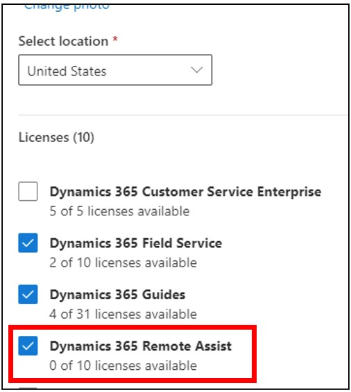

# Install the Dynamics 365 Remote Assist model-driven app

[!INCLUDE[try-guides-ra](../includes/try-guides-ra.md)]

The Dynamics 365 Remote Assist model-driven app is built on the Microsoft Dataverse. The model-driven app is a companion to the Dynamics 365 Remote Assist app for HoloLens and enables new scenarios for managing data generated and used by Dynamics 365 Remote Assist.

More information: [What are model-driven apps in Power Apps?](/powerapps/maker/model-driven-apps/model-driven-app-overview)

The Dataverse is the central location for customers to store their organization-specific data. The Dynamics 365 Remote Assist client app on HoloLens can send and receive data to the Dataverse, which can then be accessed through the model-driven app in a browser. This also allows other applications, such as Dynamics 365 Field Service, to share the same organizational data so you can gain further insights. You can even use [Microsoft Power Automate to create flows that use Microsoft Dataverse](/power-automate/common-data-model-intro) and make them available for third-party apps. The high-level architecture diagram below shows the various possible components for these scenarios. 

:::image type="content" source="media/ra-cds-architecture-diagram-2.PNG" alt-text="Architecture Diagram of a Remote Assist with CDS and companion apps." :::

> [!NOTE]
> The Dynamics 365 Remote Assist model-driven app has been deployed to the following regions: SAM, CAN, FRA, IND, FRA, UAE, GER, ZAF, JPN, APJ, GBR, OCE, EUR, NAM, GCC, USG. Other regions are not supported at this time. For more information, see:
> - [Power Platform data center regions](/power-platform/admin/new-datacenter-regions)
> - [Microsoft 365 Multi-Geo](/microsoft-365/enterprise/microsoft-365-multi-geo)

## Features enabled by the model-driven app

After installing the Dynamics 365 Remote Assist model-driven app, you'll be able to use any of the following features:

- Use the Dynamics 365 Remote Assist client app on HoloLens to [capture and view asset data](asset-capture-overview.md).

- Monitor operational metrics through the [Calls dashboard](calls-dashboard.md).

## Prerequisites

To complete the installation steps for the model-driven app, you need:

- **A Dynamics 365 Field Service or Remote Assist subscription** to create environments and install the app.

- **The ability to [manage environments](/power-platform/admin/create-environment) in the Power Platform admin center**.

- **Available database capacity**. If you're creating a new environment for Dynamics 365 Remote Assist, you'll need at least 1 GB of available database capacity. Paid subscriptions of Dynamics 365 Remote Assist provide default tenant capacity. More information: [New Dataverse storage capacity](/power-platform/admin/capacity-storage)

## Install the Dynamics 365 Remote Assist model-driven app

> [!IMPORTANT]
> To install the Dynamics 365 Remote Assist model-driven app, you must have the System Administrator role, and you must have a Power Apps license (or a license like a Dynamics 365 Field Service or Remote Assist license that includes a Power Apps license). 
> 
> 

You can install the Dynamics 365 Remote Assist app in two ways:

- Create a new Dynamics 365 environment.

- Use an existing environment. This environment must be **Dynamics 365 apps&ndash;enabled**.

### Create a new environment

1. Sign in to the [Power Platform admin center](https://admin.powerplatform.com).

1. [Create an environments with a database.](/power-platform/admin/create-environment#create-an-environment-in-the-power-platform-admin-center)

1. Make sure you select the following:

   - Under **Type**, select **Production** or **Sandbox**.

   - Under **Add a Dataverse data store**, select **Yes**.

1. Select **Next**.

1. Make sure you select **Yes** under **Enable Dynamics 365 apps**.

1. Select **Save**. This will create an environment and automatically install the Dynamics 365 Remote Assist app.

### Use an existing environment

1. Sign in to the [Power Platform admin center](https://admin.powerplatform.com).

2. In the left pane, select **Resources** > **Dynamics 365 apps**.

3. Find the Dynamics 365 Remote Assist app, select the ellipsis button , and then select **Install**.

    

4. Select an environment, review the packages to be installed, agree to the terms of service, and then select **Install**. This process might take a while.

> [!IMPORTANT]
> The environment selected must be Dynamics 365 apps&ndash;enabled.
> 
>  Do not install into the Default environment. If you select the Default environment, some Dynamics 365 Remote Assist features, such as the Calls Dashboard, won't work. 

## Update the model-driven app to the latest version

As new versions of the Dynamics 365 Remote Assist model-driven app are released, update the app by following the steps below to ensure that the latest features are available.

1. Sign in to the [Power Platform admin center](https://admin.powerplatform.com).

2. In the left pane, select **Environments**, and then select the name of the environment that you want to update.

3. From this view of environment details, you can select **Resources** > **Dynamics 365 apps** from the top nav bar or from the card in the main view.

    :::image type="content" source="media/PPAC_Environment_Details_D365_apps.png" alt-text="Screenshot of environment details in PPAC.":::

4. You'll see the appropriate status for applications that have an **Update available**. Select the status, which will show a pane with the update details. Follow the steps to start the update.

    :::image type="content" source="media/PPAC_Update_Solution.png" alt-text="Screenshot of solution updates in PPAC.":::

5. After initiating the update, the environment details will show a status of **Installing** next to the **Dynamics 365 Remote Assist** app. This process might take a while. Once the update has been completed, the status will change to **Installed**.

## Next step

You've installed the Dynamics 365 Remote Assist app! You can get to the app by opening the environment and selecting the Dynamics 365 Remote Assist app. More information: [About Unified Interface for model-driven apps in Power Apps](/power-platform/admin/about-unified-interface)

The next step is to [add users to the model-driven app](asset-capture-add-users.md) so they can interact with data in the Dataverse.

[!INCLUDE[footer-include](../includes/footer-banner.md)]
