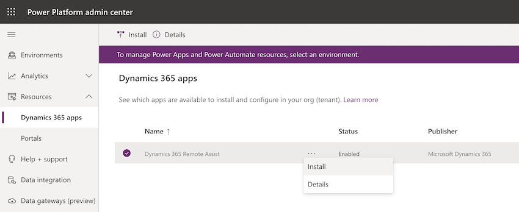

# Install the Dynamics 365 Remote Assist model-driven app

## Overview

The Dynamics 365 Remote Assist model-driven app is built on the Microsoft Dataverse. The model-driven app is a companion to the Dynamics 365 Remote Assist apps for HoloLens, iOS, and Android, and enables new scenarios for managing data generated and used by Dynamics 365 Remote Assist.

More information: [What are model-driven apps in Power Apps?](https://docs.microsoft.com/powerapps/maker/model-driven-apps/model-driven-app-overview)

The Dataverse is the central location for customers to store their organization-specific data. The Dynamics 365 Remote Assist client apps on HoloLens or mobile can send and receive data to the Dataverse, which can then be accessed through the model-driven app in a browser. This also allows other applications, such as Dynamics 365 Field Service, to share the same organizational data so you can gain further insights. You can even use [Microsoft Power Automate to create flows that use Microsoft Dataverse](https://docs.microsoft.com/power-automate/common-data-model-intro) and make them available for third-party apps. The high-level architecture diagram below shows the various possible components for these scenarios. 

:::image type="content" source="media/ra-cds-architecture-diagram-2.PNG" alt-text="Architecture Diagram of a Remote Assist with CDS and companion apps" :::

> [!NOTE]
> The Dynamics 365 Remote Assist model-driven app has been deployed to the following regions: SAM, CAN, FRA, IND, FRA, UAE, GER, ZAF, JPN, APJ, GBR, OCE, EUR, NAM, GCC, USG. Other regions are not supported at this time. For more information, see:
> - [Power Platform data center regions](https://docs.microsoft.com/power-platform/admin/new-datacenter-regions)
> - [Microsoft 365 Multi-Geo](https://docs.microsoft.com/microsoft-365/enterprise/microsoft-365-multi-geo?view=o365-worldwide)

## Features enabled by the model-driven app

After installing the Dynamics 365 Remote Assist model-driven app, you'll be able to use any of the following features:

- Use the Dynamics 365 Remote Assist client app on HoloLens or mobile to [capture and view asset data](asset-capture-overview.md).

- Create and share [one-time call links](one-time-call.md).

- Monitor operational metrics through the [Calls dashboard](calls-dashboard.md).

## Prerequisites

To complete the installation steps for the model-driven app, you need:

- **A Dynamics 365 Remote Assist subscription** to create environments and install the app.

- **The ability to manage environments in the Microsoft Power Platform admin center**. This article covers creating Dynamics 365 environments and installing apps. Admin access is required (Dynamics 365 service admin, global admin, or Power Platform service admin).

- **Available database capacity**. If you're creating a new environment for Dynamics 365 Remote Assist, you'll need at least 1 GB of available database capacity. Paid subscriptions of Dynamics 365 Remote Assist provide default tenant capacity. More information: [New Dataverse storage capacity](https://docs.microsoft.com/power-platform/admin/capacity-storage)

> [!IMPORTANT]
> You can get a 30-day trial subscription of Dynamics 365 Remote Assist to try out the Remote Assist model-driven app. Make sure to follow [these instructions to create a **subscription-based trial environment**](https://docs.microsoft.com/power-platform/admin/trial-environments#create-a-trial-subscription-based-environment-in-the-power-platform-admin-center). Note that you **can't use the standard trial instructions** for this purpose. 
> In step 4 of the subscription-based trial environment instructions:
> - For the **Enable Dynamics 365 apps** option, select **Yes**. 
> - For the **Automatically deploy these apps** option, select **All enterprise applications**. If you select **Customer Service Pro** or **Sales Pro**, the Remote Assist model-driven app will **NOT** be installed.

## Install the Dynamics 365 Remote Assist model-driven app

You can install the Dynamics 365 Remote Assist app in two ways:

- Create a new Dynamics 365 environment.

- Use an existing environment. This environment must be **Dynamics 365 apps&ndash;enabled**.

### Create a new environment

1. Sign in to the [Power Platform admin center](https://admin.powerplatform.com) as an admin (Dynamics 365 service admin, Global admin, or Power Platform service admin).

2. In the left pane, select **Environments**, and then select **New**.

3. Do the following:

    1. Enter a name for the environment.

    2. Under **Type**, select **Production** or **Sandbox**.

    3. Under **Create a database for this environment**, select **Yes**.

    4. Select **Next**.

       :::image type="content" source="media/PPAC_Environment_Create_Database.png" alt-text="Screenshot of a new environment create database.":::

4. In the **Add database** pane:

    1. Under **Enable Dynamics 365 apps**, select **Yes**.

    2. In the **Automatically deploy these apps** list, select **Remote Assist**.

    3. Select **Save**. This will create an environment and automatically install the Dynamics 365 Remote Assist app. If you encounter an issue, see [the troubleshooting](#troubleshooting) section in this article.

    :::image type="content" source="media/PPAC_Environment_Enable_D365_apps.png" alt-text="Screenshot of a new environment with enable Dynamics 365 apps.":::

More information: [Create and manage environments in the Power Platform admin center](https://docs.microsoft.com/power-platform/admin/create-environment#create-an-environment-in-the-power-platform-admin-center)

### Use an existing environment

1. Sign in to the [Power Platform admin center](https://admin.powerplatform.com) as an admin (Dynamics 365 service admin, Global admin, or Power Platform service admin).

2. In the left pane, select **Resources** > **Dynamics 365 apps**.

3. Find the Dynamics 365 Remote Assist app, select the ellipsis button , and then select **Install**.

    

4. Select an environment, review the packages to be installed, agree to the terms of service, and then select **Install**. This process might take a while.

> [!IMPORTANT]
> The environment selected must be Dynamics 365 apps&ndash;enabled (for example, you can't use the default environment). If it isn't compatible, the installation will fail. Choose another environment that's compatible, or create a new environment with Dynamics 365 apps enabled.

## Update the model-driven app to the latest version

As new versions of the Dynamics 365 Remote Assist model-driven app are released, you will need to update the app by following the steps below to ensure that the latest features are available.

1. Sign in to the [Power Platform admin center](https://admin.powerplatform.com) as an admin (Dynamics 365 service admin, Global admin, or Power Platform service admin).

2. In the left pane, select **Environments**, and then select the name of the environment that you want to update.

3. From this view of environment details, you can select **Resources** > **Dynamics 365 apps** from the top nav bar or from the card in the main view.

    :::image type="content" source="media/PPAC_Environment_Details_D365_apps.png" alt-text="Screenshot of environment details in PPAC.":::

4. You'll see the appropriate status for applications that have an **Update available**. Select the status, which will show a pane with the update details. Follow the steps to start the update.

    :::image type="content" source="media/PPAC_Update_Solution.png" alt-text="Screenshot of solution updates in PPAC":::

5. After initiating the update, the environment details will show a status of **Installing** next to the **Dynamics 365 Remote Assist** app. This process might take a while. Once the update has been completed, the status will change to **Installed**.

## Next step

You've installed the Dynamics 365 Remote Assist app! You can get to the app by opening the environment and selecting the Dynamics 365 Remote Assist app or from [https://home.dynamics.com/](https://home.dynamics.com). More information: [About Unified Interface for model-driven apps in Power Apps](https://docs.microsoft.com/power-platform/admin/about-unified-interface)

The next step is to [add users to the model-driven app](asset-capture-add-users.md) so they can interact with data in the Dataverse.

## Troubleshooting

### The Dynamics 365 Remote Assist model-driven app failed to install because of missing dependencies

This will occur if you try to install Dynamics 365 Remote Assist in an environment that isn't enabled for Dynamics 365 apps. Try installing the app in an environment where other Dynamics 365 apps&mdash;such as Dynamics 365 Field Service or Dynamics 365 Sales&mdash;are installed, or create a new environment that's enabled for Dynamics 365 apps. More information: [Create a new environment](#install-the-dynamics-365-remote-assist-model-driven-app)

### Can't enable Dynamics 365 apps

If you aren't able to turn on the **Enable Dynamics 365 apps** toggle switch when you create an environment, ensure that you have an active Dynamics 365 Remote Assist subscription. You can view your subscriptions in the [Microsoft 365 admin center](https://www.admin.microsoft.com).

### Not enough capacity to create environments

Environment creation requires at least 1 GB of available database capacity. Paid subscriptions of Dynamics 365 Remote Assist provide a default tenant entitlement of 10 GB of database capacity (if Dynamics 365 Remote Assist was your first Dynamics 365 subscription). More information: [New Dataverse storage capacity](https://docs.microsoft.com/power-platform/admin/capacity-storage)

### The Dynamics 365 Remote Assist app isn't showing up in the Power Platform admin center

1. Check to ensure that you have an active Dynamics 365 Remote Assist subscription.

2. Try assigning a Dynamics 365 Remote Assist license to your account from the [Microsoft 365 admin center](https://admin.microsoft.com) to force a license sync to occur. Wait five minutes, and then see whether the app appears in the [Power Platform admin center](https://admin.powerplatform.com).

3. If the steps above don't resolve the issue, file a support request by going to the [Power Platform admin center](https://admin.powerplatform.com) > **Help + support** > **New support request**.

[!INCLUDE[footer-include](../includes/footer-banner.md)]
