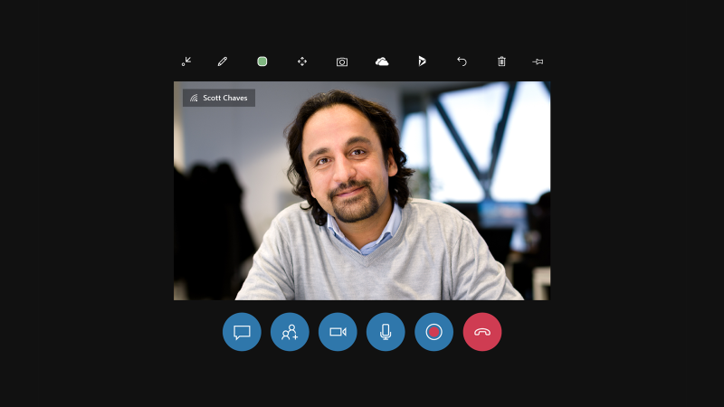
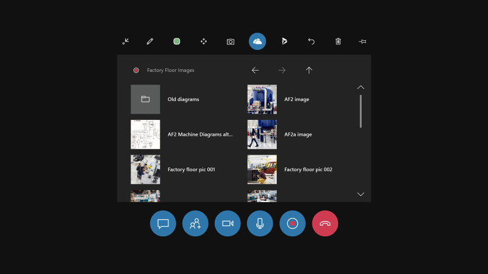
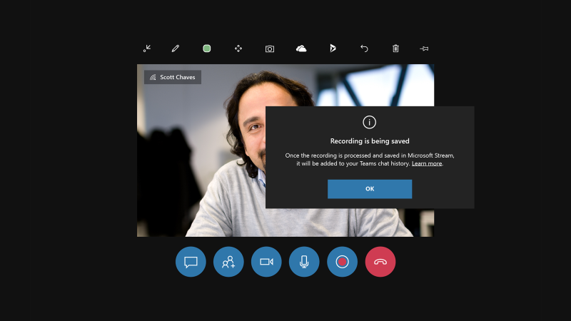
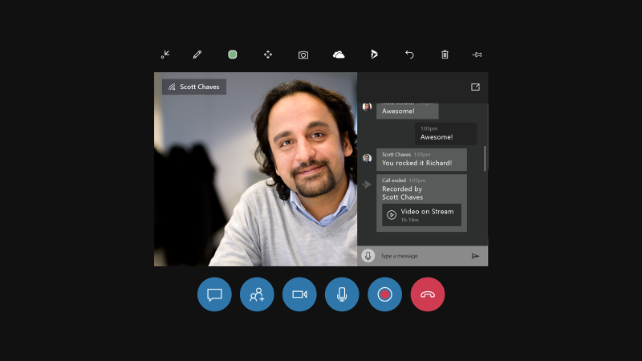
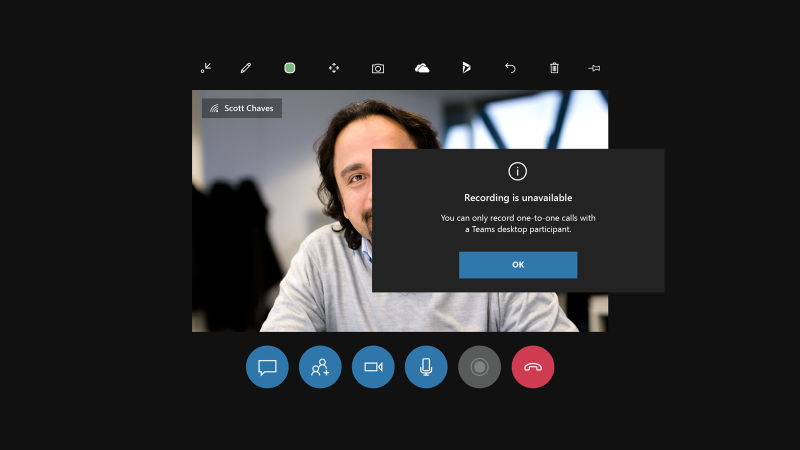

# Record calls in Dynamics 365 Remote Assist on HoloLens 

Recording a call is great for training or record-keeping purposes. Cloud-based recordings are automatically uploaded to Microsoft Stream. When the recording finishes uploading, all call participants can view the Stream link via the Teams chat.

Read about the [layout](https://docs.microsoft.com/dynamics365/mixed-reality/remote-assist/record-calls-hololens#cloud-based-recording-layout) of this type of call before deciding whether to record using this method. You may also consider [alternatives to cloud-based recordings](https://docs.microsoft.com/dynamics365/mixed-reality/remote-assist/record-calls-hololens#alternative-methods-for-recording).

## Overview of cloud-based recording   

>[!Note] 
> Starting in the April 2020 release, Remote Assist users can initiate a cloud-based recording of a one-to-one call with one Teams desktop user.
>  
> If you are not using the April 2020 release or later, a one-to-one call can only be recorded if the Teams desktop user initiates the call using the Meet Now feature.

The following chart explains which call participant can initiate a cloud-based call recording in each type of call:

|            | Who records in a call between Remote Assist HoloLens & Teams Desktop? | Who records in a call between Remote Assist HoloLens & Teams mobile? |
| ---------- | ------------------------------------------------------------------------ | ----------------------------------------------------------------------- |
| 1:1 call   | After April 2020 release, Remote Assist HoloLens. Before April 2020 release, the Teams desktop must use the Teams Meet Now feature to initiate the call and begin recording.                                                 | No one                                                                  |
| Group call | Teams desktop                                                            | No one                                                                  |
| Meeting    | Teams desktop                                                            | Teams mobile                                                            |

Learn more about using [Teams desktop]( https://support.office.com/article/Record-a-meeting-in-Teams-34dfbe7f-b07d-4a27-b4c6-de62f1348c24) or [Teams mobile]( https://support.office.com/en-us/article/Record-a-meeting-in-Teams-34dfbe7f-b07d-4a27-b4c6-de62f1348c24#ID0EAABAAA=Mobile) to record the call. 

> [!Note]
> The recorder is the owner of the video. The owner needs to [give permission](https://support.office.com/article/Play-and-share-a-meeting-recording-in-Teams-7d7e5dc5-9ae4-4b94-8589-27496037e8fa#bkmk_sharemeetingrecording) or [download](https://support.office.com/article/Play-and-share-a-meeting-recording-in-Teams-7d7e5dc5-9ae4-4b94-8589-27496037e8fa#bkmk_downloadmeetingrecording) the video to share the recording beyond these people.  

> [!Note]
>  **If you are not using the April 2020 release or later**, a cloud-based call recording can only be initiated if the Teams desktop user initiates the call using the **Meet Now** feature in the Teams Calendar tab. Learn more about it [in this video starting at 0:33](https://www.microsoft.com/videoplayer/embed/RWedV7?pid=ocpVideo0-innerdiv-oneplayer&postJsllMsg=true&maskLevel=20&market=en-us). A one-to-one call *cannot be recorded* if:
> * The Remote Assist (HoloLens and mobile) user initiates the one-to-one call.
> * The Teams mobile user initiates the call. 
> * The Teams desktop user initiates the call using the Teams Call tab.

## How to create a cloud-based recording of a one-to-one call with a Teams desktop user 

1.	Select the **Start Record** button (as shown here: ) to start recording the call.

2.	You may see a loading notification, as seen in the following screenshot.

 
3.	You'll see a reminder that the call recording only captures the middle vertical section of your field of view. This means that if there are procedures or assets that are critical for you to record, keep them in the middle of your field of view. For more context about this notification, learn about [Teams recording layout for calls with two participants](https://docs.microsoft.com/dynamics365/mixed-reality/remote-assist/record-calls-hololens#cloud-based-recording-layout). Press OK to start recording.
 

4.	The **Start Recording** button now becomes a Stop **Recording** button. You'll also see a persistent recording indication in the top left of the video card. 
 

 
5.	The persistent recording indication will be visible even if you open the OneDrive tab, so you can always verify whether a recording is ongoing. 

 
6.	To end the recording, press the **Stop Recording** (as seen here: ) button. You'll see a reminder that the recording is being processed and saved securely in Microsoft Stream.  

7.	After the recording is processed and saved, it will appear in your Remote Assist chat history and also your Teams chat history. Remember that your Remote Assist chat history does not persist when the call ends, but your Teams chat history does. To view the recording in your HoloLens browser, select the link in the Remote Assist chat. To view all the call recordings you initiated, visit your [Stream videos page](https://msit.microsoftstream.com/studio/videos). 
 

If you're *not* in a one-to-one call with one Teams desktop user, the recording button will be greyed out. If you select it, you'll see a reminder that you can only record in one-to-one calls with a single Teams desktop user.   
 

## Cloud-based recording layout 

At this time, the layout of the Teams recording depends on the number of call participants, and the layout cannot be configured. When using Teams to record the call, the Remote Assist HoloLens user never occupies the entire recording. If it is imperative that your recording only captures as much of the Remote Assist HoloLens user’s view as possible, and as little of Teams user’s outgoing videos (or avatars), consider using one of the following alternative recording methods. 

- In a Teams recording with two participants, each participant’s outgoing video (or avatar) occupies one-half of the recording, and both halves are vertical. This means that during a Remote Assist call, a Teams desktop user sees a horizontal slice of what you see, but the recording only captures the middle vertical slice of what you see. Furthermore, during the Remote Assist call, the Teams user only sees their outgoing video feed in the corner of the call, but in the recording, their outgoing video feed occupies half the recording. (If the Teams user turns off their outgoing video feed, their avatar will occupy half the recording.)

- In a Teams recording with three participants, each participant’s outgoing video (or avatar) occupies one-third of the recording. Furthermore, during the Remote Assist call, the Teams user only sees their outgoing video feed in the corner of the call, but in the recording, their outgoing video feed occupies one third the recording. (If the Teams user turns off their outgoing video feed, their avatar will occupy one third of the recording.)

- In a Teams recording with four participants, each participant’s outgoing video (or avatar) occupies one-fourth of the recording. During the Remote Assist call, the Teams user only sees their outgoing video feed in the corner of the call, but in the recording, their outgoing video feed occupies one fourth of the recording. (If the Teams user turns off their outgoing video feed, their avatar will occupy one fourth of the recording.)  

- A Teams recording including five or more participants splits the horizontal recording into four, with remaining participants’ avatars in the bottom-right corner of the recording. 

## Alternatives to cloud-based recording 

### Use the HoloLens OS to record only what you see in the HoloLens, what you hear around you, and what you hear through the HoloLens speakers

Use this option when:
- No call participant can initiate a cloud-based call recording
- You only want the recording to capture what you see through the HoloLens. For example, the recording will only show the participants in the Remote Assist call if you manually navigate to the participants panel. 

You can use the HoloLens OS to record only what you see in the HoloLens, what you hear around you, and what you hear through the HoloLens speakers. These videos are saved to the HoloLens camera roll. Keep in mind that the video will not be automatically uploaded to Stream, so  follow the instructions for getting a photo or video off HoloLens camera roll. 

1.	From the Start Menu:
  * Select the **Video** button from the bottom tool pane.
  * Air tap when you are ready to record.
  * To stop recording, perform the **Start Gesture** and press the **Video** button.

2.	By voice: 
- Say "Hey Cortana, Record a video."
- Cortana’s blue ring will appear, and your voice command will display on screen while giving feedback by voice.
- There will be a countdown from three to one, when the recording will start.
- There will be red recording indicator in the top right-hand corner of your view while the recording is live.
- To stop recording, say "Hey Cortana, Stop recording."
- The video will be available in your **Camera Roll**. Navigate to your camera roll using the **Start** menu.

3. By Hololens hardware:
- Press and hold the volume-up and volume-down buttons simultaneously until a three-second countdown begins. To stop recording, tap both buttons simultaneously.
 
There are three ways to get a photo or video off the HoloLens camera roll. 

1.	Upload to OneDrive: 
- Launch the **Start** menu. 
- Select the **Windows App Store**.
- Download the OneDrive app.
- Sign into OneDrive.
- Upload your file to OneDrive.

2.	Manual connection to PC with a USB-C cable: 
- Access the internal storage through the file explorer (on a PC).
- Go to the **Pictures** > **Camera Roll folder**.
- Copy your images or videos from this folder.

3.	If you have Dynamics 365 Remote Assist, you can start a call with someone, open the **Text Chat**, and attach the picture (but not a video) in the Text Chat. <-- SOPHIA TO DOUBLE CHECK THIS 

Learn more about taking photos, taking videos, and getting them off the device [here](https://docs.microsoft.com/hololens/holographic-photos-and-videos#capture-a-mixed-reality-photo).

### Ask a Teams desktop user to use the Windows Game Bar to capture a screen recording of a Remote Assist call from their perspective

Use this option when:
- You want the recording to capture exactly what the Teams desktop user sees during the call (for example, including the Teams UI and call layout the Teams desktop user configures).

1. On a [!include[pn-ms-windows-short](../includes/pn-ms-windows-short.md)] 10 desktop PC, join a call using [!include[pn-microsoft-teams](../includes/pn-microsoft-teams.md)].

2. Press **Windows logo key** + **G** to open the game bar.

   

3. Select **Start Recording** (or press **Windows logo key** + **Alt** + **R**).

   A small recording menu will appear that shows that the recording is in progress.
   
   
   
4. To stop recording, select **Stop Recording**.

The video of the recording will appear in your **Videos/Captures** folder.
   
For more information, [learn more about the Game Bar](https://support.xbox.com/xbox-on-windows/social/record-game-clips-game-bar-windows-10).
