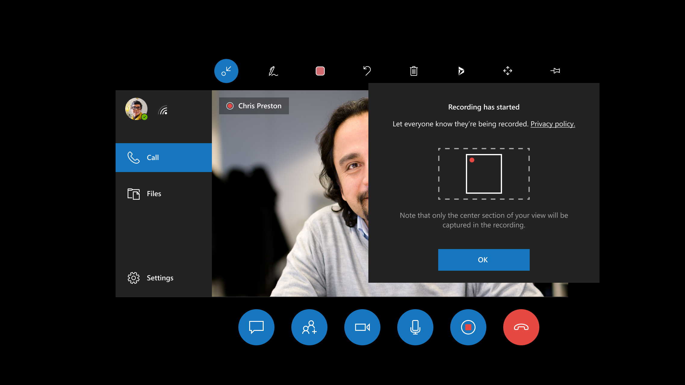
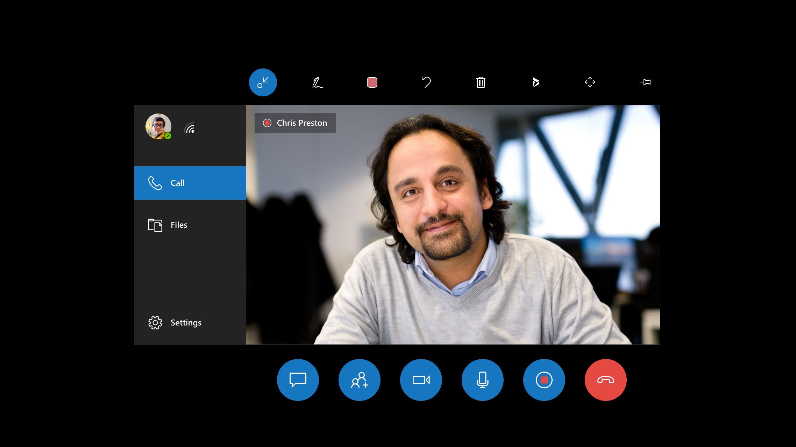
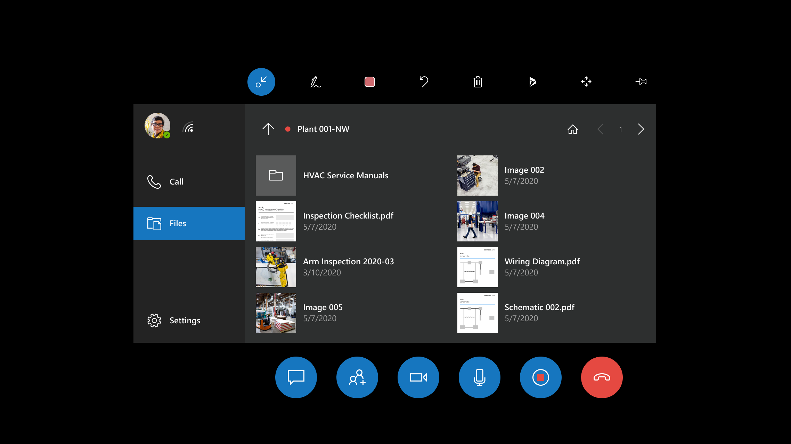
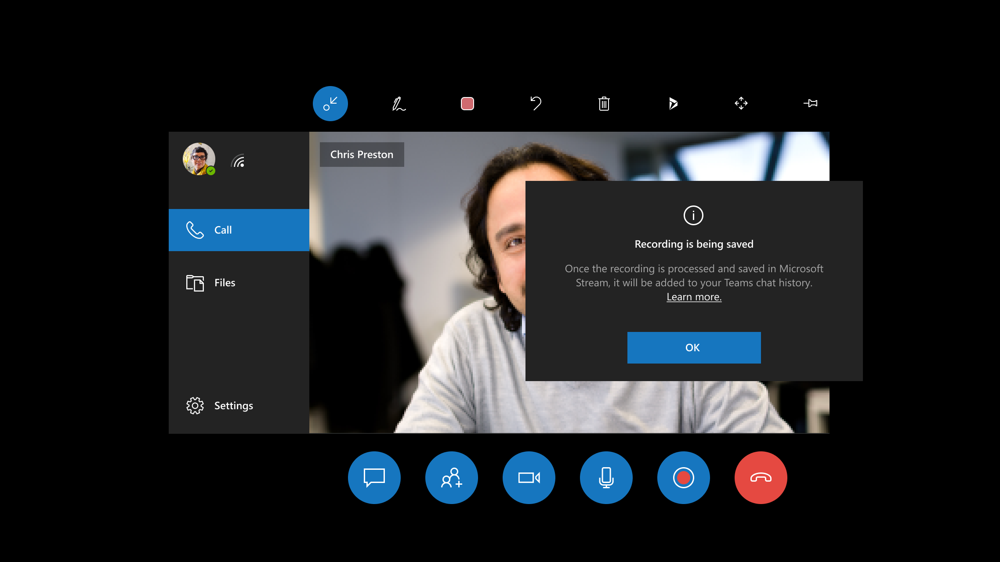
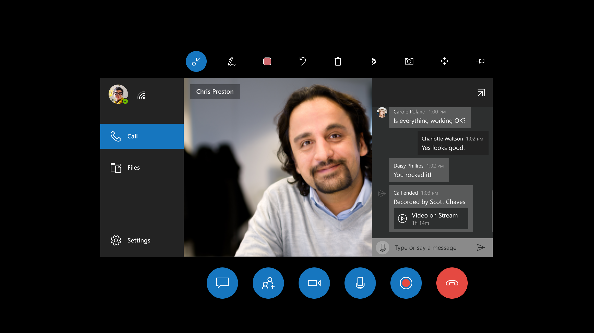
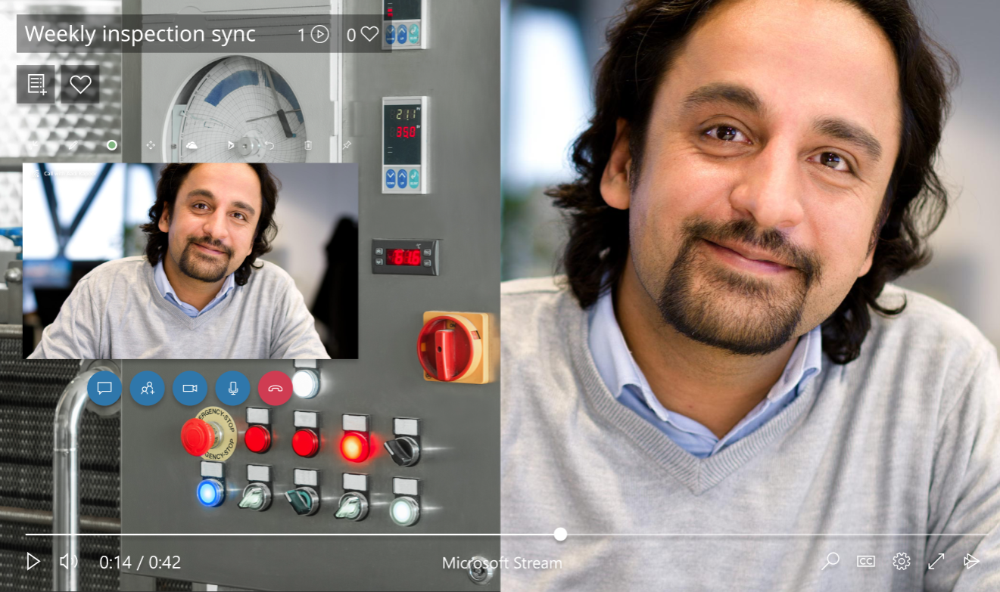
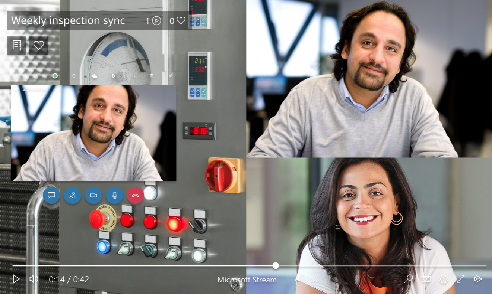
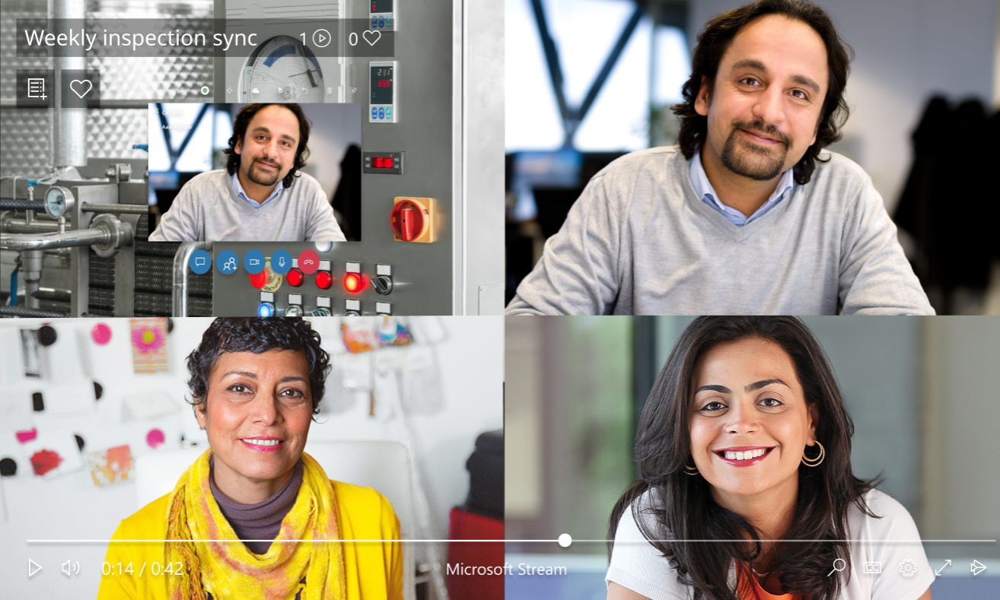
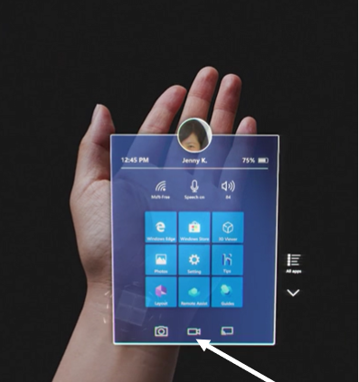

# Record calls in Dynamics 365 Remote Assist on HoloLens

Recording a call is great for training or record-keeping purposes. Cloud-based recordings are automatically uploaded to Microsoft Stream. When the recording finishes uploading, all call participants can find the Stream link via the Teams chat.

Read about the [layout](https://docs.microsoft.com/dynamics365/mixed-reality/remote-assist/record-calls-hololens#cloud-based-recording-layout) of this type of call before deciding whether to record using this method. You may also consider [alternatives to cloud-based recordings](https://docs.microsoft.com/dynamics365/mixed-reality/remote-assist/record-calls-hololens#alternative-methods-for-recording).

## Overview of cloud-based recording

The following chart explains which call participant can initiate a cloud-based call recording in each type of call:

|     Type of call    |     Can a Dynamics 365   Remote Assist HoloLens user record?     |     Can a Dynamics 365   Remote Assist mobile user record?     |     Can a Teams desktop user record?    | Can a Teams mobile user record? | 
|-----------------|------------------------------------------------------------------|----------------------------------------------------------------|-------------------------------------------|-----------------|
|     One-to-one call         |     Yes                                                          |     Yes                                                        |     Yes                                   | No |
|     Group       |     Yes                                                          |     Yes                                                        |     Yes                                   | N/A| 
|     Meeting     |     Yes                                                           |     Yes                                                       |     Yes                                   | N/A| 

Exceptions include:
* Unlicensed one-time call participant  
* Call participant without the [required license](https://docs.microsoft.com/microsoftteams/cloud-recording#prerequisites-for-teams-cloud-meeting-recording)
* Additional exceptions described by [Microsoft Teams documentation](https://docs.microsoft.com/microsoftteams/cloud-recording#prerequisites-for-teams-cloud-meeting-recording)

Learn more about using [Teams desktop]( https://support.office.com/article/Record-a-meeting-in-Teams-34dfbe7f-b07d-4a27-b4c6-de62f1348c24) to record the call. 

> [!Note]
> The recorder is the owner of the video. The owner needs to [give permission](https://support.office.com/article/Play-and-share-a-meeting-recording-in-Teams-7d7e5dc5-9ae4-4b94-8589-27496037e8fa#bkmk_sharemeetingrecording) or [download](https://support.office.com/article/Play-and-share-a-meeting-recording-in-Teams-7d7e5dc5-9ae4-4b94-8589-27496037e8fa#bkmk_downloadmeetingrecording) the video to share the recording beyond these people.  

## How to initiate a cloud-based recording

1. Select the **Start Record** button () to start recording the call.

    
    
2. You may see a loading notification.
    
3. You'll see a reminder that the call recording only captures the middle vertical section of your field of view. This means that if there are procedures or assets that are critical for you to record, keep them in the middle of your field of view. For more context about this notification, learn about [Teams recording layout for calls with two participants](https://docs.microsoft.com/dynamics365/mixed-reality/remote-assist/record-calls-hololens#cloud-based-recording-layout). Select **OK** to start recording.

    
    
4. The **Start Recording** button now becomes a **Stop Recording** button. You'll also see a persistent recording indication in the top left of the video card.

    
    
5. The persistent recording indication will be visible even if you open the **Files** tab, so you can always verify whether a recording is ongoing.

    
    
6. To end the recording, press the **Stop Recording** () button or end the call. You'll see a reminder that the recording is being processed and saved securely in Microsoft Stream.  

    
    
7. After the recording is processed and saved, it will appear in your Dynamics 365 Remote Assist chat history (if you are still in the call) and also your Teams chat history. Remember that your Dynamics 365 Remote Assist chat history does not persist when the call ends, but your Teams chat history does. To view the recording in your HoloLens browser, select the link in the Dynamics 365 Remote Assist chat. To view all the call recordings you initiated, visit your [Stream videos page](https://msit.microsoftstream.com/studio/videos).

    

## Cloud-based recording layout

At this time, the layout of the cloud-based recording depends on the number of call participants, and the layout cannot be configured. When using Dynamics 365 Remote Assist or Teams to record the call, the Dynamics 365 Remote Assist HoloLens user's view (that is, their outgoing video feed) never occupies the entire recording (unless the Dynamics 365 Remote Assist HoloLens user is the only person in a call or meeting).

If it is imperative that your recording captures as much of the Dynamics 365 Remote Assist HoloLens user's view as possible and as little of the Teams user's outgoing video feed or avatars, consider using [one of the alternative recording methods](https://docs.microsoft.com/dynamics365/mixed-reality/remote-assist/record-calls-hololens#alternatives-to-cloud-based-recording).

Below are several examples of what the recording layout looks like when you use Teams or Dynamics 365 Remote Assist to record.

- In a recording with two participants, each participant's outgoing video (or avatar) occupies one-half of the recording, and both halves are vertical. This means that during a Dynamics 365 Remote Assist call, a Teams desktop user sees a horizontal slice of what you see, but the recording only captures the middle vertical slice of what you see. Furthermore, during the Dynamics 365 Remote Assist call, the Teams user only sees their outgoing video feed in the corner of the call, but in the recording, their outgoing video feed occupies half the recording. (If the Teams user turns off their outgoing video feed, their avatar will occupy half the recording.)

    

- In a recording with three participants, each participant's outgoing video (or avatar) occupies one-third of the recording. Furthermore, during the Dynamics 365 Remote Assist call, the Teams user only sees their outgoing video feed in the corner of the call, but in the recording, their outgoing video feed occupies one third the recording. (If the Teams user turns off their outgoing video feed, their avatar will occupy one third of the recording.)

    

- In a recording with four participants, each participant's outgoing video (or avatar) occupies one-fourth of the recording. During the Dynamics 365 Remote Assist call, the Teams user only sees their outgoing video feed in the corner of the call, but in the recording, their outgoing video feed occupies one fourth of the recording. (If the Teams user turns off their outgoing video feed, their avatar will occupy one fourth of the recording.)  

    

- A Teams recording including five or more participants splits the horizontal recording into four, with remaining participants' avatars in the bottom-right corner of the recording.

    

## Alternatives to cloud-based recording

### Use the HoloLens OS to record only what you see in the HoloLens, what you hear around you, and what you hear through the HoloLens speakers

Use this option when:

- No call participant can initiate a cloud-based call recording
- You only want the recording to capture what you see through the HoloLens. For example, the recording will only show the participants in the Dynamics 365 Remote Assist call if you manually navigate to the participants panel and it is in your field of view.

You can use the HoloLens OS to record only what you see in the HoloLens, what you hear around you, and what you hear through the HoloLens speakers. There are three ways to do so.

1. From the **Start** menu:

  - Select the **Video** button from the bottom tool pane.
  - Air tap when you are ready to record.
  - To stop recording, perform the **Start Gesture** and press the **Video** button.

> [!Note]
> If you are using this method to record your environment outside a call, joining a call will end the recording.

2. By voice: 

- Say "Hey Cortana, Record a video."
- Cortana's blue ring will appear, and your voice command will display on screen while giving feedback by voice.
- There will be a countdown from three to one, when the recording will start.
- There will be red recording indicator in the top right-hand corner of your view while the recording is live.
- To stop recording, say "Hey Cortana, Stop recording."
- The video will be available in your **Camera Roll**. Navigate to your camera roll using the **Start** menu.

3. By HoloLens hardware:

- Press and hold the volume-up and volume-down buttons simultaneously until a three-second countdown begins. To stop recording, tap both buttons simultaneously.

These videos are saved to the HoloLens camera roll. Keep in mind that the video will not be automatically uploaded to Stream, but there are two ways to get a photo or video off the HoloLens camera roll.

4. Upload to OneDrive:

- Launch the **Start** menu. 
- Select the **Windows App Store**.
- Download the OneDrive app.
- Sign into OneDrive.
- Upload your file to OneDrive.

5. Manual connection to PC with a USB-C cable:

- Access the internal storage through the file explorer (on a PC).
- Go to the **Pictures** > **Camera Roll folder**.
- Copy your images or videos from this folder.

Learn more about taking photos, taking videos, and getting them off the device [here](https://docs.microsoft.com/hololens/holographic-photos-and-videos#capture-a-mixed-reality-photo).

### Ask a Teams desktop user to use the Windows Game Bar to capture a screen recording of a Dynamics 365 Remote Assist call from their perspective

Use this option when:

- You want the recording to capture exactly what the Teams desktop user sees during the call (for example, including the Teams UI and call layout the Teams desktop user configures).

Learn more about how a Teams desktop user can [record a call using Windows Game Bar](https://docs.microsoft.com/dynamics365/mixed-reality/remote-assist/teams-pc-all.md#record-your-teams-desktop-screen-using-windows-game-bar).

For more information, [learn more about the Game Bar](https://support.xbox.com/xbox-on-windows/social/record-game-clips-game-bar-windows-10).
