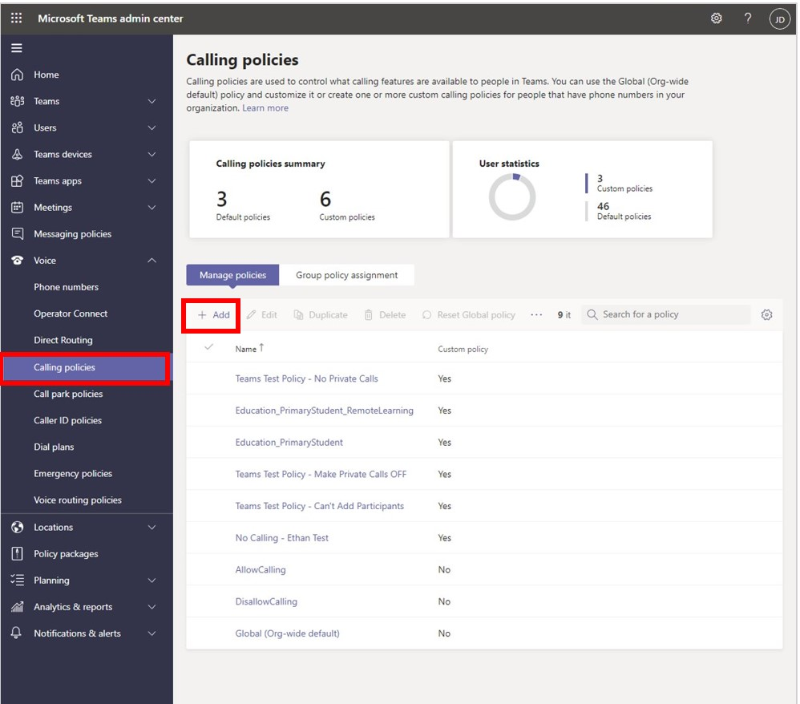
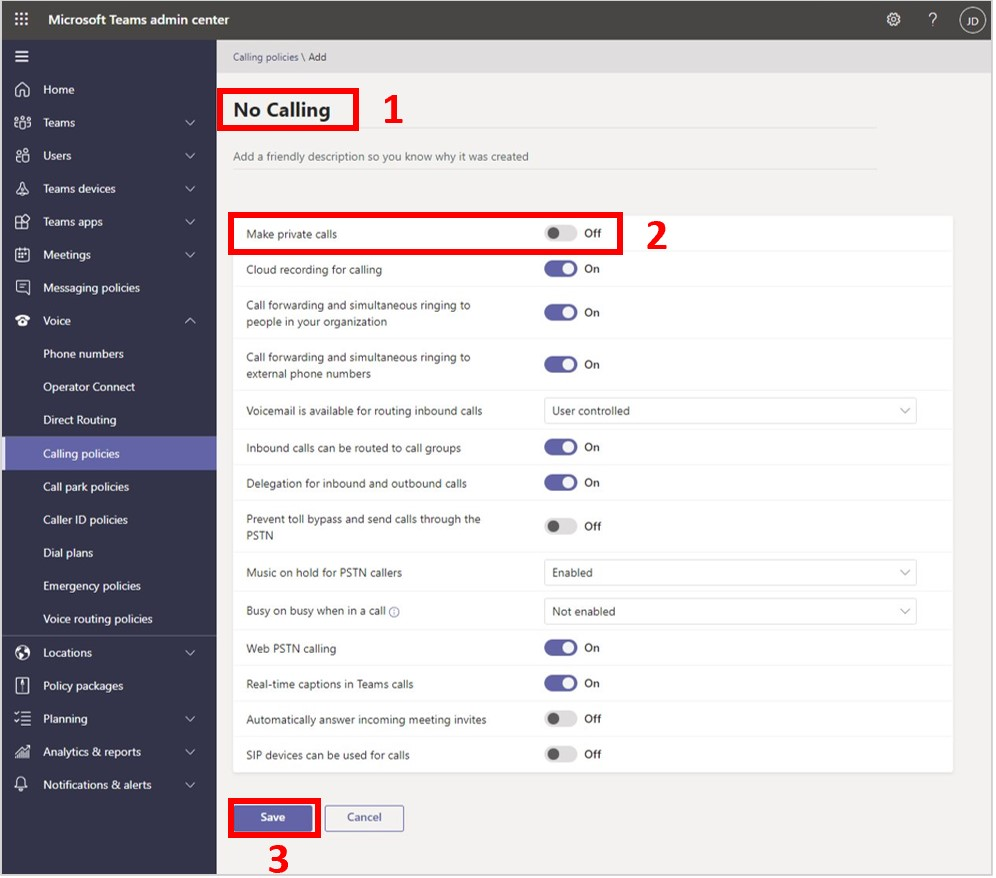
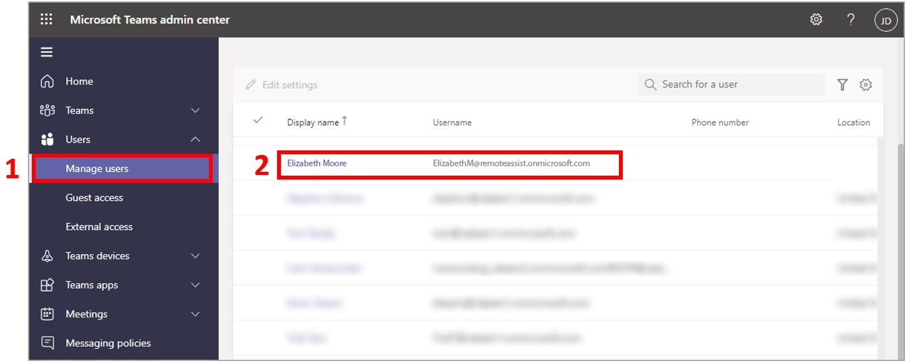
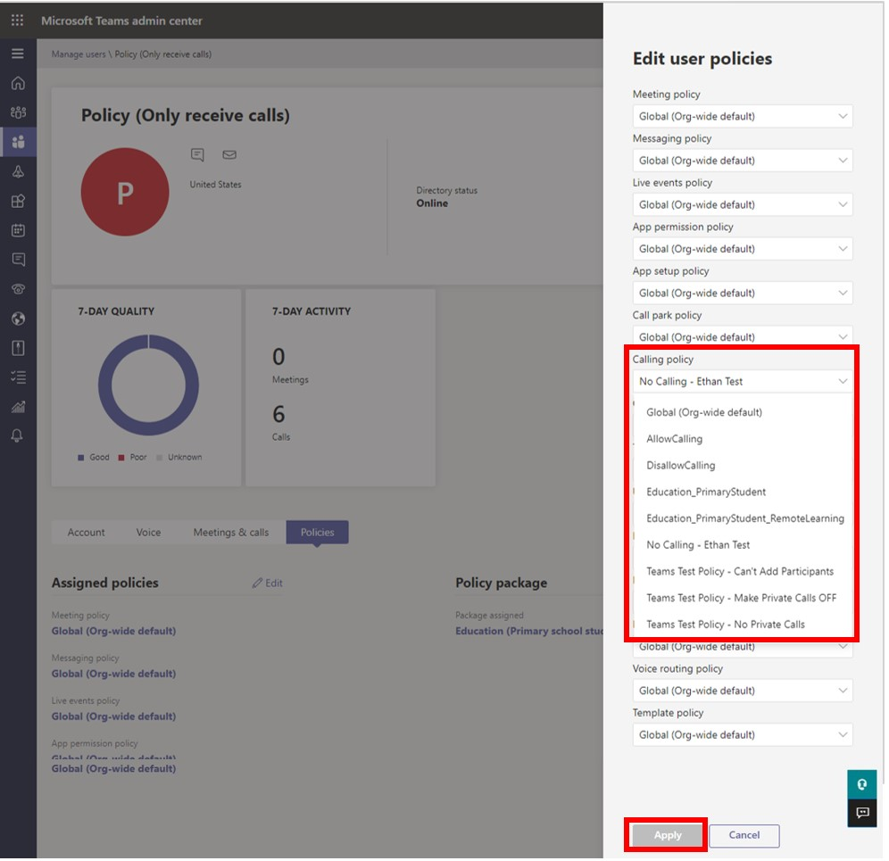

# Restrict calling and the ability to search and access contacts in Dynamics 365 Remote Assist for HoloLens

[!INCLUDE[private-preview](../includes/private-preview.md)]

If you [have a scenario where you need to protect company information](restricted-mode-overview.md), you can restrict the ability for Dynamics 365 Remote Assist users on HoloLens from:

- Initiating calls 

- Receiving incoming calls outside of a meeting

- Searching for contacts and accessing contacts

When you restrict calling for Dynamics 365 Remote Assist users, they can still:

- Join a meeting

- Receive a request to join a meeting that's already in progress

With this combination of restrictions and abilities, your company data stays safe and Dynamics 365 Remote Assist users can continue to join meetings to troubleshoot issues with colleagues on an ad-hoc basis. 

> [!NOTE]
> You can't restrict calling and the ability to search and access contacts for the Dynamics 365 Remote Assist mobile app, but you can [set up one-time calls](one-time-call.md). 

## Restrict calling

To restrict calling, first you create a new Microsoft Teams policy, and then you assign that policy to the appropriate user(s). 

> [!TIP]
> You can also assign policies to groups. [Learn more](https://docs.microsoft.com/microsoftteams/assign-policies-users-and-groups) 

1. Go to the [Microsoft Teams admin center](https://admin.teams.microsoft.com) and sign in with your admin credentials.      

2. In the left pane, select **Calling policies**, and then select **Add**.

    
    
    > [!NOTE]
    > [Learn about Microsoft Teams policies supported by Dynamics 365 Remote Assist](https://docs.microsoft.com/dynamics365/mixed-reality/remote-assist/teams-policies)

3. Enter a name for your policy, turn the **Make private calls** setting to **Off**, and then select **Save**. 

    

4. In the left pane, select **Manage users**, and then select the user you want to assign the policy to. 

    

5. Select the **Policies** button, and then select **Edit**.

    

6. On the right side of the screen, in the **Calling policy** list, select the policy you created, and then select **Apply**.

    

   Once the policy takes effect, users will be able to join meetings or receive notifications for meetings already in progresss but they won't be able to initiate calls or receive calls outside of a meeting. They also won't be able to access the contacts list. 

    > [!NOTE]
    > It can take a few hours for the policy changes to go into effect.

## See also

- [Overview of restricting capabilities in Dynamics 365 Remote Assist](restricted-mode-overview.md)
- [Restrict the ability to access OneDrive files](restricted-mode-files.md)
- [Restrict the ability to access asset records](restricted-mode-assets.md)
- [Restrict the ability to change user accounts](restricted-mode-signout.md)
