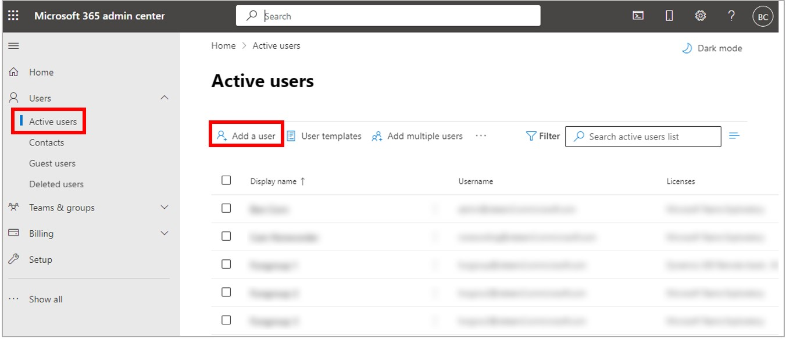
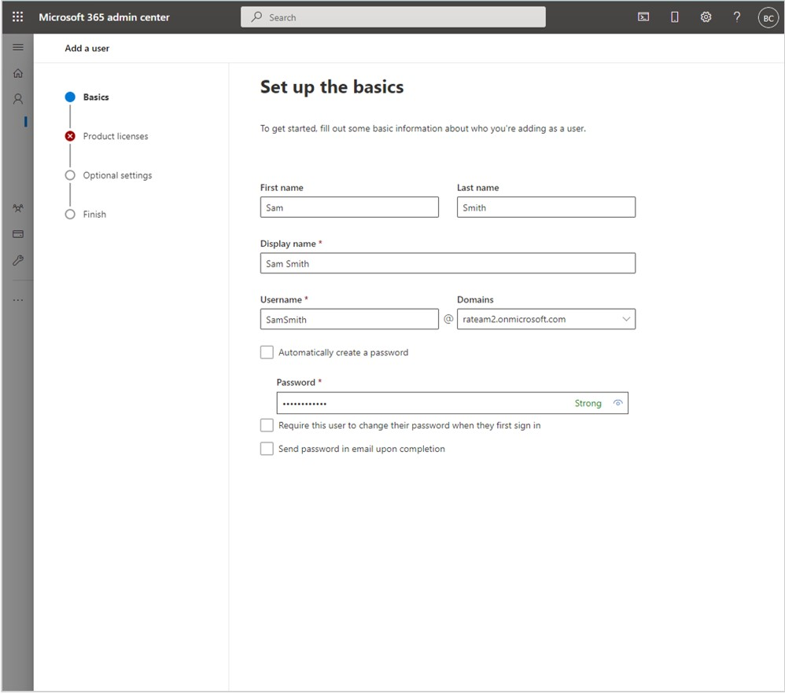
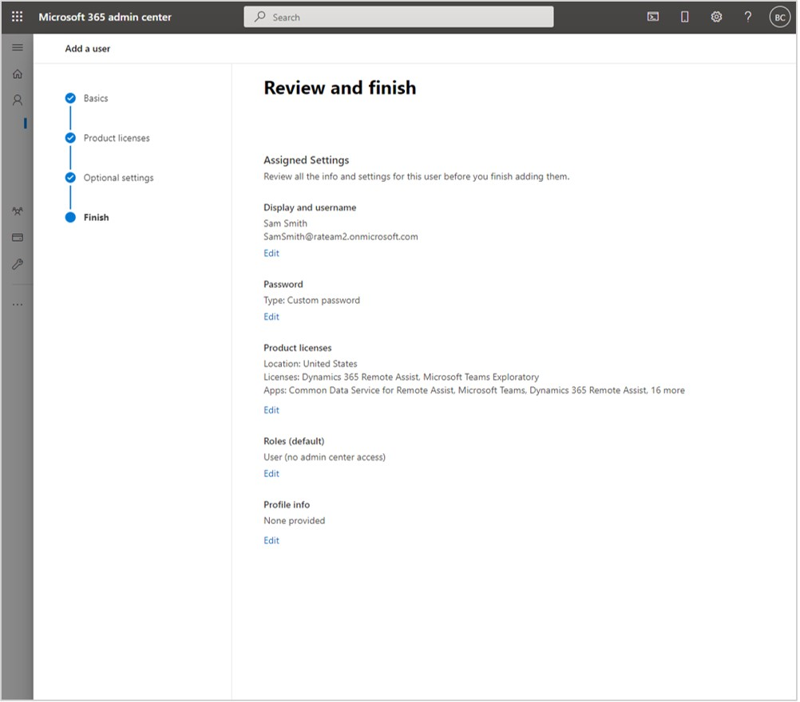
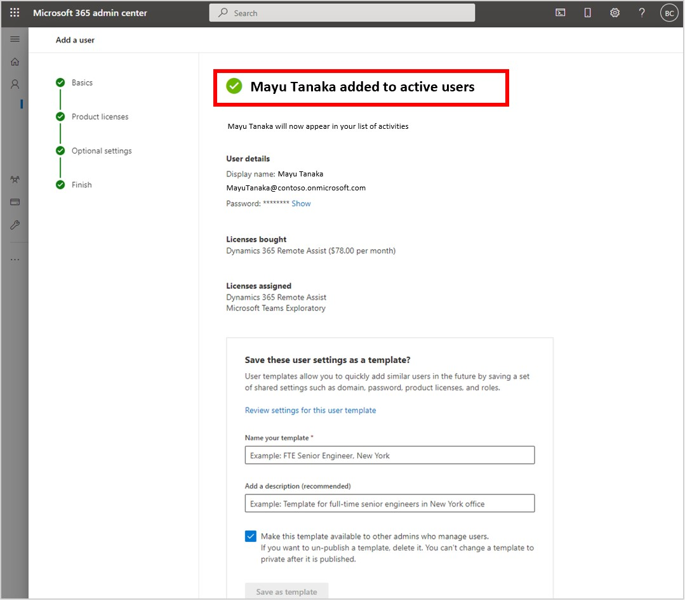

# Restrict the ability to access OneDrive files in Dynamics 365 Remote Assist

[!INCLUDE[private-preview](../includes/private-preview.md)]

If you [have a scenario where you need to protect your company information](restricted-mode-overview.md), you can restrict the ability for Dynamics 365 Remote Assist users from accessing OneDrive files. Restricting the ability to access OneDrive files is also helpful in a situation where a service account is shared between users and you want to prevent users from accessing each other's files. 

When you restrict the ability to access OneDrive files:

- HoloLens users will see the **Files** tab, but no files will be visible and they'll see this message: "We can't connect to OneDrive."
- Users of the mobile app will not be able to access OneDrive files. 

## Restrict access to OneDrive files

1. Sign in to the [Microsoft 365 admin center](https://admin.microsoft.com/Adminportal/Home?#/users) as an admin. 

2. In the left pane, select **Users** > **Active users**, and then select **Add a user**.

    
    
    > [!IMPORTANT]
    > It's critical to create a NEW ACCOUNT to make sure that the user will not have access to the licenses required to access OneDrive files. 

3. Fill out the user information, and then select **Next**.

    

4. Select the **Dynamics 365 Remote Assist** and **Microsoft Teams** license check boxes.

    

    > [!NOTE]
    > The name of the Teams license may vary base on the products you have installed. 

5. Clear the **Office for the Web** and **SharePoint** license check boxes, and then select **Next**.

    

6. In the **Optional settings** section, leave the default value (no administration access), and then select **Next**.

    

7. In the **Review and finish** section, make sure the information is correct, and then select **Finish adding** when you're ready.
    
    

8. If you see the following confirmation screen, you'll know the user was added correctly. Select **Close**.

    
    
## See also

- [Overview of restricting capabilities in Dynamics 365 Remote Assist](restricted-mode-overview.md)
- [Restrict calling and the ability to search and access contacts](restricted-mode-calling.md)
- [Restrict the ability to access asset records](restricted-mode-assets.md)
- [Restrict the ability to change user accounts](restricted-mode-signout.md)
