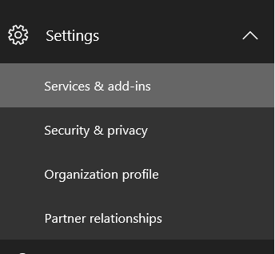
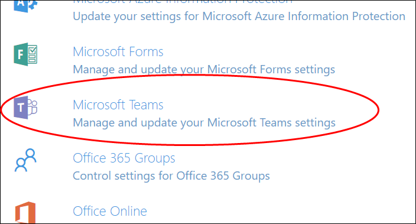
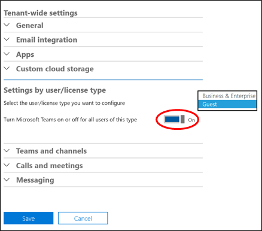
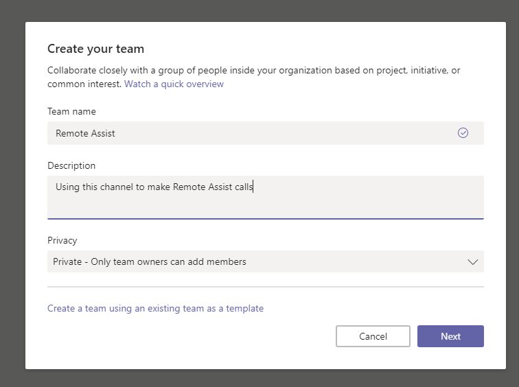
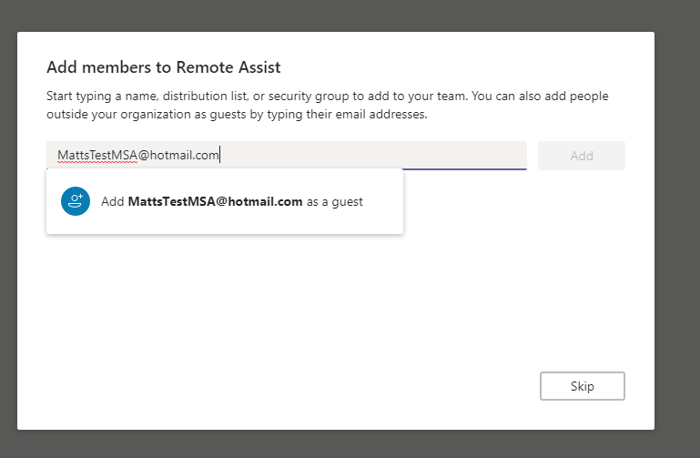

# Set up Microsoft Teams with Dynamics 365 Remote Assist 

A [!include[cc-microsoft](../includes/cc-microsoft.md)] [!include[pn-dyn-365-remote-assist](../includes/pn-dyn-365-remote-assist.md)] user on [!include[pn-hololens](../includes/pn-hololens.md)] can work collaboratively with a colleague (typically an expert in a particular field) during a video call by using [!include[cc-microsoft](../includes/cc-microsoft.md)] [!include[pn-teams](../includes/pn-teams.md)]. The expert can see everything that the [!include[pn-dyn-365-remote-assist](../includes/pn-dyn-365-remote-assist.md)] user sees, and they can holographically draw and annotate together. For example, let’s say a first-line worker is servicing a complex machine and isn’t sure how to solve a problem. The first-line worker can call an expert anywhere in the world and have the expert assist with
the servicing using annotations or files.

Setting up this collaboration using [!include[pn-teams](../includes/pn-teams.md)] is simple and it’s free for the
expert.

## Prerequisites

The [!include[pn-dyn-365-remote-assist](../includes/pn-dyn-365-remote-assist.md)] user (first-line worker) on [!include[pn-HoloLens](../includes/pn-HoloLens.md)] needs:

- [A subscription to Dynamics 365 Remote Assist.](buy-remote-assist.md) The [!include[pn-dyn-365-remote-assist](../includes/pn-dyn-365-remote-assist.md)] subscription includes a subscription to [!include[pn-microsoft-teams](../includes/pn-microsoft-teams.md)].

- A [!include[pn-hololens](../includes/pn-hololens.md)] running the [Windows 10 April 2018
    Update](https://support.microsoft.com/help/12643) (or later).

- An [!include[pn-azure-active-directory](../includes/pn-azure-active-directory.md)] account.

The expert needs:

- A PC running [!include[pn-ms-windows-short](../includes/pn-ms-windows-short.md)] 10 with the latest version of [Microsoft Teams](https://products.office.com/microsoft-teams/group-chat-software) or a mobile device running [!include[pn-microsoft-teams](../includes/pn-microsoft-teams.md)] Mobile. The expert uses [!include[pn-teams](../includes/pn-teams.md)] to communicate with the [!include[pn-dyn-365-remote-assist](../includes/pn-dyn-365-remote-assist.md)] user on [!include[pn-HoloLens](../includes/pn-HoloLens.md)]. [!include[pn-teams](../includes/pn-teams.md)] may be available [as a free download](https://teams.microsoft.com/downloads).

- A free [!include[cc-microsoft](../includes/cc-microsoft.md)] account. The expert might already have a [!include[cc-microsoft](../includes/cc-microsoft.md)] account if they signed up for the [!include[cc-microsoft](../includes/cc-microsoft.md)] App Store, Skype, Xbox, Hotmail, or Outlook.com. If the expert doesn’t already have a [!include[cc-microsoft](../includes/cc-microsoft.md)] account, they can sign up for one by going to their [Microsoft account page](https://account.microsoft.com/account).

## Setup

You can onboard an expert and collaborate using [!include[pn-teams](../includes/pn-teams.md)] in three easy steps:

| **Step** | **Description**                                                                  | **Who does this step?**           |
|----------|----------------------------------------------------------------------------------|-----------------------------------|
|    1.      | Enable guest access for [!include[pn-teams](../includes/pn-teams.md)]                                                    | Administrator                     |
|    2.      | Invite the expert to join a team as a guest using the expert’s [!include[cc-microsoft](../includes/cc-microsoft.md)] account | Administrator or [!include[pn-dyn-365-remote-assist](../includes/pn-dyn-365-remote-assist.md)] user and expert (to download [!include[pn-teams](../includes/pn-teams.md)]) |
|    3.      | Place a call                                                                     | [!include[pn-dyn-365-remote-assist](../includes/pn-dyn-365-remote-assist.md)] user or expert     |

### Step 1: Enable guest access for teams

1.  If you’re the admin for the main [!include[pn-azure](../includes/pn-azure.md)] tenant, go to the [Microsoft admin portal](https://admin.microsoft.com/adminportal/) to open the Office Admin portal, and then sign in.

2.  From the menu on the left, select **Show More** > **Settings** > **Services & add-ins**.

    

3.  Select **[!include[cc-microsoft](../includes/cc-microsoft.md)] [!include[pn-teams](../includes/pn-teams.md)]** from the list of applications.

    

4.  Select **Settings by user/license type**.

5.  In the drop-down list next to **Select the user/license type you want to
    configure**, select **Guest**.

6.  Set **Turn [!include[cc-microsoft](../includes/cc-microsoft.md)] [!include[pn-teams](../includes/pn-teams.md)] on or off for all users of this type** to **On**, and then choose **Save**.

    

7.  Wait an hour for the settings to propagate.

### Step 2: Invite the expert to join a team

1. In [!include[pn-teams](../includes/pn-teams.md)], select **Join or create a team** to create a team if it doesn’t already exist. The [!include[pn-dyn-365-remote-assist](../includes/pn-dyn-365-remote-assist.md)] user and the expert must be on the same team to communicate.

    

2. When asked to add members, enter the expert’s [!include[cc-microsoft](../includes/cc-microsoft.md)] account.

    

    > [!NOTE]
    > If you don’t see the option to add a guest when typing an email address, it’s likely that guest access isn’t enabled on your company’s [!include[pn-azure](../includes/pn-azure.md)] tenant for [!include[pn-teams](../includes/pn-teams.md)]. Enable guest access as described earlier in this topic.

3. The expert will immediately receive an email message and can click the link
    in the message to open (or download) [!include[cc-microsoft](../includes/cc-microsoft.md)] [!include[pn-teams](../includes/pn-teams.md)]. This version of [!include[pn-teams](../includes/pn-teams.md)]
    is free and is not a trial version.

Need more help? [Check out Dynamics 365 Remote Assist FAQs](faq.md) for answers to common questions.