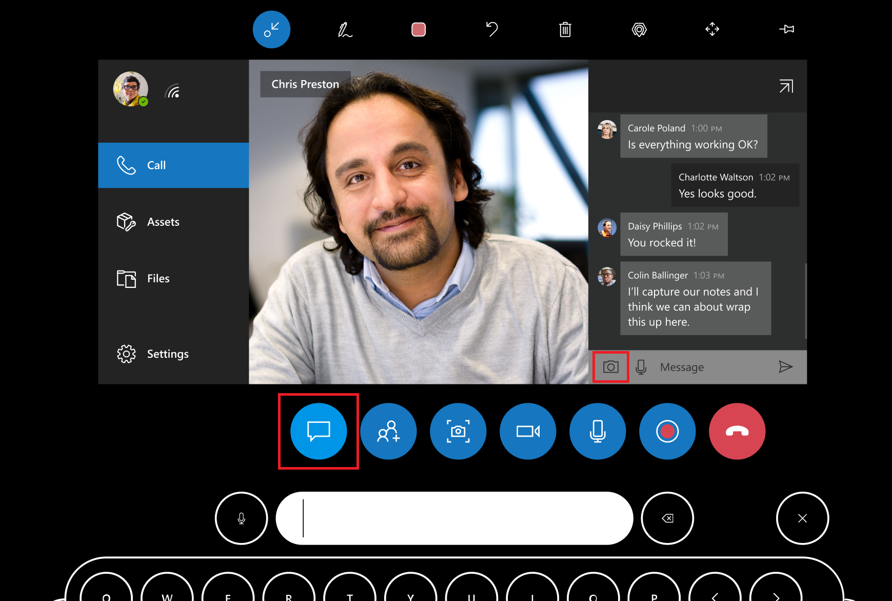

# Take a photo and save it to a Dynamics 365 Field Service booking

In this article, we'll take a look at how Dynamics 365 Remote Assist users can take a photo in their HoloLens and save it to OneDrive or a Field Service booking.

## Take a photo

You can take a snapshot of your mixed reality annotations during a call if your admin has turned on Microsoft 365 and enabled OneDrive. For example, you can use a snapshot to document the quality of the assets you’re inspecting. If your network connectivity is poor, send a snapshot to your remote collaborators so that they can clearly see an intricate part of the machine or a machine tag with small characters. 

To take a photo, go to the chat and then select the **Camera** icon (or say "Remote Assist, Camera"), and then air tap (or say "Snap") to take the photo.

## Save a photo to OneDrive or an open Dynamics 365 Field Service booking

Photos are saved differently depending on whether or not the Dynamics 365 Remote Assist call is associated with a Dynamics 365 Field Service booking.

- If the call *is* associated with a booking, after you take the photo, you'll see an option to save it to OneDrive or to the booking. (A call is associated with a booking if, from the Recent Contacts page, you selected a booking.)
- If a Dynamics 365 Remote Assist call is *not* associated with a booking, your photo will automatically be saved in OneDrive.

A link to the photo is sent via text chat. All call participants can access the link via Teams chat during and after the call.

[!INCLUDE[footer-include](../includes/footer-banner.md)]