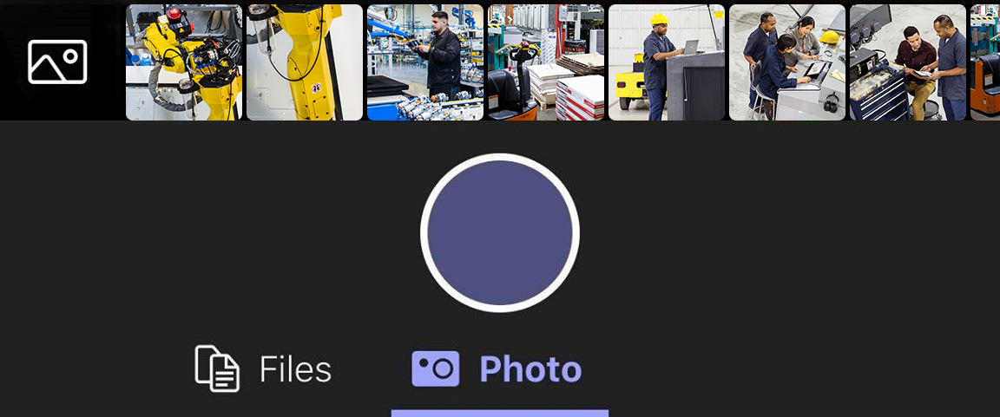
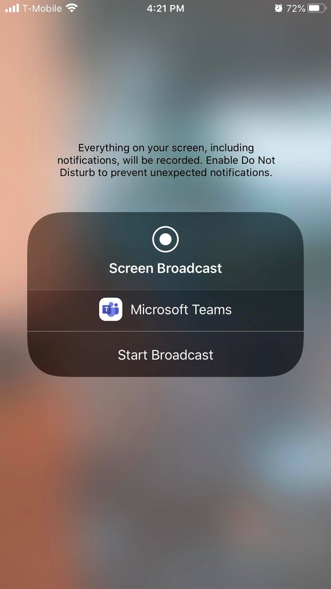

# Collaborate with a Dynamics 365 Remote Assist user via Microsoft Teams on mobile 

Dynamics 365 Remote Assist users and Microsoft Teams users can collaborate using a variety of devices to solve problems together, faster. Dynamics 365 Remote Assist is available on HoloLens and HoloLens 2, and also AR-capable iOS and Android mobile phones and tablets. Remote collaborators can use Teams on PC or mobile to collaborate with Dynamics 365 Remote Assist users. The benefit of using Teams on mobile (versus PC) is that you can collaborate with Dynamics 365 Remote Assist users on-the-go. 

When you use Teams on mobile, you can collaborate in a one-to-one call with one person who is using Dynamics 365 Remote Assist on HoloLens or HoloLens 2 ("Dynamics 365 Remote Assist HoloLens user"). You can also collaborate in a one-to-one call with one person who is using Dynamics 365 Remote Assist on mobile ("Dynamics 365 Remote Assist mobile user"). However, the available features differ.

| Feature |  Available for Teams mobile user in a one-to-one call with one Dynamics 365 Remote Assist HoloLens user | Available for Teams mobile user in a one-to-one call with a Dynamics 365 Remote Assist mobile user 
---| ---| ---
Make outgoing call | Yes | No
Receive incoming call | Yes| Yes
Control outgoing video, outgoing audio, and incoming audio  | Yes | Yes
Annotate Dynamics 365 Remote Assist user’s environment using arrows and ink  | Yes | Yes
Annotate 2D snapshot using arrows and ink | No | Yes
Send a text message | Yes |Yes
Share file from OneDrive | Yes| Yes
Share photo from device | Yes | Yes
Record call | No; only the Dynamics 365 Remote Assist user can initiate the recording | No; only the Dynamics 365 Remote Assist user can initiate the recording
Share screen | Yes | No

## Make a call

Launch Teams and go to the **Calls** tab.

  

Under **History**, you will see your recent contacts. Select one of the contacts to call them. 

## Use call controls

Use call controls to specify whether your collaborator can see what you see, hear what you hear, and more.

Call controls are found at the bottom of the screen. 
- The **Video icon** controls outgoing video.
- The **Microphone icon** controls outgoing audio.
- The **Speaker icon** controls incoming audio.

For additional actions, select the ellipses icon. Additional actions include:
-	**Toggle incoming video**
-	**Share your screen** – your screen will pop up as a video in the Dynamics 365 Remote Assist HoloLens user’s world.
-	**Start video with blur** (iOS only) - useful if you have sensitive information behind you or want to protect the privacy of colleagues who are behind you. 
- **Insert file** to share a file 

> [!NOTE]
> Turn your phone horizonal to see more of the Dynamics 365 Remote Assist HoloLens user’s environment.   

## Annotate Dynamics 365 Remote Assist user's environment 

To add an annotation, select the **Edit icon**.

Then, the Dynamics 365 Remote Assist user's video feed will freeze and you will see the **Mixed Reality toolbar**. 

- To add arrows, select **Place arrow** (shown here: ). Then, tap where you would like to place the arrow. To control the direction of the arrow, tap, hold, and draw a circle with your finger until it is at the correct direction. Then release.

- To make drawing annotations, select the **Ink icon** (shown here: ).

- To change the arrow or ink color, select the **Pick a color icon** (shown here: ). 
  
- To undo the most recent annotation you added, select **Undo**.

- To delete every annotation you’ve added, select **Erase** (shown here: ) and then select **Delete All Notes**.

- To delete only the annotations you added recently, select the **Erase icon** (shown here: ) and then select **Clear Current Notes**. It does not clear the annotations your collaborator added.

When you’re done adding annotations, select the checkmark icon to resume the live video feed. All annotations will persist even after you stopped editing. 

> [!NOTE]
> Each call participant can only undo and delete their own annotations.

## Annotate 2D snapshot (only in a call with Dynamics 365 Remote Assist mobile user)

Dynamics 365 Remote Assist mobile lets users take 2D snapshots of their environment and mixed reality annotations, and annotate them during a call. Snapshots are critical in situations where a still image might be needed to carefully add annotations to it. These snapshots can be used for reference later or work validation. Snapshots can also be utilized in low bandwidth situations.

When a Dynamics 365 Remote Assist mobile user takes a snapshot, the video feed will freeze and you will see any annotations they add while they are in 2D snapshot mode. Select **Edit** to begin adding annotations. After both call participants are finished annotating on the snapshot, the Dynamics 365 Remote Assist mobile user selects the check mark to exit from the annotation mode and can choose to save the snapshot to their device's photo gallery.

Annotations are only displayed during the snapshot session. When the Dynamics 365 Remote Assist mobile user exists snapshot mode, annotations from that snapshot session will be removed. 

For more information, [learn more about using snapshots](./mobile-app/annotate-snapshot.md).

## Send a text message

Select the **Text icon** (which looks like this: ) to open the text chat and send text messages. After the call, all participants can access the messages (and OneDrive and Teams file links) via the Teams chat. 

> [!NOTE]
> You may notice that you can attach a photo, gif, or file via the text message. This is not the best way to share a file. Please read the next two sections to learn how to share a OneDrive file and a photo from your device.

## Share OneDrive file 

You can display OneDrive files in the Dynamics 365 Remote Assist HoloLens user's space or send OneDrive files in the Dynamics 365 Remote Assist mobile text chat. For example, add a PDF of a diagram to assist with the call.

Go to the call controls and select the ellipses icon [...]. Then select **Insert Files** and select whether to insert file from OneDrive or from Teams teams and channels. You can insert an image, still gif, video, or PDF.

If you are collaborating with a Dynamics 365 Remote Assist HoloLens user, the file will be uploaded to OneDrive and appear up as a new slate in the Dynamics 365 Remote Assist HoloLens user’s environment. The Dynamics 365 Remote Assist HoloLens user can save a file to their OneDrive by tapping the OneDrive icon in the top right of the slate. The OneDrive file is then automatically saved to a folder called "HoloLens Received Files." A link to the file will be available in the Teams chat even after the call ends.

If you are collaborating with a Dynamics 365 Remote Assist mobile user, the file will be uploaded to OneDrive and sent in the Dynamics 365 Remote Assist mobile user’s text chat. A link to the file will be available in the Teams chat even after the call ends.

## Share photo from device 

Go to call controls and select the ellipses icon […]. Then select **Insert Files** and select **Photo**. Then, take a photo or select a photo from your mobile device’s photo gallery. 

Select the text chat. You'll see that the photo is attached to a blank message, but has not yet been sent. Send the photo.

If you are collaborating with a Dynamics 365 Remote Assist HoloLens user, the photo will be uploaded to OneDrive and appear as a new slate in the Dynamics 365 Remote Assist HoloLens user’s environment. The Dynamics 365 Remote Assist HoloLens user can save a file to their OneDrive by tapping the OneDrive icon in the top right of the slate. The OneDrive file is then automatically saved to a folder on the HoloLens called "HoloLens Received Files."  a link to the file will be available in the Teams chat even after the call ends. 

If you are collaborating with a Dynamics 365 Remote Assist mobile user, the photo will be uploaded to OneDrive and will appear in the Dynamics 365 Remote Assist mobile user’s text chat. A link to the file will be available in the Teams chat even after the call ends.

## Share screen (only in a call with Dynamics 365 Remote Assist HoloLens user)

To share your screen, go to call controls, select the ellipses icon […], select **Share**, then select **Start Broadcast**.

After a few seconds, a live view of your screen will be displayed as a new slate in the Dynamics 365 Remote Assist HoloLens user’s environment. 

